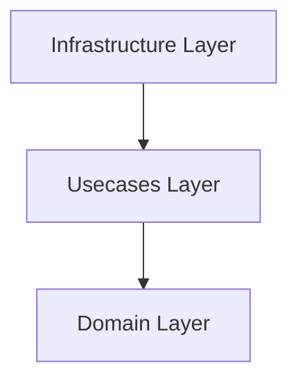

# Enterprise Clean Architecture Blueprint (Hexagonal)

This blueprint enforces a clear separation of concerns, ensuring core business logic is independent of frameworks, databases, and network adapters.

## 1. Directory Structure

```
src/
├── domain/                  # Core entities, value objects, and business rules (Zero dependencies)
│   ├── models/              # Pure structures/classes
│   └── exceptions/          # Custom domain-specific errors
├── usecases/                # Orchestrates the flow of data to and from domain entities
│   ├── interfaces/          # Ports (Repository & service interfaces)
│   └── actions/             # Input boundaries / application workflows
└── infrastructure/          # Adapters linking the outside world to our app
    ├── database/            # Concrete database operations (repositories, ORMs)
    ├── web/                 # Controllers, route handlers, and API frameworks (FastAPI, Express, etc.)
    └── config/              # Environment profiles and secret resolution
```

## 2. Dependency Rule

> **Dependencies MUST only point inwards.**
> Code in the `domain` layer must have zero dependencies on external packages, frameworks, or other layers.



## 3. Implementation Checklist
- [ ] Business logic and rules are contained solely in the `domain` layer.
- [ ] Database client dependencies (Prisma, SQLAlchemy, etc.) are strictly kept within the `infrastructure` layer.
- [ ] The `usecase` layer uses interfaces/ports to fetch and save data, never calling concrete DB clients directly.
