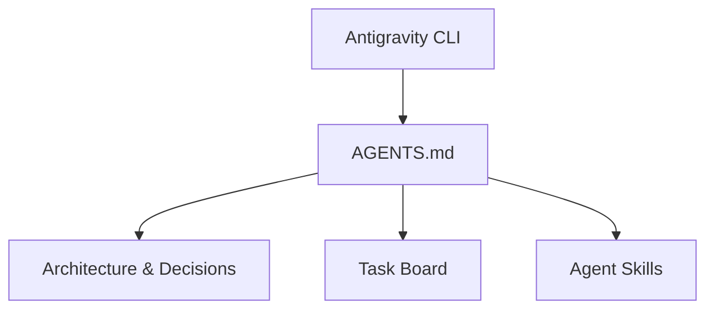

# AAC V2 System Architecture

This document summarizes the layout and design philosophy of the Antigravity Agent Core V2 system.

## 1. System Topology

The framework is organized into three major components:
- **Core CLI/Scripts**: Thin wrappers (like `helper.sh`) that delegate operational tasks to modular Python commands.
- **Agent Protocols**: Human-readable rules (`AGENTS.md` and `.agents/rules.md`) that guide LLM behaviors.
- **Persistent State**: File-based tracking of tasks, budgets, and architectural decisions.

## 2. Directory Map
- `/AGENTS.md`: Entry point prepended to all agent prompts.
- `/.agents/tasks/board.md`: Active task board.
- `/.agents/memory/architecture.md`: This file.
- `/.agents/memory/decisions/`: Folder containing ADRs.
- `/.agents/memory/glossary.md`: Core terminology index.
- `/.agents/skills/`: Custom capability playbooks.
- `/.agents/workflows/`: Automated slash-command macros.

## 3. Decisions & ADR Registry
All major architectural changes must be registered as ADRs:
- [ADR 0001: Initialization of V2 layout](file:///home/rafaelghifari/Muraghi/Project/antigravity-agent/.agents/memory/decisions/0001-v2-initialization.md)
