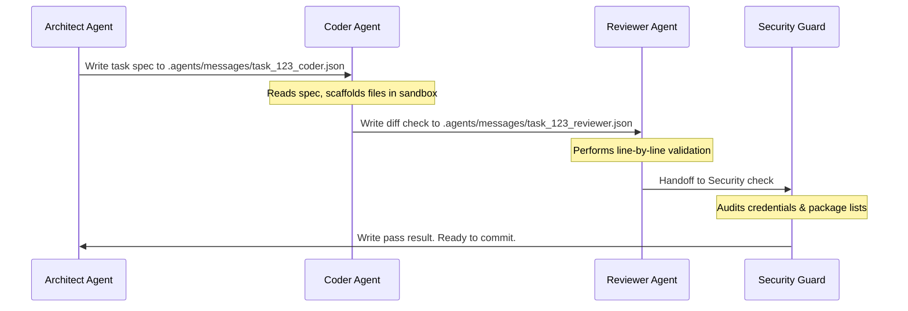

# AAC V3: Multi-Developer Collaboration & Swarm Coordination Blueprint

This document specifies the architecture, data schemas, and workflows to support **multi-developer (multi-account) contributions** and **asynchronous Multi-Agent Swarms** in AAC V3.

---

## 1. Multi-Developer Identity Isolation & Security

To enable multiple developers (humans and agent accounts) to contribute to the same workspace without credentials leaks or signature conflicts:

### A. Non-Committed Git Profile Registry
* **The Profile Config:** Local developer identities (git name, email, GPG keys, signing configuration) are declared in `.agents/git_profiles.json`.
* **Security Guard:** This file is generated dynamically from `.agents/git_profiles.example` and is strictly ignored by `.gitignore` and `.antigravityignore` to prevent staging developer credentials to the shared repository.
* **V3 Upgrade:** Introduce dynamic GPG key loading. When switching profiles using `./helper.sh profile switch <name>`, the CLI will automatically import the corresponding GPG public/private key block from a secure environment variable or a local encrypted file, configuring `user.signingkey` and `commit.gpgsign` dynamically.

### B. Branch-Locked Contributor Identity
* When starting work on an issue (e.g. `./helper.sh issue checkout issue-123`), the CLI records the contributor's active profile name inside the issue file (e.g. `assignee: dev-alice`).
* When audits run during `git commit`, `validate.py` verifies that the active git config email and name match the profile assigned to the checked-out branch, preventing commit signature drift across developers.

---

## 2. Asynchronous Multi-Agent Swarm Protocol

To support concurrent contributions by specialized agent roles (Coder, Reviewer, Security Guard), V3 implements a file-based, git-tracked asynchronous swarm mailbox.



### A. Swarm Message Schema (`.agents/messages/<msg_id>.json`)
Every coordination message is structured as a standard JSON envelope:
```json
{
  "message_id": "msg_01h2j3k4l5",
  "conversation_id": "0ed0237e-7423-4403-9dd9-b8d9cd1d57a6",
  "timestamp": "2026-07-09T19:42:42Z",
  "sender": "architect-agent",
  "recipient": "coder-agent",
  "status": "pending",
  "payload": {
    "task_id": "issue-222",
    "action": "scaffold_files",
    "target_files": [".agents/plans/collaborative_blueprint.md"],
    "specifications": "Detailed description of multi-account contribution flows..."
  }
}
```

### B. State Machine and Git Coordination
* **Concurrency Locks:** Agents execute their respective tools on feature branches. If an agent needs to hand over work to a reviewer, it writes the message envelope with status `pending`, pushes the feature branch, and suspends itself.
* **Zero-Poll Wakeups:** The system's reactive messenger detects changes to the `.agents/messages/` registry and resumes the recipient agent automatically, preventing expensive API polling loops.

---

## 3. Pull Request Validation Sandbox

When a remote developer (human or external agent) submits a Pull Request, the CI/CD pipeline or local validation runner must isolate their verification run.

```
                  ┌──────────────────────────────┐
                  │   Remote Contributor PR      │
                  └──────────────┬───────────────┘
                                 │
                   [CI / GitHub Actions Event]
                                 │
                                 ▼
                  ┌──────────────────────────────┐
                  │    Secrets & OWASP Audit     │
                  └──────────────┬───────────────┘
                                 │
                           [Audits Pass]
                                 │
                                 ▼
                  ┌──────────────────────────────┐
                  │    SandboxManager venv       │
                  │   (Isolates Unit Tests)      │
                  └──────────────────────────────┘
```

1. **Phase 1 (Static Audit):** The CI checks the branch and commit history structure (Conventional Commits checks, file link audits, secrets scans).
2. **Phase 2 (Sandboxed Test Run):** The runner boots the `SandboxManager` venv, copies the PR modifications into the temporary sandbox, and executes `pytest` or compilation checks inside it. 
3. **Outcome:** Even if a contributor submits malicious test code (e.g. attempting to read host `~/.ssh` or environment variables), the sandbox venv insulates the environment, blocking access to host keys and staging folders.
