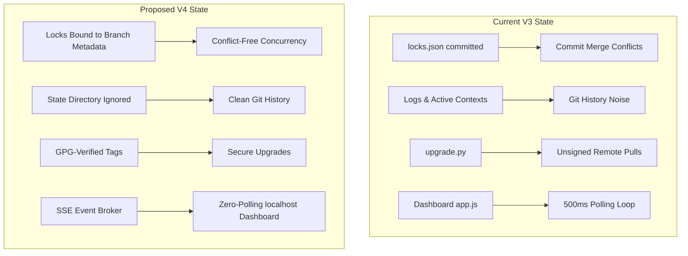

# Architectural Blueprint: Antigravity Agent Core (AAC) V4 Upgrade

This document outlines the proposed architectural updates, key design choices, and implementation roadmap to transition the **Antigravity Agent Core (AAC)** to **V4**. The focus of V4 is **Metadata Isolation, Git-Native Concurrency Locking, Cryptographic Release Validation, and Real-Time Event-Driven Dashboarding**.

---

## 1. Executive Summary & V4 Design Goals

While AAC V3 successfully introduced sandboxing, parallel validations, and mailboxes, it exposed operational friction and vulnerabilities:
1. **Git Tree Pollution**: Committing logs, locks, active contexts, and task lists clutters release tags and complicates pull request reviews.
2. **Commit Conflicts on Locks**: Storing global lock maps in a committed `.agents/locks.json` file creates merge conflicts in concurrent swarm scenarios.
3. **Supply-Chain Vulnerability**: Auto-updates fetch and run remote code branches without cryptographic origin authentication.
4. **Dashboard Polling Overhead**: Monolithic client polling of HTTP endpoints consumes redundant local CPU cycles.

### AAC V4 Core Design Objectives
* **Clean Git Trees**: Move all dynamic, transient operational states to git-ignored structures or local directories.
* **Git-Native Locking**: Transition file locks to Git branch checkout metadata, avoiding state tracking files entirely.
* **Cryptographically Signed Upgrades**: Restrict auto-upgrades to GPG-signed release tags validated against a trusted local keyring.
* **Event-Driven UI**: Replace client polling with Server-Sent Events (SSE) on a strictly bound localhost-only interface.

---

## 2. Proposed V4 Architecture Upgrades

### A. Phase 1: Operational Metadata Isolation & Git Cleanliness
* **State Directory Separation**: Relocate all transient state metadata files (including `active_context.md`, `locks.json` if temporary, and command logs) into a dedicated `.agents/state/` folder.
* **Strict Exclusions**: Append `.agents/state/` to `.gitignore` and `.antigravityignore`. 
* **Remote-First Task Mapping**: Modify `sync_issues` to interact with GitHub/GitLab APIs directly to check status mapping, preventing local issue markdown checklists from requiring repository updates.

### B. Phase 2: Git-Native Concurrency Locking
* **Branch-Bound Module Ownership**: Replace `.agents/locks.json` with branch-level configuration mapping.
* **Mechanics**:
  1. Module ownership is declared strictly within the branch’s active issue file (e.g. `issue_226.md` listing locks).
  2. When an agent or developer attempts to commit changes, the validation gate inspects the checked-out branch name and verifies if it matches the ticket assignee and locked files declared on that branch.
  3. No locks map file is modified or committed during work, eliminating merge conflicts.

### C. Phase 3: Cryptographically Signed Upgrades
* **GPG Tag Verification**: Modify `upgrade.py` to only process signed Git release tags.
* **Mechanics**:
  1. The upgrader fetches remote tags from the tracking repository.
  2. It invokes `git tag -v <tag>` or `gpg --verify` to authenticate the GPG signature against the local trusted developer keyring.
  3. If verification fails (unsigned tag or unauthenticated identity), the upgrade is aborted with a security warning.

### D. Phase 4: Localhost-Only SSE Dashboard
* **Server Hardening**: Reconfigure the HTTP server to bind exclusively to `127.0.0.1`.
* **State Push Engine**:
  1. Introduce a Server-Sent Events (SSE) route (`/api/events`) in the Python web dashboard server.
  2. Implement an internal event queue that broadcasts file lock changes, test completions, and validation stages immediately to connected clients.
  3. Update `app.js` to utilize standard `EventSource` connections, eliminating HTTP polling.

---

## 3. Implementation Roadmap & Phases

| Phase | Milestone | Target Files | Key Verification Criteria |
|---|---|---|---|
| **Phase 1** | Git Cleanliness & Metadata Isolation | `validate.py`, `.gitignore` | Transient files are git-ignored; validation runs cleanly. |
| **Phase 2** | Git-Native Branch Module Locking | `commands/lock.py`, `commands/issue.py` | Commits fail if branch does not own the edited file. |
| **Phase 3** | GPG-Signed Upgrades Integration | `commands/upgrade.py`, `git_api.py` | Upgrade fails on unsigned tags or untrusted signatures. |
| **Phase 4** | Event-Driven Local Dashboard | `commands/dashboard.py`, `app.js` | Zero client polling; UI updates dynamically via SSE. |

---

> [!IMPORTANT]
> All developments must strictly conform to PEP 8 standards and preserve 100% platform-parity between Bash (`.sh`) and PowerShell (`.ps1`) launchers.
