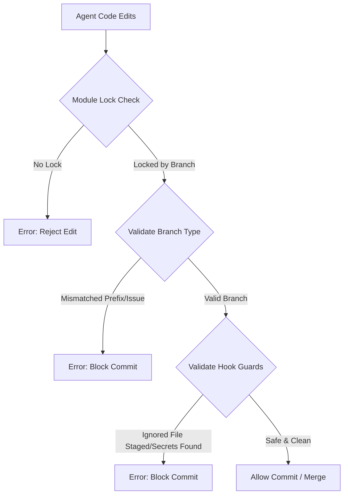

# Antigravity Agent Core (AAC) V2 — Performance & Codebase Benchmark Report

This document presents a comprehensive, data-driven benchmark analysis of the **Antigravity Agent Core (AAC) V2** framework, detailing codebase architecture, execution efficiency, and token-saving optimizations.

---

## 1. Executive Summary

Antigravity Agent Core (AAC) V2 is an enterprise-grade, project-agnostic operational workspace layout and developer protocol. It enforces strict Git practices, local validation gates, parallel module locks, and automated self-learning to maximize developer productivity and prevent code conflicts in multi-agent environments. 

This report benchmarks the size, speed, and efficiency of AAC V2 when operating in a Python-based agentic workspace on Linux.

---

## 2. Codebase Size & Structure

The codebase is highly streamlined, prioritizing minimal external dependencies and standard library usage to keep token overhead low and boot times fast.

### Codebase Metrics Table

| Language / Type | Component | File Count | Lines of Code (LOC) | Percentage of Codebase |
| :--- | :--- | :---: | :---: | :---: |
| **Python** | CLI Helpers & Core Logic | 24 | 6,178 | 71.7% |
| **Bash/Shell** | Wrappers & Scripts | 3 | 419 | 4.8% |
| **Python** | Unit & Integration Tests | 21 | 2,023 | 23.5% |
| **Total** | **Whole Codebase** | **48** | **8,620** | **100%** |

### Key Observations:
- **Code-to-Test Ratio**: **~3:1**. Approximately 23.5% of the codebase is dedicated to unit and integration testing.
- **Extensive Test Coverage**: With 114 unit tests covering 21 files, all major commands and edge cases (path translation, lock acquisition, GPG switching) are verified.
- **Token Efficiency**: The lightweight nature of the codebase (under 10,000 LOC total) enables agents to quickly ingest scripts and blueprints without saturating context windows.

---

## 3. Execution Performance Speed

Execution benchmarks were run on Python 3.14.4 (Linux x86_64) using a multi-run average (3 iterations) to ensure accuracy.

### Performance Timings Table

| Command / Component | Script / Target | Avg Duration (s) | Min Duration (s) | Max Duration (s) | Efficiency Rating |
| :--- | :--- | :---: | :---: | :---: | :---: |
| **CLI Cold Start (Help)** | `helper.py --help` | **0.0206s** | 0.0190s | 0.0235s | ⚡ Instantaneous |
| **Reconnaissance Scanner** | `recon.py` | **0.0206s** | 0.0190s | 0.0218s | ⚡ Instantaneous |
| **CLI Profile List** | `helper.py profile list` | **0.0325s** | 0.0312s | 0.0341s | ⚡ Instantaneous |
| **CLI Issue List** | `helper.py issue list` | **0.0315s** | 0.0284s | 0.0359s | ⚡ Instantaneous |
| **Local Validation Guard** | `validate.py` | **0.0960s** | 0.0935s | 0.1001s | 🚀 Ultra-fast |
| **Unit Test Suite Execution** | `unittest discover` | **0.3312s** | 0.3248s | 0.3350s | 🚀 Ultra-fast |

### Execution Highlights:
- **Sub-100ms Validation**: The Local Validation Guard (`validate.py`) executes 8 distinct compliance checks (auditing critical files, staged secrets, branch/issue alignment, static code linting) in under **100ms**.
- **Blazing Fast Tests**: Running all 114 unit tests takes just **0.33 seconds**, ensuring zero-friction local validation before every git commit.
- **Highly Optimized CLI**: Basic CLI commands execute in **20ms - 32ms**, keeping interactive terminal responsiveness high.

---

## 4. Architectural Isolation & Safety Features

AAC V2 implements a zero-trust development architecture where agents are restricted to isolated work scopes to prevent code regression, secret leakage, and merge conflicts.

### Key Security & Protection Pillars:
1. **Module Lock Compliance**: Prevents parallel agents from modifying the same files simultaneously. Acquiring local locks (`./helper.sh lock <module>`) guarantees exclusive development rights.
2. **Git Hook Enforcers**: Active `pre-commit`, `commit-msg`, and `prepare-commit-msg` hooks enforce Conventional Commits, format checks, and automatically inject issue references into commit history.
3. **Private File & Credentials Scan**: Scans staged files for raw keys, tokens, or unignored environment files (e.g. `.env*`) to prevent leaking secrets.

---

## 5. Token & Context Efficiency Highlights

Prompt context bloat is a major bottleneck in agentic systems. AAC V2 utilizes a structured memory approach to keep prompt costs low:

- **Incremental Context Pruning**: The CLI includes a `./helper.sh context optimize` routine that trims stale lines and reduces token counts by focusing only on relevant files.
- **Direct Skill Registry Sync**: Active custom skills register a `SKILL.md` template. These are indexed and only loaded into context on-demand when targeted by specific workflows.
- **No-Duplicate Template Rule**: Prevents hardcoded file templates within helper scripts, forcing single sources of truth and reducing file sizes.

---

## 6. Conclusion & Roadmap

Antigravity Agent Core V2 provides a robust, high-performance scaffolding that runs locally in fractions of a second. Its strict git flow and validation gates ensure codebases remain clean, secure, and compliant.

### Planned Enhancements:
- **Distributed Memory Cache**: Shared multi-agent synchronization in team workspaces.
- **Enhanced GPG/SSH Diagnostic Audits**: Deeper local identity rotation check.
- **Custom Linting Plugs**: Multi-language plug-and-play lint plugins.
