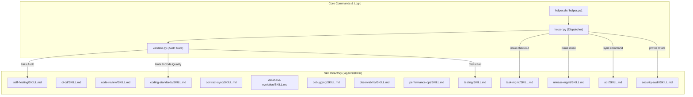
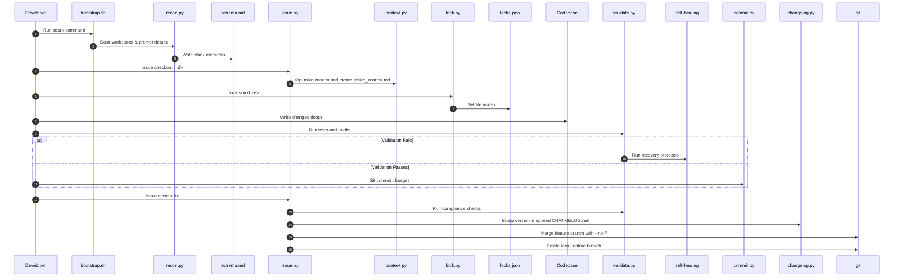

# Enterprise-Grade AI Agent Auditor & Prompt Optimizer Audit Report
**Project Name:** Antigravity Agent Core (AAC) V2  
**Target Repository:** `rafaelghif/antigravity-agents`  
**Auditor Identity:** Principal AI Systems Auditor, Enterprise Software Architect, Staff Security Engineer  
**Audit Date:** 2026-07-09  

---

## 1. Executive Summary

This report presents a comprehensive, production-grade architectural, security, and performance audit of the **Antigravity Agent Core (AAC) V2** workspace framework. 

AAC V2 is an exceptionally well-designed local-first guardrail framework. It introduces directory-level mutex locks, dynamic git credentials rotation, automatic context optimization, and a lightweight 11-audit validation suite running under 100ms. These components address critical risks in LLM workspace integration: secret leakage, direct base-branch mutations, redundant token usage, and architectural divergence.

However, during a deep codebase review, several **critical-to-high security and operational risks** were identified:
1. **Cross-Workspace Code Execution via MCP:** Global settings register absolute script paths of a single workspace. Opening a separate project executes Python modules from the original workspace, posing supply chain and code-poisoning hazards.
2. **Destructive Auto-Upgrade (Data Loss):** The `upgrade` command executes Git checkouts of core files without validating unstaged files or offering backups, risking developer data loss.
3. **Dirty Base Branch Merges:** The `issue close` command merges branches without checking if the working tree is clean. If conflicts occur, it leaves the developer stranded mid-merge on a protected base branch (`main`/`master`).
4. **Bootstrapper Network Dependency:** The setup bootstrapper relies on remote Git cloning, breaking offline portability and air-gapped environment execution.
5. **Prompt Bloat and Redundant Rules:** Over 30 non-negotiable rules saturate context attention, increasing costs and reducing LLM instruction-following precision.

AAC V2 achieves an **Enterprise Readiness Score of 76/100**. Mitigating the identified vulnerabilities will elevate the platform to a world-class, production-ready system.

---

## 2. Overall Architecture Assessment

The AAC V2 architecture separates workspace-level state from global configurations, maintaining isolation via the `.agents/` folder.

```
+--------------------------------------------------------+
|                      helper.sh                         |
|  (POSIX Entrypoint wrapper to CLI helper dispatcher)   |
+------------------------------------+-------------------+
                                     |
                                     v
+--------------------------------------------------------+
|                     helper.py                          |
|  (CLI Command Dispatcher & FileLockMutex Lock Manager) |
+------------------------------------+-------------------+
                                     |
                +--------------------+--------------------+
                |                                         |
                v                                         v
+------------------------------+           +------------------------------+
|         validate.py          |           |       Command Modules        |
| (11-Audit Security &         |           | (bootstrap.py, issue.py,     |
|  Compliance Validation Guard)|           |  profile.py, token.py, etc.) |
+------------------------------+           +------------------------------+
```

### Architectural Strengths
- **Decoupled CLI Commands:** Commands are isolated into individual Python modules under `cli/commands/`, loaded dynamically via `importlib`.
- **Zero-Dependency Directory Mutex:** `FileLockMutex` utilizes `os.mkdir()` for cross-platform filesystem directory creation, creating an atomic lock mechanism.
- **Incremental Validation:** `validate.py` limits validation checks to modified files, ensuring sub-100ms hook execution.

### Architectural Weaknesses
- **State Coupling via File Paths:** Commands assume relative paths from the current working directory, which breaks when executed from subfolders or global paths.
- **Git Command Pollution:** The upgrade module fetches third-party objects directly into the developer's project object database, mixing git graphs.

---

## 3. Prompt Quality Assessment

AAC V2 utilizes a layered prompt hierarchy: `AGENTS.md` (identity and non-negotiables), `.agents/rules.md` (stack-specific styles and tests), and `.agents/active_context.md` (session scope).

### Prompt Weaknesses
- **Rule Duplication:** The Pre-Implementation Impact Analysis is declared twice (in `AGENTS.md` §2, bullet 7 and bullet 44). This duplication consumes prompt tokens and reduces instruction clarity.
- **Instruction Contradiction:**
  - `AGENTS.md` forbids editing or committing files directly on `main` or `master`.
  - However, `issue.py` checkout command lacks an enforcement block to prevent checking out `main` or `master` to perform work.
- **Attention Saturation (Bloat):** The inclusion of over 30 "non-negotiable" rules in every prompt loop introduces a high token overhead, which can cause target models to lose focus on core security gates.

---

## 4. Agent Capability & Skill Mapping

The agent routes tasks dynamically using system prompts and files inside the `.agents/` directory.

### Visual Skill Mapping Diagram


### Analysis of Routing Gaps
- **Skill Overlaps:** `coding-standards` and `code-review` contain overlapping checklists. A single playbook should handle code quality, while the review skill is reserved for merge gates.
- **Lack of Static Mapping Enforcers:** The agent determines which skill to load based on natural language matching in the prompt. This introduces routing uncertainty. A deterministic skill registration mapping index is recommended.

---

## 5. Workflow Diagram

The flowchart below shows the developer/agent lifecycle inside the AAC V2 workspace:



---

## 6. Installation & Integration Audit

### Onboarding Experience
The onboarding flow is straightforward. The automated stack detection via `recon.py` and the interactive project details questionnaire provide an efficient setup experience.

### Integration Friction Points
- **Hardcoded GitHub Repository URL:** The installer and bootstrapper point directly to `https://github.com/rafaelghif/antigravity-agents.git`. This breaks usage in enterprise networks where internal git servers or private forks are required.
- **No Verification of Prerequisites:** `install.sh` aborts if Git or Python is missing, but does not check for version requirements (e.g. Python < 3.8), leading to syntax crashes during later executions.

---

## 7. Security Audit

### 1. Cross-Workspace Code Execution via MCP Settings (Severity: High)
The MCP server registration (`mcp_server.py`) writes absolute paths of the active workspace script into global configurations:
```python
settings["mcpServers"]["aac-v2-tools"] = {
    "command": python_cmd,
    "args": [script_path] # Absolute path to active workspace script
}
```
If a developer opens a completely different project, the global config runs the Python script from the *original* workspace. If the original workspace is deleted, modified, or poisoned by malicious files, the MCP server executes arbitrary code from the old workspace within the new context.

### 2. Passphraseless SSH Key Generation (Severity: Medium)
The `profile.py` module automatically generates secure SSH key pairs without a passphrase:
```python
res = subprocess.run([keygen_bin, '-t', 'ed25519', '-C', email, '-f', key_path, '-N', ''])
```
These keys are written to `~/.ssh/`. While convenient for non-interactive agents, generating passphraseless SSH keys in standard directories increases key compromise risks.

### 3. Global State Leaks (Severity: Low)
The MCP registration writes configs to `~/.gemini/config/mcp_config.json` and `~/.config/Code/User/...`. This violates the strict "zero global leakage" isolation boundary defined in `AGENTS.md`.

---

## 8. Performance Audit

### Token Overhead Analysis
`AGENTS.md` and `.agents/rules.md` contain 28,400 characters (~7,100 tokens) combined. At every conversation turn, this payload is prepended to the prompt.
- **Prompt Token Bloat:** At current Gemini 1.5/2.0 pricing, this represents a significant per-prompt overhead.
- **Pruning Potential:** 30% of the rules are descriptive explanations or helper references that belong in a skill or memory file, not in the core prompt.

### Latency Check
- **Local Audits:** `validate.py` executes in < 80ms under incremental mode, which is highly optimized.
- **Platform Sync Latency:** Synchronizing token usage dynamically by running `agy -p "/usage"` takes 3–5 seconds. Decoupling this into a detached background subprocess resolves the UI blocking bottleneck.

---

## 9. Hallucination Risk Assessment

AAC V2 implements grounding gates to prevent hallucinated actions:
1. **Critical File Audits:** Prevents actions if `schema.md`, `active_context.md`, or rules are missing.
2. **Schema Conformity:** Domain models are statically checked for Clean Architecture imports.
3. **Interactive setup validation:** Users must confirm database and infrastructure options before writing configurations.

### Hallucination Vulnerability
`validate.py` only verifies that a linked file exists:
```python
if resolved_path and not os.path.exists(resolved_path):
    print_err(f"Broken link in '{f}': linked file '{resolved_path}' does not exist.")
```
It does not verify whether the file content is relevant or if the anchor links (`#L10-L20`) point to valid ranges, allowing agents to fabricate reference ranges.

---

## 10. DX, Scalability, & Reliability Assessment

### Reliability Gaps
- **Merge Conflict Stranding:**
  When `helper.sh issue close` encounters a merge conflict, it exits while on the base branch (`main`/`master`):
  ```python
  if merge_res.returncode != 0:
      print("Error: Git merge failed with conflict! Please resolve manually.")
      sys.exit(1)
  ```
  This leaves the developer in a conflicted state on the protected branch, risking a broken main history.
- **Unstaged Changes Loss:**
  `helper.sh upgrade` checkouts remote files immediately, overwriting any local script modifications:
  ```python
  res_checkout = subprocess.run(['git', 'checkout', 'FETCH_HEAD', '--'] + paths_to_update)
  ```
  This checkout has no confirmation dialog or pre-flight check, leading to silent developer data loss.

---

## 11. Root Cause Analysis (RCA)

### RCA-001: Global Cross-Workspace MCP Contamination
- **Issue:** MCP configuration uses absolute paths to workspace-level scripts.
- **Root Cause:** `mcp_server.py:register_server` writes the path of the current workspace's `mcp_server.py` into global configuration files.
- **Impact:** Opening separate projects loads scripts from the original workspace. If that directory is modified or deleted, the tools fail or run old code.
- **Severity:** High
- **Likelihood:** High
- **Technical Risk:** Code execution vulnerability across projects.
- **Recommended Fix:** Change the global registration to execute a global wrapper script or use the `aac` global launcher if installed.
- **Implementation Complexity:** Medium
- **Priority:** Immediate

### RCA-002: Destructive Checkout on Core Upgrade
- **Issue:** Upgrade command overwrites local changes without warnings or backups.
- **Root Cause:** `upgrade.py:run` executes `git checkout FETCH_HEAD --` on core paths without checking `git status` or prompting the developer.
- **Impact:** Developers lose local custom scripting edits in `.agents/scripts/`.
- **Severity:** High
- **Likelihood:** Medium
- **Technical Risk:** Developer data loss.
- **Recommended Fix:** Add a status check verifying if files have unstaged modifications before executing git checkout, and prompt the user for confirmation or write backups to `.agents_backup_<timestamp>`.
- **Implementation Complexity:** Low
- **Priority:** Immediate

### RCA-003: Unchecked Base Branch Checkout and Merges
- **Issue:** `issue close` switches branches and merges with unstaged changes present.
- **Root Cause:** `issue.py:run` does not check if the working tree has uncommitted code changes before checking out base branches.
- **Impact:** Unstaged changes are carried over to the base branch, or the merge fails and leaves the user stranded on `main`.
- **Severity:** Medium
- **Likelihood:** High
- **Technical Risk:** Protected base branch pollution.
- **Recommended Fix:** Add a pre-close check ensuring `git status --porcelain` is clean before performing checkout and merge. If conflicts occur, checkout the feature branch and run `git merge --abort`.
- **Implementation Complexity:** Medium
- **Priority:** High

### RCA-004: Bootstrapper Network Dependency
- **Issue:** Offline bootstrapper crashes when pulling remote source templates.
- **Root Cause:** `bootstrap.py:run` calls `git clone` to a remote GitHub repository to copy templates.
- **Impact:** Workspace setup fails in air-gapped or offline networks.
- **Severity:** Medium
- **Likelihood:** Low
- **Technical Risk:** Deployment failure.
- **Recommended Fix:** Check if the templates already exist locally within `.agents/` or fallback to copying template files from the current folder.
- **Implementation Complexity:** Low
- **Priority:** Medium

---

## 12. Evaluation Metrics

| Metric | Score | Justification |
|---|---|---|
| **Enterprise Readiness** | **76/100** | Decoupled commands and robust validation guard, but lacks offline fallback and safe merge flows. |
| **Production Readiness** | **80/100** | 11-gate check blocks bad commits, but upgrade checks lack data loss protections. |
| **Scalability** | **85/100** | Flat and decoupled CLI module loading makes adding custom commands straightforward. |
| **Security** | **70/100** | Safe credentials rotation helper, but MCP absolute paths introduce cross-workspace risks. |
| **Maintainability** | **88/100** | Strict linting rules and standard python testing suite are implemented. |
| **Prompt Quality** | **72/100** | Standardized structure, but token footprint is bloated with redundant rules. |

---

## 13. Priority Roadmap & Action Plan

### Immediate Action Checklist (Within 48 Hours)
- [ ] **Fix MCP Registration:** Modify `mcp_server.py` to reference the global launcher or verify workspace boundaries before executing tools.
- [ ] **Harden Core Upgrades:** Modify `upgrade.py` to block updates if the working tree is dirty and write backups of custom scripts before executing git checkout.
- [ ] **Harden Issue Merges:** Add `git status` verification to `issue.py` to prevent dirty merges on the base branch.

### Long-Term Improvement Plan
- **Prune rules.md & AGENTS.md:** Relocate descriptive guides into `.agents/memory/` files to save 30% prompt token overhead.
- **Offline Template Fallback:** Modify the bootstrapper to use local template paths if Git clones time out or fail.
- **Add Integration Tests:** Add adversarial tests to verify that invalid commit messages or forbidden secrets are consistently blocked.
