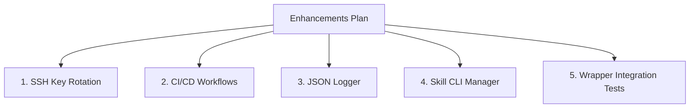

# Implementation Plan: Enhancing AAC V2 Core (Points 1–5)

This plan outlines the design, architecture, and step-by-step tasks to implement the five requested enhancements for the Antigravity Agent Core (AAC) V2.



---

## 1. SSH Key Rotation per Developer Profile

### Objective
Enhance the profile manager (`./helper.sh profile`) to dynamically rotate SSH keys used by Git, avoiding permissions issues when pushing to different GitHub/GitLab accounts (e.g., personal vs. corporate).

### Design & Changes
*   **Schema Update**: Extend `.agents/schema.md` and `.agents/git_profiles.example` to support `ssh_key_path`.
*   **Git Config Hook**: Modify [profile.py](file:///home/rafaelghifari/Muraghi/Project/antigravity-agent/.agents/scripts/cli/commands/profile.py) to configure Git's local `core.sshCommand` on switch:
    ```bash
    git config local core.sshCommand "ssh -i /absolute/path/to/key -o IdentitiesOnly=yes"
    ```
*   **Validation**: Update [validate.py](file:///home/rafaelghifari/Muraghi/Project/antigravity-agent/.agents/scripts/validate.py) to verify that if `ssh_key_path` is specified, the path is absolute, exists, and has safe permissions.

---

## 2. Automated CI/CD Workflow Templates

### Objective
Enable out-of-the-box CI/CD validation by automatically generating pipeline configuration files during project bootstrapping.

### Design & Changes
*   **Template Creation**: Add `.agents/templates/ci_github_workflow.yml.template` containing a GitHub Actions workflow that installs Python, checks out the codebase, and runs `./helper.sh validate`.
*   **Scaffolding Hook**: Update [bootstrap.py](file:///home/rafaelghifari/Muraghi/Project/antigravity-agent/.agents/scripts/cli/commands/bootstrap.py) to copy this template into the target project's `.github/workflows/verify.yml` automatically.

---

## 3. Structured Observability Logs (JSON CLI Logging)

### Objective
Ensure all CLI executions are audited and logged in a machine-readable JSON format, enabling diagnostic retrieval when the agent runs commands programmatically.

### Design & Changes
*   **Centralized Logger**: Integrate a JSON logger in [helper.py](file:///home/rafaelghifari/Muraghi/Project/antigravity-agent/.agents/scripts/cli/helper.py) that appends events to `.agents/logs/cli.log`.
*   **Entry Format**:
    ```json
    {
      "timestamp": "2026-06-27T20:45:00Z",
      "command": "issue",
      "args": ["checkout", "issue-071"],
      "status": "success",
      "duration_ms": 120,
      "error": null
    }
    ```
*   **Ignored Folder**: Add `.agents/logs/` to `.gitignore` and `.antigravityignore` template.

---

## 4. Skill Registry CLI Manager

### Objective
Introduce a dedicated CLI command (`./helper.sh skill`) to dynamically install, list, update, and remove Custom Agent Skills in the workspace.

### Design & Changes
*   **New CLI command**: Implement `cli/commands/skill.py` with:
    *   `list`: Lists all installed skills and their descriptions.
    *   `install <source>`: Copies a skill directory (from a local path or a Git URL) into `.agents/skills/<name>` and automatically runs `./helper.sh sync`.
    *   `uninstall <name>`: Deletes a skill folder and runs sync to clean up `AGENTS.md`.

---

## 5. Wrapper Integration Parity Testing

### Objective
Ensure wrapper scripts (`helper.sh`, `helper.ps1`, `install.sh`, `install.ps1`) continue to function identical on both Unix and Windows setups.

### Design & Changes
*   **Integration Test Suite**: Create `.agents/tests/test_integration_wrappers.py` containing integration tests that invoke the shell and PowerShell scripts within simulated mock contexts to verify:
    *   Dynamic relative-directory execution.
    *   Accurate Python 3 resolution.
    *   Error output handling when Python is missing.

---

## Proposed Tasks & Milestones
- [ ] **Milestone 1**: Implement SSH key rotation and update validation guard (Point 1).
- [ ] **Milestone 2**: Create CI/CD workflow template and integrate bootstrapping scaffolding (Point 2).
- [ ] **Milestone 3**: Build structured JSON logger in the CLI wrapper (Point 3).
- [ ] **Milestone 4**: Implement the `skill` manager command and integrate with sync registry (Point 4).
- [ ] **Milestone 5**: Implement integration test suites for wrappers, verify all tests, and merge (Point 5).
