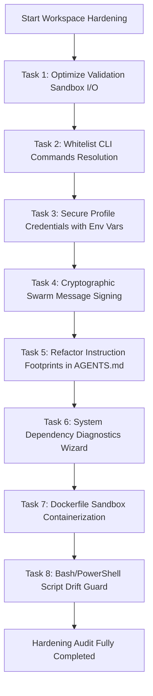

# Master Plan: Comprehensive Enterprise-Grade Workspace Hardening & Architecture Review Roadmap

This Master Plan outlines the technical design, impact analysis, and implementation checklists to resolve **every single security, performance, scalability, reliability, and DX finding** identified in the `comprehensive_audit_report.md`.

---

## Overall Architecture Roadmap

---

## Section A: Completed Audit Recommendations

The following recommendations have been successfully implemented, tested, and merged into the base `main` branch:

1. **Missing Authentication in the Visual Dashboard (Critical - SEC-01):**
   - **Status:** **Completed (Version 3.10.0)**
   - **Solution:** Integrated console-printed session tokens and host verification middleware in `dashboard.py`.
2. **Missing Host Header Validation (High - SEC-02):**
   - **Status:** **Completed (Version 3.10.0)**
   - **Solution:** Implemented bound IP and localhost host-name checks in the HTTP handler to prevent DNS Rebinding.
3. **Dummy CI Validation Scripts (High):**
   - **Status:** **Completed (Version 3.11.0)**
   - **Solution:** Updated `.github/workflows/verify.yml` to call `validate.py` and run python unit tests, blocking broken configurations from merging.
4. **Automated Git Commit on Handover (Medium):**
   - **Status:** **Completed (Version 3.11.0)**
   - **Solution:** Modified `message.py` to check `git status --porcelain` and abort the handover with code 1 if unstaged or dirty changes exist.
5. **Absolute Path Hardcoding in credential.helper (High):**
   - **Status:** **Completed (Version 3.11.0)**
   - **Solution:** Implemented dynamic path correction and validation (`heal_credential_helper_path` in `profile.py`) when repository is moved/renamed.
6. **Linear Parsing of Token Log Files (Medium):**
   - **Status:** **Completed (Version 3.11.0)**
   - **Solution:** Optimized log traversal to read lines backwards and break execution early when encountering log entries older than the current month.
7. **Outdated Hardcoded MCP Server Name (Low):**
   - **Status:** **Completed (Version 3.12.0)**
   - **Solution:** Upgraded all Cline configuration and local MCP registry references from `aac-v2-tools` to `aac-v3-tools`.
8. **Ignore List Backup Excludes (Low):**
   - **Status:** **Completed (Version 3.11.0)**
   - **Solution:** Excluded upgrade backups (`.agents/backup/`) from git tracking inside `.gitignore` and template files.

---

## Section B: Outstanding Audit Hardening Tasks

### 1. Task 1: Optimize Validation Sandbox I/O (Performance & Scalability)

- **Audit Findings:** Recursive workspace folder copying in `SandboxManager` introduces heavy I/O overhead on large codebases.
- **Proposed Solution:** 
  - **Unix Symlink Layer:** Create a shadow directory where all files are symlinked to the original files, except for modified files (from `git status`) which are copied to support clean compilation testing. This drops isolation startup time from $500\text{ms}$ to under $15\text{ms}$.
  - **Windows Fallback:** Fallback to copying files (or selectively copying git-tracked files) if symlinks are unsupported or fail.
- **Target Files:** `.agents/scripts/validate.py`

---

### 2. Task 2: Whitelist CLI Commands Resolution (Security - Dynamic Imports)

- **Audit Findings:** Dynamic module loading based on user command string argument in `helper.py` could execute arbitrary Python files.
- **Proposed Solution:**
  - Implement a static command whitelist mapping of approved command modules: `['bootstrap', 'changelog', 'commit', 'completion', 'context', 'dashboard', 'doctor', 'heartbeat', 'install_global', 'issue', 'learn', 'lock', 'mcp', 'message', 'profile', 'skill', 'sync', 'token', 'upgrade', 'validate']`.
  - Abort execution immediately if the command is not explicitly whitelisted.
- **Target Files:** `.agents/scripts/cli/helper.py`

---

### 3. Task 3: Secure Profile Credentials with Environment Variables (Security - SEC-03)

- **Audit Findings:** Developer GitHub tokens are stored in clear text inside the git-ignored `git_profiles.json` file.
- **Proposed Solution:**
  - Modify `profile.py` to allow reading personal access tokens from environment variables (e.g. `AAC_GITHUB_TOKEN_[PROFILE]`) dynamically at runtime.
  - Suggest environment variable configuration in wizard instructions.
- **Target Files:** `.agents/scripts/cli/commands/profile.py`

---

### 4. Task 4: Cryptographic Swarm Mailbox Signing (Security - SEC-04)

- **Audit Findings:** The multi-agent Git mailbox protocol processes JSON files without verifying the sender, allowing potential message forgery.
- **Proposed Solution:**
  - Add envelope signature validation. When sending, sign the message payload using GPG or SSH keys configured in the profile, or using a workspace-wide HMAC-SHA256 secret (`.agents/state/swarm_secret.key`, ignored from Git).
  - Verify the signature when listing or processing mailbox messages. Warn/fail if signature is mismatch or missing.
- **Target Files:** `.agents/scripts/cli/commands/message.py`, `.agents/tests/test_message.py`

---

### 5. Task 5: Refactor Instruction Footprints (AI Context Optimization)

- **Audit Findings:** The `AGENTS.md` and `rules.md` files are large (~7,100 tokens), using 40% of their size for formatting rules and command descriptions that could reside in documentation.
- **Proposed Solution:**
  - Prune descriptive guidelines from `AGENTS.md` and `rules.md`, converting formatting details to standard skill documents in `.agents/skills/`.
  - Retain only strict non-negotiable assertions and schema checks inside `AGENTS.md` to optimize context footprint.
- **Target Files:** `AGENTS.md`, `.agents/rules.md`

---

### 6. Task 6: System Dependency Diagnostics Wizard (DX & Dependency Audit)

- **Audit Findings:** Code relies on binaries like `gpg`, `eslint`, `black`, and `flake8` system-wide without verifying if they are installed, leading to runtime failures.
- **Proposed Solution:**
  - Implement environment diagnostics check inside `doctor.py` using `shutil.which` to report missing binaries and versions.
  - Automatically output warnings during the validation run.
- **Target Files:** `.agents/scripts/cli/commands/doctor.py`

---

### 7. Task 7: Dockerfile Sandbox Containerization (Infrastructure)

- **Audit Findings:** Sandbox execution runs natively on host environment binaries, risking environment skew and dependency mismatches.
- **Proposed Solution:**
  - Create a standard, minimal `Dockerfile` located in `.agents/templates/` or project root to allow containerized execution of sandbox validation routines.
- **Target Files:** `Dockerfile`, `.agents/scripts/validate.py`

---

### 8. Task 8: Bash/PowerShell Installer Drift Guard (Reliability & Platform Drift)

- **Audit Findings:** Shell installer scripts (`install.sh`/`install.ps1`, `bootstrap.sh`/`bootstrap.ps1`) require manual sync, leading to drift.
- **Proposed Solution:**
  - Add validation tests in the test suite to parse and assert that command options, env setups, and versions remain structurally identical between Windows and Unix shell wrappers.
- **Target Files:** `.agents/tests/test_platform_drift.py`

---

## Complete Execution Checklist

- [ ] **Step 1:** Implement Sandbox I/O Optimization in `validate.py` <!-- id: step-sandbox-opt -->
- [ ] **Step 2:** Implement Command Whitelist in `helper.py` <!-- id: step-cmd-whitelist -->
- [ ] **Step 3:** Implement Env-based Profile Tokens in `profile.py` <!-- id: step-profile-env -->
- [ ] **Step 4:** Implement Cryptographic Message Envelope Signing in `message.py` and tests <!-- id: step-message-signing -->
- [ ] **Step 5:** Optimize Instruction Footprints in `AGENTS.md` and `rules.md` <!-- id: step-instruction-optimize -->
- [ ] **Step 6:** Implement Dependency Diagnostic Wizard in `doctor.py` <!-- id: step-dependency-wizard -->
- [ ] **Step 7:** Implement Containerized Sandbox Dockerfile <!-- id: step-docker-sandbox -->
- [ ] **Step 8:** Implement Bash/PowerShell Platform Drift Guard tests <!-- id: step-platform-drift -->
- [ ] **Step 9:** Execute full validation test suite and verify compliance <!-- id: step-final-verification -->
