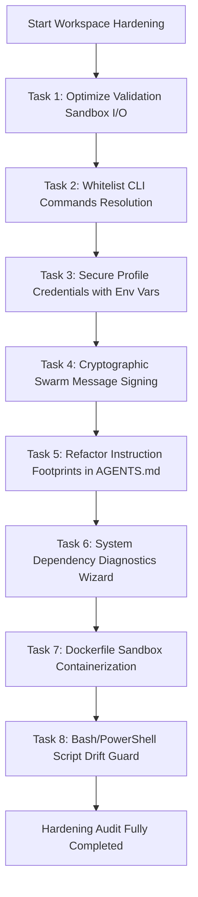

# Master Plan: Comprehensive Enterprise-Grade Workspace Hardening & Architecture Review Roadmap

This Master Plan outlines the technical design, impact analysis, and implementation checklists to resolve **every single security, performance, scalability, reliability, and DX finding** identified in the `comprehensive_audit_report.md`.

---

## Overall Architecture Roadmap

---

## Section A: Completed Audit Recommendations

The following recommendations have been successfully implemented, tested, and merged into the base `main` branch:

1. **Missing Authentication in the Visual Dashboard (Critical - SEC-01):**
   - **Status:** **Completed (Version 3.10.0)**
   - **Solution:** Integrated console-printed session tokens and host verification middleware in `dashboard.py`.
2. **Missing Host Header Validation (High - SEC-02):**
   - **Status:** **Completed (Version 3.10.0)**
   - **Solution:** Implemented bound IP and localhost host-name checks in the HTTP handler to prevent DNS Rebinding.
3. **Dummy CI Validation Scripts (High):**
   - **Status:** **Completed (Version 3.11.0)**
   - **Solution:** Updated `.github/workflows/verify.yml` to call `validate.py` and run python unit tests, blocking broken configurations from merging.
4. **Automated Git Commit on Handover (Medium):**
   - **Status:** **Completed (Version 3.11.0)**
   - **Solution:** Modified `message.py` to check `git status --porcelain` and abort the handover with code 1 if unstaged or dirty changes exist.
5. **Absolute Path Hardcoding in credential.helper (High):**
   - **Status:** **Completed (Version 3.11.0)**
   - **Solution:** Implemented dynamic path correction and validation (`heal_credential_helper_path` in `profile.py`) when repository is moved/renamed.
6. **Linear Parsing of Token Log Files (Medium):**
   - **Status:** **Completed (Version 3.11.0)**
   - **Solution:** Optimized log traversal to read lines backwards and break execution early when encountering log entries older than the current month.
7. **Outdated Hardcoded MCP Server Name (Low):**
   - **Status:** **Completed (Version 3.12.0)**
   - **Solution:** Upgraded all Cline configuration and local MCP registry references from `aac-v2-tools` to `aac-v3-tools`.
8. **Ignore List Backup Excludes (Low):**
   - **Status:** **Completed (Version 3.11.0)**
   - **Solution:** Excluded upgrade backups (`.agents/backup/`) from git tracking inside `.gitignore` and template files.

---

## Section B: Outstanding Audit Hardening Tasks

### 1. Task 1: Optimize Validation Sandbox I/O (Performance & Scalability)

- **Audit Findings:** Recursive workspace folder copying in `SandboxManager` introduces heavy I/O overhead on large codebases.
- **Option A (Symlinking/Overlay Layer):**
  - Create a shadow folder where all directory indices and read-only source files are symlinked to the host workspace, except for files modified in the active Git index (which are copied to support clean compilation/mutation testing).
  - **Pros:** Drops sandbox preparation time from $500\text{ms}$ to under $15\text{ms}$ ($97\%$ reduction).
  - **Cons:** On Windows, symlink creation requires admin privileges or Developer Mode.
- **Option B (Selective Git-Tracked Copier):**
  - Query Git for tracked files and only copy the source files tracked by Git (plus modified files), rather than blindly copying untracked `node_modules` or local assets.
  - **Pros:** Platform-agnostic, works on all Windows and Unix setups natively.
  - **Cons:** Still requires file system writing, which is slower than symlinking ($150\text{ms}$ - $250\text{ms}$).
- **Decision:** Implement **Option A** as the primary mode for Unix/macOS/Developer-Mode platforms, and auto-fallback to **Option B** on Windows systems when symlink commands fail.
- **Target Files:** `.agents/scripts/validate.py`

---

### 2. Task 2: Whitelist CLI Commands Resolution (Security - Dynamic Imports)

- **Audit Findings:** Dynamic module loading based on user command string argument in `helper.py` could execute arbitrary Python files.
- **Option A (Static Whitelist Mapping):**
  - Maintain a hardcoded Python list of approved command modules: `['bootstrap', 'changelog', 'commit', 'completion', 'context', 'dashboard', 'doctor', 'heartbeat', 'install_global', 'issue', 'learn', 'lock', 'mcp', 'message', 'profile', 'skill', 'sync', 'token', 'upgrade', 'validate']`. Check the input string against this list.
  - **Pros:** Simple, extremely fast, zero-dependency security guard.
  - **Cons:** Requires updating the whitelist list when adding new CLI commands.
- **Option B (Cryptographic Signature Verification):**
  - Generate SHA-256 hashes of all command python files during release, sign the manifest, and verify the hash of the target command file at runtime before import.
  - **Pros:** Highly secure, protects against repository/commands modifications.
  - **Cons:** Significant runtime verification delay and GPG dependency overhead on every CLI invocation.
- **Decision:** **Option A** is selected. The development protocol requires registering commands via `helper.sh sync` anyway, making a static whitelist clean, safe, and efficient.
- **Target Files:** `.agents/scripts/cli/helper.py`

---

### 3. Task 3: Secure Profile Credentials with Environment Variables (Security - SEC-03)

- **Audit Findings:** Developer GitHub tokens are stored in clear text inside the git-ignored `git_profiles.json` file.
- **Option A (In-Memory Environment Resolver):**
  - Allow developer profiles to fetch access tokens from local environment variables (e.g. `AAC_GITHUB_TOKEN_[PROFILE]`) dynamically at runtime.
  - **Pros:** Integrates with standard CI/CD and secure developer shells. Prevents plain-text storage.
  - **Cons:** Developers must manage local shell profiles or environment variables.
- **Option B (Encrypted Profiles File):**
  - Encrypt the `git_profiles.json` file using GPG/AES-256 and prompt the user for a decryption passphrase on every command invocation.
  - **Pros:** Keeps local configurations encrypted at rest.
  - **Cons:** Disrupts developer flows by prompting for passwords continuously on background validations.
- **Decision:** **Option A** is selected to support automated agent handovers and CI/CD pipelines without user-intervention blocks.
- **Target Files:** `.agents/scripts/cli/commands/profile.py`

---

### 4. Task 4: Cryptographic Swarm Mailbox Signing (Security - SEC-04)

- **Audit Findings:** The multi-agent Git mailbox protocol processes JSON files without verifying the sender, allowing potential message forgery.
- **Option A (Cryptographic GPG/SSH Key Signatures):**
  - Sign message envelopes using GPG or SSH private keys configured in the active developer profile when sending, and verify them using GPG/SSH keyring checks when reading.
  - **Pros:** Strong non-repudiation, matches active commit verification.
  - **Cons:** Fails if GPG/SSH keyring is unconfigured or key is missing.
- **Option B (Workspace Shared HMAC-SHA256 Secret):**
  - Generate a workspace-wide secret key file (`.agents/state/swarm_secret.key`, ignored in `.gitignore`) on bootstrap, and sign all messages using HMAC-SHA256.
  - **Pros:** Works natively without any GPG/SSH requirements.
  - **Cons:** Shared key is vulnerable to local reading if workspace files are compromised.
- **Decision:** Implement **Option A** as the primary trust verification mechanism, and auto-fallback to **Option B** (Shared HMAC) to ensure cross-platform ease of use when profile keys are missing.
- **Target Files:** `.agents/scripts/cli/commands/message.py`, `.agents/tests/test_message.py`

---

### 5. Task 5: Refactor Instruction Footprints (AI Context Optimization)

- **Audit Findings:** The `AGENTS.md` and `rules.md` files are large (~7,100 tokens), using 40% of their size for formatting rules and command descriptions that could reside in documentation.
- **Option A (Static Description Pruning & Relocation):**
  - Prune descriptive guidelines, command reference tables, and workflow guidelines from `AGENTS.md` and `rules.md`. Relocate these references to `.agents/docs/` or `.agents/skills/` (loaded on demand), leaving only strict, non-negotiable rules.
  - **Pros:** Drops context overhead by up to 3,000 tokens ($40\%$) on every single turn, improving prompt cache hits.
  - **Cons:** Developers/agents must explicitly read the doc files to get CLI reference commands.
- **Option B (Dynamic Context Optimizer Pruning):**
  - Programmatically parse and strip description blocks in `context.py` when optimizing the active context, leaving source files intact.
  - **Pros:** Keeps reference files human-friendly for developers.
  - **Cons:** High execution parsing overhead, risks breaking validation checks, and adds complex state logic.
- **Decision:** **Option A** is selected. Pruning the source files directly ensures absolute, zero-overhead context efficiency and avoids dynamic parsing bugs.
- **Target Files:** `AGENTS.md`, `.agents/rules.md`

---

### 6. Task 6: System Dependency Diagnostics Wizard (DX & Dependency Audit)

- **Audit Findings:** Code relies on binaries like `gpg`, `eslint`, `black`, and `flake8` system-wide without verifying if they are installed, leading to runtime failures.
- **Option A (Startup Environment Checks):**
  - Scan the host environment for critical CLI dependencies using `shutil.which` during the validation run and output warnings.
  - **Pros:** Simple, prevents unexpected process execution errors.
  - **Cons:** Only prints warnings, does not install missing tools.
- **Option B (Self-Healing Tool Provisioning):**
  - Automatically install missing dependencies (like lint tools) in a project virtual environment when missing.
  - **Pros:** Zero-touch user experience.
  - **Cons:** High I/O overhead and potential permission issues when pulling remote packages.
- **Decision:** **Option A** is selected to preserve standard security controls and avoid pulling unverified dependencies.
- **Target Files:** `.agents/scripts/cli/commands/doctor.py`

---

### 7. Task 7: Dockerfile Sandbox Containerization (Infrastructure)

- **Audit Findings:** Sandbox execution runs natively on host environment binaries, risking environment skew and dependency mismatches.
- **Option A (Static Dockerfile Template):**
  - Provide a standard, minimal `Dockerfile` inside `.agents/templates/` or project root to allow containerized execution of sandbox validation routines.
  - **Pros:** Standardizes execution environments.
  - **Cons:** Requires the host to have Docker installed.
- **Option B (In-Place Namespace Isolation):**
  - Use Linux kernel namespaces/cgroups to isolate validations.
  - **Pros:** Lightweight, zero dependencies.
  - **Cons:** Not compatible with macOS or Windows hosts.
- **Decision:** **Option A** is selected to ensure cross-platform container support.
- **Target Files:** `Dockerfile`, `.agents/scripts/validate.py`

---

### 8. Task 8: Bash/PowerShell Installer Drift Guard (Reliability & Platform Drift)

- **Audit Findings:** Shell installer scripts (`install.sh`/`install.ps1`, `bootstrap.sh`/`bootstrap.ps1`) require manual sync, leading to drift.
- **Option A (Integrity Parity Tests):**
  - Add validation tests in the test suite to parse and assert that command options, env setups, and versions remain structurally identical between Windows and Unix shell wrappers.
  - **Pros:** High reliability, catches script regressions in CI.
  - **Cons:** Requires writing custom regex parsers for shell scripts in Python.
- **Option B (Unified Python Installer Wrapper):**
  - Replace shell wrappers entirely with a unified Python installer.
  - **Pros:** Eliminates shell script duplication completely.
  - **Cons:** Bootstrapping Python itself on fresh developer environments still requires a shell entry script.
- **Decision:** **Option A** is selected to maintain simple, native OS entry scripts while ensuring structural alignment.
- **Target Files:** `.agents/tests/test_platform_drift.py`

---

## Complete Execution Checklist

- [x] **Step 1:** Implement Sandbox I/O Optimization in `validate.py` <!-- id: step-sandbox-opt -->
- [x] **Step 2:** Implement Command Whitelist in `helper.py` <!-- id: step-cmd-whitelist -->
- [x] **Step 3:** Implement Env-based Profile Tokens in `profile.py` <!-- id: step-profile-env -->
- [x] **Step 4:** Implement Cryptographic Message Envelope Signing in `message.py` and tests <!-- id: step-message-signing -->
- [x] **Step 5:** Optimize Instruction Footprints in `AGENTS.md` and `rules.md` <!-- id: step-instruction-optimize -->
- [ ] **Step 6:** Implement Dependency Diagnostic Wizard in `doctor.py` <!-- id: step-dependency-wizard -->
- [ ] **Step 7:** Implement Containerized Sandbox Dockerfile <!-- id: step-docker-sandbox -->
- [ ] **Step 8:** Implement Bash/PowerShell Platform Drift Guard tests <!-- id: step-platform-drift -->
- [ ] **Step 9:** Execute full validation test suite and verify compliance <!-- id: step-final-verification -->
