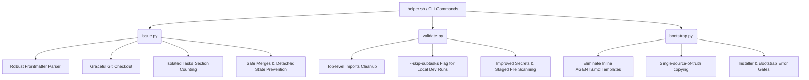

# Pre-Implementation Impact Analysis & Execution Plan

This document details the impact analysis and execution plan for remediating technical debt and potential bugs across three core modules:
1. **Point 2: The Issue Lifecycle & Sync CLI Commands** (`issue.py`, `sync.py`)
2. **Point 3: The Validation & Module Lock Compliance Guard** (`validate.py`)
3. **Point 4: The Project Bootstrap & Installer Scripts** (`bootstrap.py`, `install.sh`, `bootstrap.sh`)

---

## 1. Pre-Implementation Impact Analysis

We compare two design options for addressing the codebase technical debt and architectural compliance.

### Option A: Minimal Patching (Symptom-Level Fixes)
* **Description**: Patch specific runtime bugs (e.g., wrap checkout in try-except, modify the task counter regex, and suppress frontmatter parsing exceptions).
* **Pros**: Low code churn, minimal risk of introducing regressions to stable CLI paths.
* **Cons**:
  - Retains duplicate templates in `bootstrap.py` (which violates the non-negotiable rule in `AGENTS.md` section 2).
  - Validation guard continues to fail during normal development runs due to incomplete checklist tasks, discouraging continuous validation.
  - Parsing remains brittle to spacing or quoting changes in markdown issue files.

### Option B: Robust Refactoring & Strict Rule Alignment (Recommended)
* **Description**: Complete compliance overhaul. Eliminate inline file templates for `AGENTS.md` in `bootstrap.py` (reading from source instead). Refactor issue parsing to use robust line-by-line frontmatter processing and restrict checklist checks to the `## Tasks` section. Add validation bypass flags for development and streamline git close transactions.
* **Pros**:
  - Fully aligns with the `AGENTS.md` non-negotiable rule against duplicate inline file templates.
  - Permits continuous local validation checks during active coding via a bypass flag while retaining strict gates before issue completion.
  - Dramatically improves robust parser reliability for issue and task board status.
* **Cons**: Larger code change footprint requiring careful verification through unit and integration testing.

### Recommendation
We proceed with **Option B** to ensure architectural integrity, DRY compliance, and a developer-friendly validation experience.

---

## 2. Proposed Changes & Impact Areas

### Point 2: Issue Lifecycle & Sync Commands (`issue.py` & `sync.py`)
- **Robust YAML-like Frontmatter Parsing**: Replace brittle regex search with block/line-by-line parsing of markdown headers.
- **Section-Isolated Task Checklist Counter**: Only search under `## Tasks` header for open checkbox checklist items, ignoring example tasks or user problem statements.
- **Graceful Checkout**: Check if feature branch exists first before calling `git checkout -b`. If it exists, checkout normally without throwing an error.
- **Safe Branch Close**:
  - Add rollback steps or clear error hints if `git merge` encounters a conflict.
  - Ensure the local workspace isn't left in a confusing state.

### Point 3: Validation & Module Lock Compliance Guard (`validate.py`)
- **Developer Bypass Flag**: Add support for a `--skip-subtasks` CLI argument (and a matching environment variable `SKIP_SUBTASK_AUDIT=true`) so that local validation doesn't fail when running on a feature branch during active development.
- **Clean Imports & Refactoring**: Move local inline imports (like `import py_compile`, `import json`, `import shutil`) to module-level imports.
- **Lock Check Enhancements**: Warn if locks are missing on unstaged modified files, but only error on staged ones.

### Point 4: Project Bootstrap & Installer Scripts (`bootstrap.py`, `bootstrap.sh`, `install.sh`)
- **Eliminate Inline Templates**:
  - Refactor `bootstrap.py` to copy `AGENTS.md` and related config files from the installation source folder (or fallback to an existing file), rather than maintaining a duplicated 150-line string template inside the Python script.
  - Align with the "single source of truth" guideline.
- **Check Git Initialization**: Ensure local git configurations are only run if a git repository is successfully initialized or available.
- **Resilient Installer Download**: Make zip download fallbacks in `install.sh` support branch names dynamically or fallback gracefully with a clearer error messages.

---

## 3. Implementation Plan

### Step 1: Lock Modules
Before editing, acquire lock compliance on the target files:
- `./helper.sh lock issue`
- `./helper.sh lock validate`
- `./helper.sh lock bootstrap`

### Step 2: Implement Point 2 (Issue CLI)
- Refactor `issue.py` to extract checklist items solely from the tasks section.
- Handle existing branch checkout gracefully.

### Step 3: Implement Point 3 (Validation Guard)
- Refactor imports in `validate.py`.
- Implement the `--skip-subtasks` argument flag and environment variable gate.

### Step 4: Implement Point 4 (Bootstrap & Installer)
- Refactor `bootstrap.py` to load template structure from source files rather than hardcoded inline strings.
- Standardize source path resolution.

### Step 5: Test and Validate
- Run all existing unit tests.
- Add new test coverage for `--skip-subtasks` and the bootstrap logic.
- Run `./helper.sh validate` to verify the workspace status.
