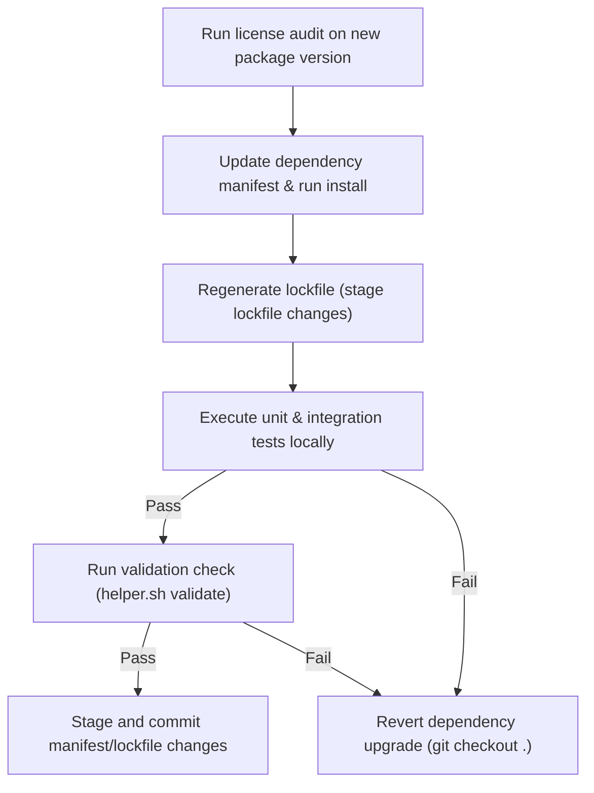

# Open-Source Compliance & Dependency Management Playbook

This playbook establishes the development standards for auditing third-party open-source libraries, ensuring license compliance, pinning dependency trees, executing safe upgrades, and enforcing data privacy boundaries.

---

## 1. Core Principles of Dependency Hygiene

Every external package added to a codebase expands the security and operational attack surface of the project.

1. **Explicit Dependency Registration**: Every third-party library must be registered and cataloged in standard dependency manifests (e.g. `requirements.txt` for Python, `package.json` for Node.js).
2. **Deterministic Locking**: Always use and check in lockfiles (e.g. `poetry.lock`, `package-lock.json`, `pnpm-lock.yaml`) to ensure identical builds across development and production environments.
3. **Continuous License Audits**: Avoid importing libraries with licenses that impose viral terms on commercial software.

---

## 2. Strict Version Pinning Policy

To protect the software supply chain from dependency confusion and unexpected breaking releases:

* **No Wildcard Specifiers**: Never use `*` or leave versions blank in manifest files.
* **Exact Matching**: Pin packages using strict exact versions:
  * Python: `requests==2.31.0` (rather than `requests>=2.31.0` or `requests~=2.31`)
  * Node: `"express": "4.19.2"` (avoiding `^` or `~` ranges unless explicitly required by a monorepo setup)
* **Check in Lockfiles**: Always stage and commit lockfiles alongside the manifest edits.

---

## 3. Open-Source License Auditing

Ensure the codebase contains only libraries with approved software licenses:

### A. Approved Licenses (Permissive)
* **MIT License**
* **Apache License 2.0**
* **BSD Licenses (2-Clause / 3-Clause)**
* **ISC License**

### B. Prohibited Licenses (Viral/Copyleft)
* **GPL (GNU General Public License) v2 / v3**
* **AGPL (Affero General Public License)**
* **LGPL (Lesser General Public License)** (requires legal signoff)
* **CC-BY-NC (Creative Commons Non-Commercial)**

### C. Auditing Actions
* Run automated license scanners (e.g. `license-checker` for Node, `pip-licenses` for Python) before introducing new packages.
* Block commits or builds that introduce packages violating the license policy.

---

## 4. Safe Dependency Upgrade Workflow

When updating packages to get security patches or new features, follow this validation pipeline:

---

## 5. Dependency Bloat & Unused Packages

Prevent repository bloat by pruning dead packages:

* **Unused Scan**: Periodically run tools like `depcheck` (Node.js) or `pip-deptree` / `pipcheck` (Python) to check if dependencies registered in the manifest are actually imported anywhere in the source code.
* **Pruning**: Unused packages must be removed immediately from both manifests and lockfiles.

---

## 6. Data Privacy & PII Safeguards

When dealing with user databases or logs:

* **No Plain-text PII**: Sensitive PII (names, emails, phones, tokens) must never be stored in plain text in database fields. Use at-rest encryption or cryptographic hashing where appropriate.
* **Log Scrubbing**: Filter sensitive parameters from logger statements (see [observability playbook](file://.agents/skills/observability/SKILL.md#L10-L15)) to prevent database leaks to third-party log aggregators.
