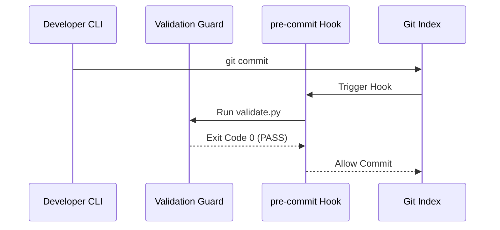

# Technical Documentation & Spec Management Playbook

This playbook establishes the development standards for writing, formatting, and maintaining system manuals, API references, architecture blueprints, and ensuring strict documentation-to-code synchronization.

---

## 1. Core Principles of Documentation-as-Code

Documentation is as critical as source code. Unmaintained documentation becomes technical debt and leads to context drift.

1. **Locality of Documentation**: Place technical documentation close to the code it describes. Use standard API docstrings inside code files, and Markdown playbooks inside the repository (e.g. `.agents/docs/` or `.agents/skills/`).
2. **Single Source of Truth**: Avoid repeating architectural details. Link to shared blueprints, schemas (`.agents/schema.md`), or ADRs (`.agents/memory/decisions/`) rather than copy-pasting descriptions.
3. **Automated Verification**: Proactively run checks to ensure links are valid, schemas are synchronized, and templates are up-to-date.

---

## 2. API Docstring Standards

All public classes, methods, and functions must be documented using standardized, structured formats.

### A. Python Google Style Docstrings
For Python codebase components, always follow Google Style docstrings:

```python
def fetch_token_budget(account_id: str, force_sync: bool = False) -> Optional[dict]:
    """Retrieve the rolling token usage budget for a specific account.

    Args:
        account_id: The unique string identifier of the target API account.
        force_sync: If True, bypasses local cache and polls remote registry.

    Returns:
        A dictionary containing daily/monthly limits and usage counters,
        or None if the account is not registered.

    Raises:
        ValidationError: If account_id is empty or formatted unsafely.
    """
```

### B. JavaScript/TypeScript JSDoc Standards
For frontend/Vite/Node codebase components, use JSDoc tags:

```typescript
/**
 * Synchronize task board states with local issue checklists.
 *
 * @param {string} boardPath - Absolute file path to the task board Markdown.
 * @param {boolean} dryRun - If true, audits changes without writing to disk.
 * @returns {Promise<void>} Resolves when the board file update is complete.
 */
```

---

## 3. Architecture Blueprints & C4 Models (Mermaid)

Use structured visual models to document complex workflows and service relationships.

* **Mermaid Integration**: Use Mermaid diagram blocks in markdown documentation to draw system flowcharts, database relationships, and sequences.
* **C4 Model Layout**: Frame system architectures into clear C4 layers (Context, Container, Component, Code) when detailing system scaling.



---

## 4. Automated Parity & Sync Verification

To prevent documentation-code drift, the agent must run the following checks during validation:

1. **Markdown Link Auditing**: Run regex checks to find broken relative markdown links and empty anchor ranges.
2. **Template-to-Target Parity**: Sync files mapped in `.agents/docs/template_map.md` (e.g. ensuring changes in `.agents/rules.md.template` are propagated to `.agents/rules.md` and target installer scripts).
3. **Registry Syncing**: Proactively run `./helper.sh sync` after creating or uninstalling skills to automatically update `context_map.md` and the master `AGENTS.md` skills index.
