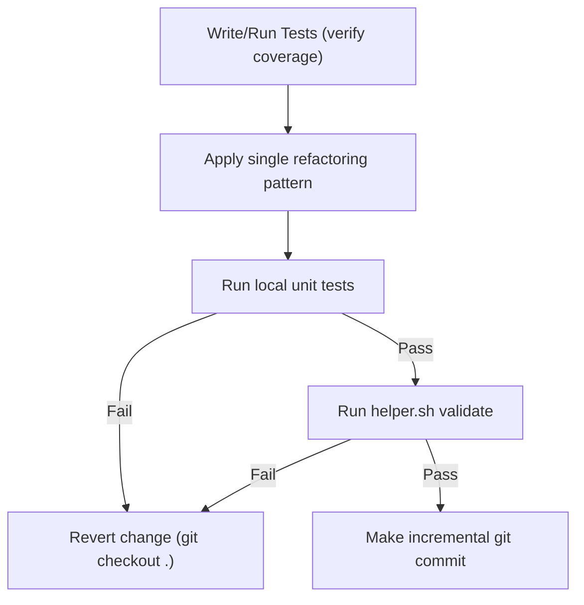

## Inherited from coding-standards

# Coding Standards & Practices Playbook

This playbook establishes the professional engineering standards required for writing, reviewing, testing, and designing software at an enterprise level.

---

## 1. Pre-Implementation Impact Analysis Protocol

Before writing any code or proposing design decisions, the agent MUST perform a comprehensive Impact Analysis. This critical thinking phase must be documented in the issue specification or shared directly with the user.

### Analysis Structure
1. **Explore Options**: Propose at least two different implementation approaches (e.g. Option A vs Option B).
2. **Trade-offs Matrix**: Compare options on complexity, maintainability, dependency footprints, performance, and UI/UX ease-of-use.
3. **Downstream Impacts**: Evaluate how each option affects other parts of the workspace, future compatibility, prompt cache size, and developer cognitive load.
4. **Recommendation**: Clearly state the recommended approach and justify why it offers the best balance of robustness and UX/DX simplicity.

---

## 2. The Code Writer Playbook (Writing High-Quality Code)

A world-class code writer transforms ambiguous problems into clean, robust, and self-documenting code.

### A. The TDD (Test-Driven Development) Cycle
We follow strict Test-Driven Development. For implementation steps and guidelines, see [testing/SKILL.md](file://.agents/skills/testing/SKILL.md#L67-L72).

### B. Defeating Cognitive Complexity
- **Short Functions**: Keep functions under 50 lines. If a function does more than one thing, split it.
- **Guard Clauses**: Return early to eliminate nested `if-else` blocks and reduce indentation levels.
- **Descriptive Naming**: Use clear, pronoun-free naming for variables, classes, and methods.

### C. Defensive Code Design
- **Input Validation**: Check arguments at API boundaries for type safety, ranges, and nullability.
- **Safe Resource Lifecycle**: Always use context managers (`with` statements in Python) for open files, database connections, and sockets.

### D. Strict Type Hints & Annotations
- **Required Types**: Every function/method signature MUST declare parameter types and return types (e.g., `def calculate_sum(a: int, b: int) -> int:`).
- **Avoid Generic Fallbacks**: Avoid using generic `Any` type annotations unless absolutely necessary. When generics are needed, use type variables (`TypeVar`) or Union/Optional types for precision.
- **Static Type Checkers**: Run local checkers (e.g., `mypy` or `tsc`) to verify type compliance before commits.

---

## 3. The Code Review Playbook (Zero-Regression Inspections)

A world-class code reviewer ensures code quality, correctness, and team consistency prior to merges.

### A. The Self-Review (First Line of Defense)
Before proposing any code review, developers must self-review their changes:
- **Diff Inspection**: Examine `git diff` line-by-line to ensure no debug/temporary code or logging statements are left.
- **Code Documentation**: Verify all public APIs have clean docstrings explaining parameters, returns, and exceptions.

### B. Core Inspection Gates
- **Secrets Audit**: Programmatically and visually verify that no credentials, API keys, passwords, or `.env` configurations are checked in (see [security-audit/SKILL.md](file://.agents/skills/security-audit/SKILL.md#L10-L14)).
- **Insulation Check**: Verify that layer boundaries are maintained. Helper utilities, DB models, and third-party frameworks must not bleed into core business logic.
- **DRY & SOLID Verification**: Identify duplicate code patterns and recommend modular class structures following SOLID principles.
- **Type Safety**: Ensure no variable types are declared as generic `Any` or left untyped at public interface boundaries.

### C. Common Code Smells to Reject
- **Dead Code**: Unused imports, variables, functions, or commented-out code blocks.
- **Magic Strings/Numbers**: Replace inline literals with named constants or configuration variables.
- **Swallowed Exceptions**: Reject try-except blocks that catch general exceptions without logging or raising them.

---

## 4. Testing & Validation Gates

Quality is not verified after implementation—it is built-in. Refer to [testing/SKILL.md](file://.agents/skills/testing/SKILL.md) for full testing conventions, mocking patterns, and isolation rules.

---

## 5. Architectural Integrity & Design Decisions (ADRs)

Maintain a long-term, self-documenting system architecture.
- **Use ADRs**: For every major design choice, write an Architectural Decision Record following [adr/SKILL.md](file://.agents/skills/adr/SKILL.md).
- **Decoupled Architecture**: Structure modules into clear domains with well-defined APIs. Keep system utilities separate from business logic.

---

## 6. Token & Context Efficiency Playbook

To optimize agent runtime cost, token consumption, and cognitive footprint, agents must strictly follow these rules:

- **Targeted File Reads**: Avoid viewing whole files. Always specify `StartLine` and `EndLine` parameters when calling `view_file` to target only the code relevant to the task.
- **Decoupled Subagents**: Only invoke subagents for separate, heavy, or multi-step research operations. Perform straightforward code editing and validation within the parent agent context.
- **Zero Redundant Commands**: Do not run repetitive commands or searches. If a search query or validation command fails 3 times, immediately halt and prompt the user.
- **No E2E testing overhead**: Do not request, setup, or run browser-based End-to-End or UI tests unless explicitly demanded by the user. Focus strictly on fast, mock-driven unit and integration testing.

## Inherited from refactoring

# Code Refactoring & Technical Debt Playbook

This playbook establishes the engineering workflows and coding patterns for refactoring legacy components, reducing cognitive complexity, and systematically eliminating technical debt while guaranteeing zero functional regression.

---

## 1. Core Principles of Safe Refactoring

Refactoring is the process of changing a software system in such a way that it does not alter the external behavior of the code, yet improves its internal structure.

1. **Test Guard Rails First**: Never refactor code that does not have unit test coverage. If tests do not exist, write them first (following [testing playbook](file://.agents/skills/testing/SKILL.md)).
2. **Small, Atomic Steps**: Make small, incremental modifications (e.g. rename a variable, extract a single helper method). Run the validation guard after *every* change.
3. **Separate Refactoring from Feature Addition**: Never commit functional changes (bug fixes, new features) in the same commit as structural refactoring. Keep them isolated.
4. **SOLID Design Philosophy**: Ensure that code modifications drive the software toward SOLID principles.

---

## 2. Identifying and Rejecting Code Smells

Code reviews and static scans must actively reject the following code smells:

### A. Large Methods & God Classes
* **Smell**: Functions longer than 50 lines or classes with more than 5 responsibilities.
* **Refactoring Strategy**: 
  * Apply **Extract Method** to pull sub-logic into small, named helper functions.
  * Apply **Extract Class** to split unrelated state/behaviors into decoupled classes (Single Responsibility).

### B. Nested Conditionals (Arrow Anti-Pattern)
* **Smell**: Deeply nested `if-else` blocks that make execution paths difficult to trace.
* **Refactoring Strategy**: Use **Guard Clauses**. Check invalid or simple cases first and return early. Eliminate the `else` branch entirely where possible.

```python
# POOR PRACTICE (Nested)
def process_user_payment(user, amount):
    if user is not None:
        if user.is_active:
            if amount > 0:
                return execute_transaction(user, amount)
            else:
                raise ValueError("Invalid amount")
        else:
            raise PermissionError("Inactive user")
    return None

# ENTERPRISE GRADE (Guard Clauses)
def process_user_payment(user, amount):
    if not user:
        return None
    if not user.is_active:
        raise PermissionError("Inactive user")
    if amount <= 0:
        raise ValueError("Invalid amount")
        
    return execute_transaction(user, amount)
```

### C. Duplicated Logic (DRY Violation)
* **Smell**: Copy-pasted blocks of logic or inline templates.
* **Refactoring Strategy**: Unify under a single reusable function or base helper. Never maintain duplicate code.

---

## 3. Safe Refactoring Workflow (TDD Integration)

Maintain the safety loop to avoid regressions:



---

## 4. API Deprecation & Compatibility Policy

When refactoring shared public interfaces or core libraries, you must maintain backward compatibility:

1. **Mark as Deprecated**: Do not delete old APIs immediately. Mark them with deprecation warnings so developers and client modules can migrate.
2. **Implement Warnings**: Use Python `warnings.warn` with `DeprecationWarning` or appropriate framework annotations.
3. **Redirect Implementation**: Have the deprecated method forward its calls to the new implementation to avoid maintaining duplicate business logic.
4. **Pin Sunset Schedule**: Document the version or date when the deprecated API will be deleted (e.g. "To be removed in v4.0.0").

```python
import warnings

def old_calculator(x, y):
    warnings.warn(
        "old_calculator is deprecated and will be removed in version 4.0.0. Use new_calculator instead.",
        category=DeprecationWarning,
        stacklevel=2
    )
    return new_calculator(x, y)
```

## Inherited from performance-optimization

# Performance Profiling & Optimization Playbook

This playbook establishes the engineering rules for diagnosing performance bottlenecks, profiling memory allocations, and optimizing execution runtimes.

---

## 1. Relational Database Query Profiling

Slow database queries are the primary cause of latency in enterprise applications.

### A. The N+1 Query Problem
- **Identify**: An N+1 query happens when an application executes 1 initial query to fetch a list of parent records, followed by N separate queries to fetch related child records for each parent.
- **Resolve**: Always use eager loading (relationships joining or fetching in bulk) to reduce database round-trips:
  - Django/Python: use `select_related()` (for ForeignKey/OneToOne) or `prefetch_related()` (for ManyToMany).
  - Laravel/Eloquent: use `with(['relationship_name'])`.
  - Node/ORM: use eager fetching joins.

### B. Index Analysis with EXPLAIN ANALYZE
Before adding indexes, analyze query plans:
1. Prepend `EXPLAIN (ANALYZE, BUFFERS)` in PostgreSQL or `EXPLAIN` in MySQL to the query.
2. Search for:
   - **Seq Scan / Full Table Scan**: Indicates missing indexes.
   - **Filter**: Checks rows individually, which is slow on large datasets.
3. Optimize by creating appropriate composite or concurrent indexes.

---

## 2. Memory Diagnostics & Memory Leak Prevention

- **Diagnostics**:
  - Python: Use `tracemalloc` to track memory blocks or `memory_profiler` to inspect line-by-line allocations.
  - Node: Use `--inspect` and Chrome DevTools to capture Heap Snapshots.
- **Common Memory Leaks**:
  - **Global Variables**: Storing large maps or lists in module-level global variables.
  - **Uncleared Subscriptions / Listeners**: Missing cleanups in event-driven frameworks.
  - **Open Stream Leaks**: Forgetting to close file handlers or database connections. Always wrap resources in context managers.

---

## 3. CPU Profiling & Execution Speed Optimization

- **Profiling Tools**:
  - Python: Use `cProfile` and generate visual call graphs via `gprof2dot` or `snakeviz`.
  - Node: Use `clinic.js` or built-in `--prof` profile analysis.
- **Optimization Strategy**:
  - **Avoid Nested Loops**: Refactor $O(N^2)$ nested loops into $O(N)$ operations by using dictionaries (hash maps) or sets.
  - **Lazy Initialization**: Postpone heavy operations (like reading files, parsing JSON, or connecting to services) until they are actually needed.
  - **Asynchronous Execution**: Offload long-running tasks to background queues (Celery, BullMQ) rather than blocking the main HTTP thread.

## Inherited from fullstack-development

# Fullstack Development Standards

This playbook defines framework-agnostic architectural standards for building scalable, maintainable, and high-performance fullstack web applications. These principles apply regardless of the specific technology stack (e.g., React/Node, Next.js, Go/HTMX, Vue/Laravel).

## 1. Clean API Boundaries & Separation of Concerns
* **Decoupled Layers:** Frontend clients and backend services must be strictly decoupled. Communicate exclusively via defined, versioned API contracts (REST, GraphQL, or RPC).
* **Business Logic Isolation:** Keep business logic out of UI components and routing layers. Centralize it in dedicated service modules or controllers.
* **Stateless Backends:** API endpoints should be stateless where possible to allow horizontal scaling. Use tokens (JWT) or distributed session stores for authentication.

## 2. Reusable Component Architecture
* **Dumb vs. Smart Components:** Strictly separate presentation (dumb) components from container (smart/data-fetching) components. 
* **Composition over Inheritance:** Build complex UIs by composing small, highly cohesive, single-purpose components.
* **Prop Drilling Avoidance:** Use appropriate context or state management libraries instead of passing props down deeply nested component trees.

## 3. Efficient State Management
* **Server vs. Client State:** Clearly distinguish between server state (data fetched from DB/API) and client state (UI toggles, themes, unsubmitted forms). 
* **Data Fetching:** Use modern data-fetching paradigms (e.g., SWR, React Query, or SSR fetching) that provide built-in caching, revalidation, and loading state management.
* **Mutation Optimization:** Implement optimistic UI updates for mutations to ensure the application feels instantly responsive to user actions.

## 4. Implementation Checklist
* [ ] Is the frontend completely decoupled from the backend's internal logic?
* [ ] Are UI components modular, reusable, and free of direct API calls?
* [ ] Is server state cached and managed efficiently without redundant network requests?
* [ ] Are optimistic updates implemented for critical data mutations?
* [ ] Are errors and loading states handled gracefully at the component level?