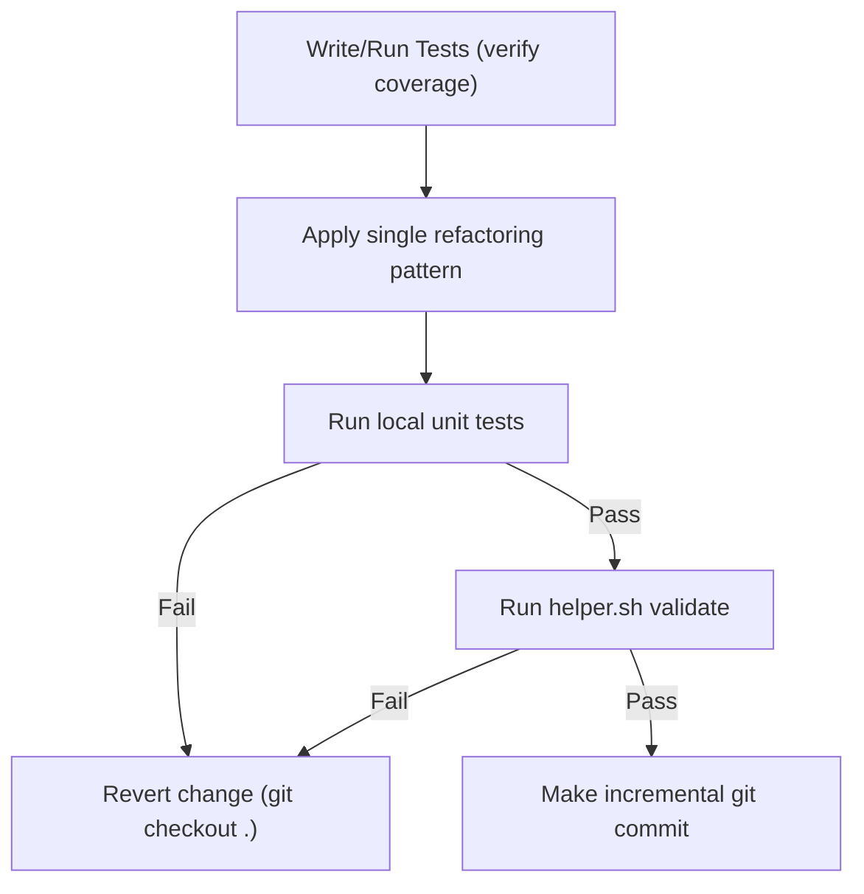

# Code Refactoring & Technical Debt Playbook

This playbook establishes the engineering workflows and coding patterns for refactoring legacy components, reducing cognitive complexity, and systematically eliminating technical debt while guaranteeing zero functional regression.

---

## 1. Core Principles of Safe Refactoring

Refactoring is the process of changing a software system in such a way that it does not alter the external behavior of the code, yet improves its internal structure.

1. **Test Guard Rails First**: Never refactor code that does not have unit test coverage. If tests do not exist, write them first (following [testing playbook](file://.agents/skills/testing/SKILL.md)).
2. **Small, Atomic Steps**: Make small, incremental modifications (e.g. rename a variable, extract a single helper method). Run the validation guard after *every* change.
3. **Separate Refactoring from Feature Addition**: Never commit functional changes (bug fixes, new features) in the same commit as structural refactoring. Keep them isolated.
4. **SOLID Design Philosophy**: Ensure that code modifications drive the software toward SOLID principles.

---

## 2. Identifying and Rejecting Code Smells

Code reviews and static scans must actively reject the following code smells:

### A. Large Methods & God Classes
* **Smell**: Functions longer than 50 lines or classes with more than 5 responsibilities.
* **Refactoring Strategy**: 
  * Apply **Extract Method** to pull sub-logic into small, named helper functions.
  * Apply **Extract Class** to split unrelated state/behaviors into decoupled classes (Single Responsibility).

### B. Nested Conditionals (Arrow Anti-Pattern)
* **Smell**: Deeply nested `if-else` blocks that make execution paths difficult to trace.
* **Refactoring Strategy**: Use **Guard Clauses**. Check invalid or simple cases first and return early. Eliminate the `else` branch entirely where possible.

```python
# POOR PRACTICE (Nested)
def process_user_payment(user, amount):
    if user is not None:
        if user.is_active:
            if amount > 0:
                return execute_transaction(user, amount)
            else:
                raise ValueError("Invalid amount")
        else:
            raise PermissionError("Inactive user")
    return None

# ENTERPRISE GRADE (Guard Clauses)
def process_user_payment(user, amount):
    if not user:
        return None
    if not user.is_active:
        raise PermissionError("Inactive user")
    if amount <= 0:
        raise ValueError("Invalid amount")
        
    return execute_transaction(user, amount)
```

### C. Duplicated Logic (DRY Violation)
* **Smell**: Copy-pasted blocks of logic or inline templates.
* **Refactoring Strategy**: Unify under a single reusable function or base helper. Never maintain duplicate code.

---

## 3. Safe Refactoring Workflow (TDD Integration)

Maintain the safety loop to avoid regressions:



---

## 4. API Deprecation & Compatibility Policy

When refactoring shared public interfaces or core libraries, you must maintain backward compatibility:

1. **Mark as Deprecated**: Do not delete old APIs immediately. Mark them with deprecation warnings so developers and client modules can migrate.
2. **Implement Warnings**: Use Python `warnings.warn` with `DeprecationWarning` or appropriate framework annotations.
3. **Redirect Implementation**: Have the deprecated method forward its calls to the new implementation to avoid maintaining duplicate business logic.
4. **Pin Sunset Schedule**: Document the version or date when the deprecated API will be deleted (e.g. "To be removed in v4.0.0").

```python
import warnings

def old_calculator(x, y):
    warnings.warn(
        "old_calculator is deprecated and will be removed in version 4.0.0. Use new_calculator instead.",
        category=DeprecationWarning,
        stacklevel=2
    )
    return new_calculator(x, y)
```
