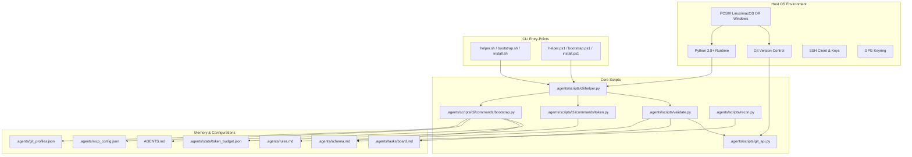

# Bootstrap & Dependency Map
**Project:** Antigravity Agent Core (AAC) V3  

---

This document traces the system startup sequence, dependency relationships, execution paths, and script file loading order inside the Antigravity Agent Core (AAC) V3 environment.

---

## 1. System Dependency Graph

The dependencies of AAC V3 are structured as follows:



---

## 2. Bootstrapping Flow & Sequence

When a developer/agent initializes a fresh workspace, the execution order proceeds through three distinct phases:

### Phase 1: Installation & Workspace Injection
1. The developer executes `./install.sh <target-dir>` or `./install.ps1 -TargetDir <target-dir>`.
2. The installation script queries the local machine for `git` and `python3` presence.
3. The script clones the remote source repository into a temporary path.
4. Clean directories (`.agents/scripts`, `.agents/skills`, `.agents/workflows`, `.agents/templates`, `.agents/docs`) are copied recursively to the target folder context.
5. Setup file overrides are created (e.g. copying `projects.example` to `projects.json` if missing).

### Phase 2: Shell Initialization & Version Sync
1. The installer triggers `./bootstrap.sh` or `./bootstrap.ps1`.
2. `bootstrap.sh` creates core directories (`.agents/memory/decisions`, `.agents/tasks`, `.agents/issues`).
3. Evaluates if `AGENTS.md` is in the target directory and syncs the product version (`3.60.0`) inside the prompt header.
4. Invokes the python `recon.py` script to run stack reconnaissance.
5. Invokes `validate.py` which automatically compiles Git commit hook scripts (e.g., `pre-commit`, `commit-msg`, `prepare-commit-msg`) and links them to the `.git/hooks/` folder.

### Phase 3: Setup Interview & Scaffolding
1. `bootstrap.sh` executes the Python setup wizard: `python3 .agents/scripts/cli/helper.py bootstrap`.
2. The wizard checks if terminal is an interactive TTY.
   - **Interactive Mode**: Prompts the developer for Project Name, programming stack, database configuration, infrastructure setups, and MVC vs. clean architecture options.
   - **Non-Interactive Mode**: Autodetects the stack (identifying `package.json`, `go.mod`, `Cargo.toml`, etc.) and applies sensible defaults.
3. Scaffold folder structures (`src/`, `tests/`) are initialized.
4. Generates configurations (`.gitignore`, `.antigravityignore`, `.github/workflows/verify.yml`).
5. personalizes templates (`.agents/schema.md`, `.agents/mcp_config.json`, and `AGENTS.md`).

---

## 3. File Loading & Reference Order (Context Flow)

When executing an agent task, the context loader queries files in the following sequence:

```
[Start Session]
   │
   ▼
1. Load AGENTS.md (Prepended as System Prompt)
   │
   ▼
2. Load active task board (.agents/tasks/board.md)
   │
   ▼
3. Load active issue specification (.agents/issues/issue_[id].md)
   │
   ▼
4. Load active context manifest (.agents/state/active_context.md)
   │
   ▼
5. Load master architecture blueprint (.agents/schema.md)
   │
   ▼
6. Load project rules (.agents/rules.md)
   │
   ▼
7. Load matching skill playbook on-demand (.agents/skills/[name]/SKILL.md)
   │
   ▼
[Execute Task]
```

---

## 4. Architectural Analysis of Dependencies

### Required Dependencies
- **Python 3.8+**: Essential for the entire command line helper system. If missing, wrappers fail.
- **Git**: Crucial for version control, branch-issue checkouts, profile synchronization, and hook validations.

### Optional Runtime Components
- **GPG Keyring**: Needed only when Git profile commits must be cryptographically signed. If missing, the validation guard automatically falls back to disabling local GPG signatures to prevent merge blockages.
- **SSH Client**: Required for connecting to remote Git repositories using key-pairs. AAC V3 automatically repairs profile connections if SSH is misconfigured.
- **MCP Server Contexts**: Required to execute lazy-loaded server tools (such as gitea or database evolutions).

---

## 5. Discovered Gaps & Missing Links

- **Unreachable / Orphaned Files**: No major orphaned files were found. All modules in `.agents/scripts/cli/commands/` are registered dynamically inside `helper.py`.
- **Dead Code**: `issue_example.md` is a reference file. While not dead code, it triggers validation warnings during audits if not excluded.
- **Conflicting Instructions**: The rules in `AGENTS.md` mandate strict workspace containment (no home directory configurations). However, `token.py`, `profile.py`, and `dashboard.py` all actively write or load files from the global user `~/.gemini/` path. This coupling represents an architectural conflict that must be hardened.
