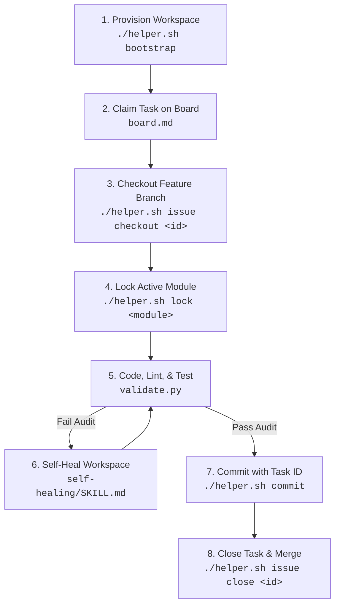

# Antigravity Agent Core (AAC) V2 🚀

[](AGENTS.md)
[](.agents/scripts/validate.py)
[](helper.sh)
[](.agents/rules.md)

A project-agnostic, enterprise-grade developer protocol and operational workspace layout designed to standardize AI coding assistants (like Gemini, Claude, Cursor, Aider, and GPT-4) across **any** tech stack. 

AAC V2 optimizes prompt caching, prevents secrets leakage, enforces architectural insulation, and dynamically auto-adapts to your project's programming languages and tools.

---

## 🗺️ Agent Lifecycle Flow

The diagram below details the autonomous agent development lifecycle enforced by AAC V2:



---

## 🌟 Core Framework Features

AAC V2 implements a zero-trust, isolated development structure specifically optimized for large-language models (LLMs) and multi-agent operations:

* **⚡ Offline Validation Guard**: Executes 10 comprehensive compliance checks (auditing critical files, credentials, syntax, link integrity, and unit tests) in **under 100ms** to guarantee repository health before commits.
* **👤 Zero-Trust Git Profiles**: Manages GPG signing keys and developer identities locally. Prevents corporate key leaks and invalid commit metadata.
* **🔒 Module-Level File Locking**: Enforces parallel developer and agent insulation, blocking conflicting edits on the same directories or files.
* **🧠 Continuous Self-Learning**: Extracts developer and agent post-mortems automatically when closing tasks, persisting lessons to rules.
* **🔀 Monorepo Orchestrator**: Manages multi-project test commands and API contracts synchronizations seamlessly.

---

## 🛡️ Enterprise-Grade Skill Playbooks

AAC V2 packages professional-level engineering guidelines within standard, discoverable markdown directories:

| Playbook / Skill | Directory Path | Description |
| :--- | :--- | :--- |
| **Self-Healing** | [.agents/skills/self-healing](file://.agents/skills/self-healing/SKILL.md) | Protocols for recovering from git conflicts, index locks, and broken environment setups. |
| **Database Evolution** | [.agents/skills/database-evolution](file://.agents/skills/database-evolution/SKILL.md) | Zero-downtime database migrations (Expand-Contract), Up/Down rollback safety, and avoiding locks. |
| **Performance Optimization** | [.agents/skills/performance-optimization](file://.agents/skills/performance-optimization/SKILL.md) | Standard CPU profiling, N+1 query identification, memory leaks detection, and query execution plans. |
| **Release Management** | [.agents/skills/release-management](file://.agents/skills/release-management/SKILL.md) | Docker multi-stage builds, non-root user execution, Feature Flags, and post-deploy Canary verification. |
| **Security Audit** | [.agents/skills/security-audit](file://.agents/skills/security-audit/SKILL.md) | OWASP Top 10 compliance audits, secret scanning, and parameter injection prevention. |
| **Observability** | [.agents/skills/observability](file://.agents/skills/observability/SKILL.md) | OpenTelemetry integrations, structured JSON logging, and centralized error instrumentation. |

---

## 🛠️ CLI Commands Quick-Reference

Use the unified POSIX wrapper `./helper.sh` (Linux/macOS) or `./helper.ps1` (Windows) to manage development:

| Command | Usage | Description |
|---|---|---|
| **`bootstrap`** | `./helper.sh bootstrap` | Scaffolds directories, detects stack, and guides Git profile setup. |
| **`validate`** | `./helper.sh validate` | Runs validation guard (checks files, secrets, links, tests, and branch type). |
| **`issue`** | `./helper.sh issue <subcommand>` | Local issue tracker. Supports `create`, `list`, `checkout`, and `close`. |
| **`lock`** | `./helper.sh lock <module>` | Local locks for collaborative coding. Run with `--release <module>` to unlock. |
| **`profile`** | `./helper.sh profile <subcommand>` | Credentials manager. Supports `add`, `switch`, `list`, and `apply`. |
| **`changelog`** | `./helper.sh changelog` | Auto-changelog generator. Parses conventional commits and bumps SemVer. |
| **`sync`** | `./helper.sh sync` | Synchronizes custom skills index in `AGENTS.md` and ADR registries. |
| **`learn`** | `./helper.sh learn "Lesson..."` | Records developer/agent lessons and post-mortems to `lessons-learned.md`. |
| **`doctor`** | `./helper.sh doctor` | Diagnostics tool verifying local setup and python dependencies. |
| **`upgrade`** | `./helper.sh upgrade` | Auto-upgrades agent core scripts from the official repository. |

---

## 🚀 Getting Started (3-Step Setup)

To bootstrap your AI assistant in **any new or existing repository**:

### 1. Run the Installer
Run the bootstrap installer script inside your project's root folder:

**Linux / macOS (Bash):**
```bash
curl -fsSL https://raw.githubusercontent.com/rafaelghifari/antigravity-agents/main/install.sh | bash
```

**Windows (PowerShell):**
```powershell
Set-ExecutionPolicy Bypass -Scope Process -Force; Invoke-WebRequest -Uri "https://raw.githubusercontent.com/rafaelghifari/antigravity-agents/main/install.ps1" -OutFile "install.ps1"; .\install.ps1
```

### 2. Auto-Detect Your Stack
The installer automatically triggers the reconnaissance script (`.agents/scripts/recon.py`), which:
- Scans your project structure recursively.
- Replaces the placeholders in `AGENTS.md` with your detected languages and tools.
- Automatically writes test/build rules in `.agents/rules.md`.

### 3. Start Coding with the Agent
When prompting your agent, refer to the master instruction guidelines:
> "Read AGENTS.md and align with our workspace layout, rules, and memory ledger."

---

## 📂 Directory Layout Blueprint

After running the bootstrap, your project will have the following layout:
- `AGENTS.md` (root): Master rules and directory maps loaded by the agent on every prompt.
- `.agents/rules.md`: Automatically generated build, test, and style configurations.
- `.agents/schema.md`: Holds definitions for config schemas and data formats.
- `.agents/projects.json`: Defines paths and test commands for sub-projects in a monorepo setup.
- `.agents/tasks/board.md`: Active markdown task board for tracking progress.
- `.agents/memory/`:
  - `architecture.md`: High-level system architecture summary.
  - `decisions/`: Repository containing Architectural Decision Records (ADRs).
  - `glossary.md`: Key terms definitions.
  - `tech-debt.md` & `lessons-learned.md`: Logs for long-term project quality.
- `.agents/skills/`: Executable playbooks (e.g. `code-review/`, `self-healing/`, `database-evolution/`).
- `.agents/workflows/`: Automation macros for shell slash commands.

---

## ⚠️ Disclaimer (No Warranty)

> [!WARNING]
> **No Warranty**: Antigravity Agent Core (AAC) is provided **"as-is"** without any warranty of any kind, express or implied. The developers and contributors make no representations or warranties regarding the security, accuracy, reliability, or correctness of code modifications, credential management, or task executions performed by the agent.
