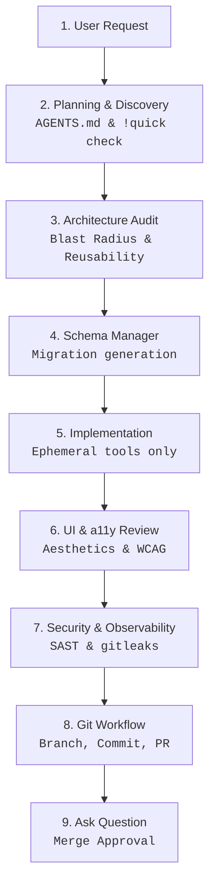

# Antigravity Agent Core (AAC) V4

[](AGENTS.md)
[](AGENTS.md)
[](https://github.com/rafaelghifari/antigravity-agents)

**Enterprise-Grade Guardrails, Zero-Assumption Execution, and Quality Gates for Autonomous AI Coding Agents.**

Autonomous coding agents offer massive productivity boosts, but running them in unstructured repositories introduces severe risks: hallucinated architectures, credential leaks, messy commit histories, and exploding token budgets.

**Antigravity Agent Core (AAC) V4** solves this by enforcing a strict, token-optimized, skill-based workflow loop governed by a supreme constitution (`AGENTS.md`). Designed for the **Antigravity CLI (agy)**, AAC V4 ensures that AI-driven coding conforms exactly to professional engineering standards, handles edge cases autonomously, and never assumes anything.

> [!IMPORTANT]
> **100% Declarative & Skill-Based**: AAC V4 abandons clunky bash scripts in favor of AI-native `.agents/skills/`. All configurations, plans, schemas, and execution logs are isolated securely under the `.agents/` directory.

> [!WARNING]
> **Disclaimer of Liability**: This software is provided "as is", without warranty of any kind. Autonomous AI agents run processes and modify files directly in your local environment. While AAC V4 establishes security hooks and quality gates, the user is solely responsible for reviewing and approving all commands, code modifications, and commits. The authors assume no liability for code regressions, data loss, credential exposures, or system errors resulting from agent activities.

---

## ⚡ What's New in V4?

| The AI Coding Risk | The AAC V4 Solution |
| :--- | :--- |
| **Hallucination & Token Bloat** | **Zero-Assumption Policy**: Agents are explicitly forbidden from guessing fields. Strict rules enforce paginated targeted reads instead of blind full-file ingestions. |
| **Infinite Loops & Hanging** | **Automated Rollback Protocol**: If 3 approaches fail, the agent snapshots the state, logs an incident report, and reverts to a known good state. A 5-minute timeout on user inputs ensures the agent aborts safely without hanging. |
| **Rogue Actions** | **Strict Precedence & Boundaries**: `AGENTS.md` is the supreme law. Critical actions (schema changes, merging, modifying rules) absolutely require user permission via `ask_question`. |
| **Silent Failures** | **Security & Observability Auditors**: Native skills scan for hardcoded secrets via `gitleaks`, enforce SAST execution, and verify structured JSON logging. |
| **Dependency Bloat** | **Execution Manager**: Mandates ephemeral invocations (`npx`, `pnpm dlx`) and actively blocks global installations or redundant framework packages. |

---

## 🗺️ The Autonomous Workflow

AAC V4 enforces a highly structured, skill-driven engineering cycle:



---

## 🚀 Core Skills

AAC V4 operates using modular, specialized **Skills** located in `.agents/skills/`. If multiple skills trigger, they execute in a strict sequence:

1. **`architecture-auditor`**: Performs rigorous Holistic Impact Analysis (blast radius, DRY, extensibility) before major code changes.
2. **`schema-manager`**: Single point of authority for DB schemas. Enforces reversible migrations and prevents field hallucination.
3. **`execution-manager`**: Oversees dependency installations, prevents redundancy, and enforces ephemeral execution (`npx` instead of `npm -g`).
4. **`ui-a11y-reviewer`**: Validates frontend components against WCAG standards, Admin vs. Consumer logic branching, and aesthetic guidelines.
5. **`security-observability-auditor`**: Scans for secrets, missing input sanitization, and verifies structured logging (JSON/Prometheus).
6. **`git-workflow`**: Strictly handles the end-to-end Version Control Lifecycle (Issue -> Time Tracking -> Branch -> Atomic Commits -> PR).

---

## 🛠️ Installation & Setup

### 1. Integrate into Your Project
To apply AAC V4 to any existing project, simply clone this repository and copy the core files over to your target project's root directory. The included `.gitignore` and scaffolded templates ensure your secrets and temporary agent states are never accidentally committed.

```bash
# Clone the AAC repository
git clone https://github.com/rafaelghifari/antigravity-agents.git
cd antigravity-agents

# Copy the core constitution, skills, and hygiene configs to your target project
cp AGENTS.md /path/to/your/project/
cp .gitignore /path/to/your/project/
cp -r .agents /path/to/your/project/
```

### 2. Configure MCP Servers (Optional but Recommended)
AAC V4 relies on Model Context Protocol (MCP) servers to interact with version control safely and execute the `git-workflow` skill.

We provide a ready-to-use sample configuration file:
```bash
cp .agents/mcp_config.json.example .agents/mcp_config.json
```
Edit `.agents/mcp_config.json` to insert your specific Personal Access Tokens (PAT) and your Gitea server URL (e.g., `http://localhost:3000`).

- **GitHub MCP**: Connects via Copilot's Remote Server-Sent Events (SSE).
- **Gitea MCP**: Connects via HTTP mode (e.g., `http://10.137.1.87:8081/mcp`) to a Gitea instance hosting the MCP endpoint. Once active, AAC V4's `git-workflow` skill will automatically detect it and enforce strict time-tracking.

---

## 📂 Directory Layout

- `AGENTS.md`: The "Constitution" and supreme ruleset.
- `.agents/brain/`: Permanent memory (`schema.md`, `state.json`, `mcp-registry.json`, `rules.md`).
- `.agents/incidents/`: Post-mortem incident reports for failed tasks or timeouts.
- `.agents/plans/`: Lightweight sequential task checklists.
- `.agents/scratch/`: Ephemeral/short-term notes and debugging context.
- `.agents/skills/`: The 6 core operational skills listed above.

---

## ⚡ Slash Commands (Anti-Hallucination)

Start your prompt with these commands to maximize autonomy:

| Command | Best For | Description |
| :--- | :--- | :--- |
| **`/goal`** | `Long-running autonomy` | Forces the agent into a persistent loop to hit complex milestones. |
| **`/grill-me`** | `Requirements gathering` | The agent pauses coding and interviews you with targeted questions. |
| **`/teamwork-preview`** | `Parallel execution` | Divides massive tasks and spawns multiple sub-agents. |
| **`/plan`** | `Step-by-step logic` | Outputs a rigorous step-by-step checklist before proceeding. |
| **`/learn`** | `Self-Correction` | Documents a new pattern in `rules.md` or generates a new skill. |
