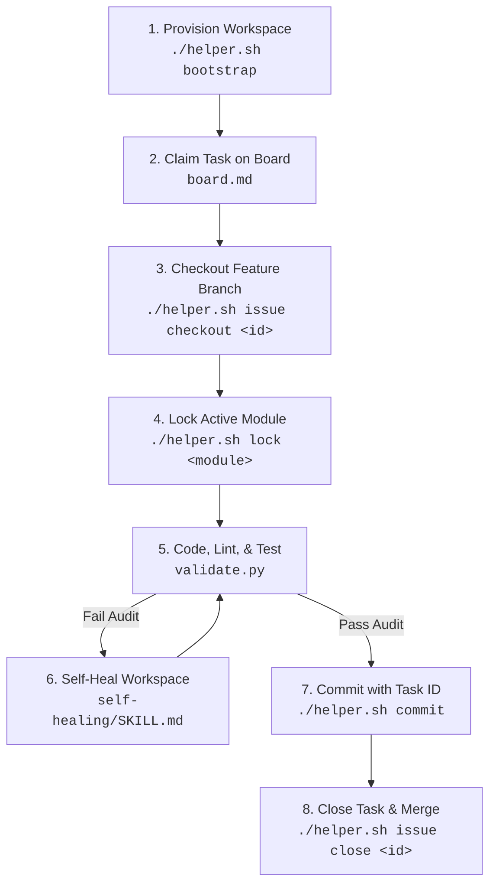

# Antigravity Agent Core (AAC) V2 🚀
### *Enterprise Guardrails & Workspace Customizations for the Antigravity CLI (agy)*
*(Also universally compatible with Cursor, Aider, Cline, and Claude)*

[](AGENTS.md)
[](.agents/scripts/validate.py)
[](helper.sh)
[](.agents/rules.md)

**AAC V2** is an open-source, local-first guardrail and workspace customization framework built for the **Antigravity CLI (agy)**. It enforces strict boundaries, directory structures, and code patterns on autonomous agents to align repository workflows with professional engineering practices.

> [!IMPORTANT]
> **AAC V2** acts as a local security sandbox and quality gate. All configurations, credentials, tasks, and plans are stored strictly at the workspace level under `.agents/` to maintain team consistency without relying on global states.

By placing a strict insulation layer around your workspace, AAC V2 prevents AI tools from:
- 🔓 Leaking local credentials, API keys, or private `.env` files.
- 🔀 Mutating critical base branches (`main`/`master`) directly.
- 🏚️ Violating architectural specifications or database migration templates.
- 💸 Bloating token budgets with stale, completed task/issue logs.

---

## 🗺️ Reusable Development Cycle

AAC V2 forces AI agents to run inside a repeatable, secure lifecycle loop:



---

## 🌟 Key Features

* **⚡ Offline Validation Guard**: Run 10 compliance audits (securing files, secrets, links, task boards, branch names, and unit tests) in **under 100ms** to block bad commits.
* **👤 Zero-Trust Git Profiles**: Rotate commits metadata and GPG/SSH keys dynamically, preventing corporate credential leaks.
* **🔒 Collaborative Module Locks**: Restrict parallel edits on directories to prevent agents from clashing.
* **📦 Active Context Archiver**: Auto-relocates completed task specifications and plans to `.agents/archive/` when optimizing context, keeping agent index files tiny and saving up to **80% in LLM token budgets**.
* **📊 Visual Status Dashboard**: Run `./helper.sh dashboard` to host a premium local dark-themed visual status panel tracking issue progress, file locks, compile errors, and self-learning lessons dynamically.
* **⏩ Human Validation Bypass**: Skip strict validation audits during quick human hotfixes via `--bypass` flags or `AAC_BYPASS_COMPLIANCE=1` env variables.
* **🚀 GitHub Action CI/CD Integration**: Block PR merges automatically in your organization if an agent attempts to push non-compliant code.
* **💻 Verified OS Support**: Actively developed and tested on **Ubuntu (modern Linux runtimes like Ubuntu 26)** and standard POSIX shells. Exposes host/port overrides for WSL2/containerized compatibility.

---

## 🚀 Getting Started (4-Step Setup)

### 1. Run the Installer
Run the bootstrap installer script inside your project's root folder:

> [!NOTE]
> The installer always downloads the verified source files directly from the Git repository to prevent version mismatch or missing local utilities.

**Linux / macOS (Bash):**
```bash
curl -fsSL https://raw.githubusercontent.com/rafaelghif/antigravity-agents/main/install.sh | bash
```

**Windows (PowerShell):**
```powershell
Set-ExecutionPolicy Bypass -Scope Process -Force; Invoke-WebRequest -Uri "https://raw.githubusercontent.com/rafaelghif/antigravity-agents/main/install.ps1" -OutFile "install.ps1"; .\install.ps1
```

### 2. Auto-Detect Your Stack
The installer triggers the reconnaissance script (`.agents/scripts/recon.py`), which scans your repository, replaces placeholders in `AGENTS.md` and generates stack-tailored test/build rules in `.agents/rules.md`.

### 3. Configure Profiles & Sub-projects (Optional)
Customize local developer identities or configure monorepo sub-project validation:
- **Developer Identities**: Edit `.agents/git_profiles.json` (created from `git_profiles.example`) to rotate author credentials, or run `./helper.sh profile add`.
- **Monorepos**: Copy `.agents/projects.example` to `.agents/projects.json` and configure relative paths and test commands for each component directory.

### 4. Start Coding with the Agent
When prompting your agent (e.g. Cline, Aider, Cursor), refer to the master instruction:
> "Read AGENTS.md and align with our workspace layout, rules, and memory ledger."

> [!TIP]
> Run `./helper.sh validate` locally before committing your changes. It executes all 10 audits in under 100ms, making it extremely fast and lightweight to run as part of your normal pre-commit flow.

---

## 🚀 GitHub Action CI/CD Setup

To enforce these AI guardrails during pull request checks:
1. Copy the CI template:
   ```bash
   mkdir -p .github/workflows
   cp .agents/templates/github-action.yml .github/workflows/aac-validate.yml
   ```
2. Commit and push the workflow file. The action will run automatically on push/PR, failing the status check if validation fails.

---

## 🛠️ CLI Commands Reference

Use `./helper.sh` (Linux/macOS) or `./helper.ps1` (Windows) to dispatcher commands:

| Command | Usage | Description |
|---|---|---|
| **`bootstrap`** | `./helper.sh bootstrap` | Scaffolds directories, detects stack, and guides Git profile setup. |
| **`validate`** | `./helper.sh validate` | Runs 10 compliance audits (files, secrets, links, branch, sync, tests, locks). |
| **`dashboard`** | `./helper.sh dashboard` | Launches local web-based interactive visual status dashboard. |
| **`issue`** | `./helper.sh issue <subcommand>` | Local issue tracker. Supports `create`, `list`, `checkout`, and `close`. |
| **`lock`** | `./helper.sh lock <module>` | Local locks for collaborative koding. Run with `--release` to unlock. |
| **`profile`** | `./helper.sh profile <subcommand>` | Credentials rotation. Supports `add`, `switch`, `list`, and `apply`. |
| **`context`** | `./helper.sh context optimize` | Rebuilds active context manifest and archives done issues. |
| **`token`** | `./helper.sh token <subcommand>` | Strict token budget tracker. Supports `log`, `status`, and `reset`. |
| **`mcp`** | `./helper.sh mcp <subcommand>` | Model Context Protocol integration. Supports `register` and `start`. |
| **`changelog`** | `./helper.sh changelog` | Auto-changelog generator. Parses conventional commits and bumps SemVer. |
| **`sync`** | `./helper.sh sync` | Synchronizes custom skills index in `AGENTS.md` and ADR registries. |
| **`learn`** | `./helper.sh learn "Lesson..."` | Records developer/agent lessons to `lessons-learned.md`. |
| **`doctor`** | `./helper.sh doctor` | Diagnostics tool verifying local setup and python dependencies. |

---

## 📂 Directory Layout Blueprint

After bootstrapping, your project will have the following layout:
- `AGENTS.md` (root): Master rules and directory maps loaded by the agent on every prompt.
- `.agents/rules.md`: Automatically generated build, test, and style configurations.
- `.agents/schema.md`: Holds definitions for config schemas and data formats.
- `.agents/projects.json`: Defines paths and test commands for sub-projects in a monorepo setup.
- `.agents/tasks/board.md`: Active markdown task board for tracking progress.
- `.agents/archive/`: Contains completed tasks, issues, and plans excluded from LLM context.
- `.agents/memory/`:
  - `architecture.md`: High-level system architecture summary.
  - `decisions/`: Repository containing Architectural Decision Records (ADRs).
  - `glossary.md`: Key terms definitions.
  - `tech-debt.md` & `lessons-learned.md`: Logs for long-term project quality.
- `.agents/skills/`: Executable playbooks (e.g. `code-review/`, `self-healing/`, `database-evolution/`).
- `.agents/workflows/`: Automation macros for shell slash commands.
