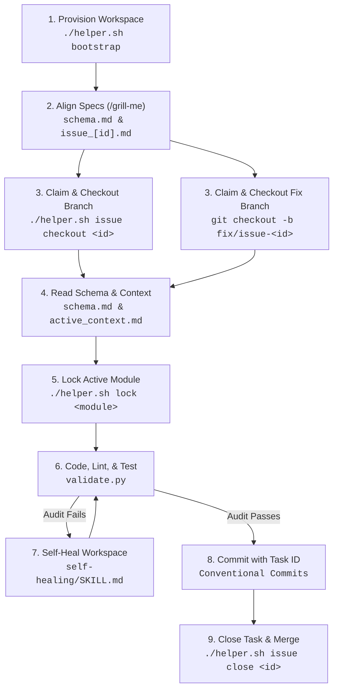

# Antigravity Agent Core (AAC) V3
### *Enterprise Guardrails, Workspace Insulation, and Local Quality Gates for Autonomous AI Agents*

[](AGENTS.md)
[](.agents/scripts/validate.py)
[](helper.sh)
[](.agents/rules.md)

Autonomous coding agents (like Cursor, Aider, Cline, and Claude) are incredibly powerful, but running them in unstructured workspaces introduces severe risks: leaked credentials, broken architecture styles, messy branch commits, and skyrocketing token budgets.

**Antigravity Agent Core (AAC) V3** is a local-first, stack-agnostic workspace insulation and guardrail framework built for the **Antigravity CLI (agy)**. It wraps a strict security, quality, and workflow loop around your repository, ensuring that AI-driven coding conforms exactly to professional, enterprise-grade engineering standards.

> [!IMPORTANT]
> **AAC V3** operates entirely locally at the workspace level. All configurations, task details, developer profiles, and execution logs are isolated under `.agents/` inside the repository. This guarantees team alignment and security without relying on global states or cloud dependencies.

> [!WARNING]
> **Disclaimer of Liability**: This software is provided "as is", without warranty of any kind, express or implied. Autonomous AI agents run processes and modify files directly in your local environment. While AAC V3 establishes security hooks and quality gates, the user is solely responsible for reviewing and approving all commands, code modifications, and commits. The authors and contributors assume no liability for code regressions, data loss, credential exposures, or system errors resulting from agent activities.

---

## The Core Problem & The AAC Solution

| The AI Coding Agent Risk | The AAC V3 Solution |
| :--- | :--- |
| **Credential & Secret Leaks** | Offline hooks block staging/committing `.env`, private keys, and local credentials. |
| **Messy Branch Commits** | Commits to base branches (`main`/`master`) are blocked. Enforces Conventional Commits with task ID references. |
| **Context & Token Bloat** | Old task details, logs, and finished specifications are auto-archived, keeping the active context token-efficient. |
| **Parallel Coding Conflicts** | Filesystem-level mutex locks prevent agents from conflict-editing the same directories in parallel. |
| **Platform / Installer Drift** | Core logic is centralized in Python scripts, with wrapper scripts acting as thin OS delegates. |

---

## 🗺️ Reusable Development Cycle

AAC V3 enforces a structured, step-by-step engineering cycle on the agent to prevent speculative coding:



---

## Key Architectural Components

* **Unified Installer Engine**: Centralizes system discovery, version-controlled file copy, backup routines, and environment exclusions in a single Python engine (`install.py`), keeping shell scripts as lightweight system delegates.
* **Interactive Stack Reconnaissance**: Performs automated stack detection to generate rules, context mappings, and folder layouts inside `.agents/rules.md` and `.agents/schema.md` to align agent behavior.
* **Automated Verification Loop**: Enforces quality gates requiring agents to compile files, run local test suites, check styles, and recover from failures using sandboxed playbooks before marking tasks completed.
* **Pre-Commit Compliance Engine**: Audits 11 distinct repository security rules (blocking secret exposures, broken references, mismatched git authorship, and lock bypasses) automatically on git hooks.
* **Isolated Developer Profile Rotation**: Configures workspace-level authorship, GPG/SSH keys, and tokens locally in `.agents/git_profiles.json` to sign commits while preventing global profile leakage.
* **Local Observability Panel**: Serves a local monitoring dashboard to visualize task workflows, active directory locks, self-learning ledgers, and compilation statuses.

---

## 📋 Prerequisites

Verify your environment meets these basic requirements before installing:
* **Git**: Installed and available in the user path.
* **Python**: Version **3.8 or newer** (`python3` or `python`).
* **Shell**: Terminal access (`bash`, `zsh`, or PowerShell).

---

## 🚀 Quick Start Setup (4 Steps)

### 1. Install AAC V3 in Your Repository
Run the bootstrap installer script inside your target project's root folder:

**Linux / macOS (Bash):**
```bash
curl -fsSL https://raw.githubusercontent.com/rafaelghif/antigravity-agents/main/install.sh | bash
```

**Windows (PowerShell):**
```powershell
Set-ExecutionPolicy Bypass -Scope Process -Force; Invoke-WebRequest -Uri "https://raw.githubusercontent.com/rafaelghif/antigravity-agents/main/install.ps1" -OutFile "install.ps1"; .\install.ps1
```

### 2. Auto-Detect Stack & Bootstrap
The installer scans your project structure and prompts you to configure:
- **Project Name** & **Language Stack**
- **Architecture Pattern** (`clean`, `layered`, or `mvc`)
- **Database** & **Framework** details

These configuration parameters are immediately written to your workspace's [rules.md](file:///.agents/rules.md) and [schema.md](file:///.agents/schema.md).

### 3. Customize Developer Profiles (Optional)
Run the profiles command to rotate developer git credentials or register key rotation:
```bash
./helper.sh profile add
```
This updates `.agents/git_profiles.json` (GPG/SSH commit signature keys and Git PAT tokens) to rotate developer profiles and prevent leakage.

### 4. Direct Your Coding Agent
When triggering your agent (Aider, Cursor, Cline, or Claude), simply start the prompt with:
> "Read AGENTS.md and align with our workspace layout, rules, and memory ledger before starting."

---

## 🛠️ CLI Commands Reference

Use `./helper.sh` (POSIX) or `./helper.ps1` (Windows) to dispatch workspace commands:

| Command | Usage | Description |
| :--- | :--- | :--- |
| **`bootstrap`** | `./helper.sh bootstrap [-q \| --quick]` | Re-initializes stack parameters and templates. Use `-q` to bypass the interview and bootstrap immediately with defaults. |
| **`validate`** | `./helper.sh validate [-q \| --quiet]` | Runs 11 workspace audits. Use `-q` to output only failed tests and validation summaries. |
| **`commit`** | `./helper.sh commit [-i \| --interactive]` | Pre-commit validation wrapper. Use `-i` to review diffs and write Conventional Commits interactively. |
| **`dashboard`** | `./helper.sh dashboard` | Spawns a local visual monitoring dashboard on your browser. |
| **`issue`** | `./helper.sh issue <subcommand>` | Local task/issue tracker. Supports `create`, `list`, `checkout`, and `close`. |
| **`lock`** | `./helper.sh lock [<module> \| --release \| --clear-all]` | Directory locks. Use `--clear-all` to clear locked directories manually. |
| **`profile`** | `./helper.sh profile <subcommand>` | Dynamic author credentials rotation. Supports `add`, `switch`, `list`, and `apply`. |
| **`context`** | `./helper.sh context optimize` | Rebuilds the active context manifest and archives completed tasks to save tokens. |
| **`token`** | `./helper.sh token [<subcommand>]` | Tracks LLM token usage and budgets. Defaults to the `status` panel if subcommand is omitted. |
| **`pause`** / **`resume`** | `./helper.sh pause` / `./helper.sh resume` | Halts or resumes agent workspace execution locks. |
| **`mcp`** | `./helper.sh mcp <subcommand>` | Integrates Model Context Protocol tools. Supports `register` and `start`. |
| **`changelog`** | `./helper.sh changelog` | Evaluates commits, maps categories from local issues, bumps SemVer, and logs changes. |
| **`learn`** | `./helper.sh learn "Lesson..."` | Appends a developer/agent technical lesson to `lessons-learned.md`. |
| **`doctor`** | `./helper.sh doctor` | Checks python environment, dependencies, and command accessibility. |
| **`heartbeat`** | `./helper.sh heartbeat` | Quick diagnostics check verifying hooks, locks, profile status, and quota. |

---

## ⚙️ Advanced Workspace Settings

You can customize AAC V3 behavior, developer profiles, and monorepo component testing using workspace-level settings files.

### 1. General Settings (`.agents/config.json`)
Create `.agents/config.json` to customize the agent's operating mode:
```json
{
  "workflow_mode": "solo"
}
```
* **`workflow_mode`** (`"team"` | `"solo"`): In `"team"` mode, AAC blocks direct edits and commits on base branches like `main` or `master`. Setting this to `"solo"` bypasses base branch checks, allowing solo developers to commit directly to the primary branch.

### 2. Developer Profiles (`.agents/git_profiles.json`)
Configure GPG/SSH keys and credentials rotation. Copy `.agents/git_profiles.example` to `.agents/git_profiles.json`:
```json
{
  "profiles": [
    {
      "name": "corporate-work",
      "email": "developer@company.com",
      "signing_key": "ssh-ed25519 AAAAC3N...",
      "ssh_key_path": "~/.ssh/id_ed25519_corp",
      "git_pat": "ghp_corporateTokenExample",
      "active": true
    }
  ]
}
```
* **`name`**: Descriptive identifier of the profile.
* **`email`**: Git author email configuration.
* **`signing_key`**: GPG or SSH signing key for signing commits.
* **`ssh_key_path`**: Path to the SSH private key used to push commits.
* **`git_pat`**: Personal Access Token (PAT) for authenticating GitHub/Gitea API commands.
* **`active`**: Set `true` to apply this profile's configuration to Git during development.

**CLI Profile Utilities:**
- **Add Profile**: `./helper.sh profile add` (launches interactive setup wizard)
- **List Profiles**: `./helper.sh profile list`
- **Switch Active Profile**: `./helper.sh profile switch <profile_name>`
- **Apply Current Profile**: `./helper.sh profile apply` (injects current active credentials directly into Git config)

### 3. Monorepos & Components (`.agents/projects.json`)
Define sub-projects, testing commands, and API contract sync rules in a monorepo. Copy `.agents/projects.example` to `.agents/projects.json`:
```json
{
  "projects": [
    {
      "name": "backend-api",
      "path": "app/backend",
      "stack": "python",
      "test_command": "pytest",
      "sync_contracts": [
        {
          "source": "openapi.yaml",
          "target": "../frontend/src/api/client.ts",
          "generator": "npx openapi-typescript"
        }
      ]
    }
  ]
}
```
* **`name`**: Unique identifier for the sub-project.
* **`path`**: Directory path relative to workspace root.
* **`stack`**: Stack/language of the component (e.g. `python`, `node`, `php`).
* **`test_command`**: Local test execution command (run inside the sub-project directory).
* **`sync_contracts`**: (Optional) Open API/GraphQL contract synchronization rules to generate frontend client bindings.

AAC's validation guard will automatically parse this JSON to run tests and linters for each component inside monorepos.

### 4. Model Context Protocol (`.agents/mcp_config.json`)
Define model context servers and token inputs. Local workspace-level MCP configurations allow secure integrations without exposing credentials globally. Copy `.agents/mcp_config.json` templates to enable external tool capabilities:

```json
{
  "mcpServers": {
    "aac-v3-tools": {
      "command": "python3",
      "args": [
        ".agents/scripts/mcp_server.py"
      ]
    },
    "github": {
      "type": "http",
      "url": "https://api.githubcopilot.com/mcp/",
      "headers": {
        "Authorization": "Bearer ${input:github_mcp_pat}"
      }
    },
    "gitea": {
      "command": "docker",
      "args": [
        "run",
        "-i",
        "--rm",
        "-e",
        "GITEA_ACCESS_TOKEN",
        "-e",
        "GITEA_HOST",
        "docker.gitea.com/gitea-mcp-server"
      ],
      "env": {
        "GITEA_ACCESS_TOKEN": "${input:gitea_token}",
        "GITEA_HOST": "${input:gitea_host}"
      }
    }
  },
  "inputs": [
    {
      "type": "promptString",
      "id": "github_mcp_pat",
      "description": "GitHub Personal Access Token",
      "password": true
    },
    {
      "type": "promptString",
      "id": "gitea_token",
      "description": "Gitea Personal Access Token",
      "password": true
    },
    {
      "type": "promptString",
      "id": "gitea_host",
      "description": "Gitea Host URL (e.g. https://gitea.com or local Gitea domain)",
      "password": false
    }
  ]
}
```
* **`github`**: Integrates GitHub Copilot MCP tools for remote repositories, issues, and workflow runs.
* **`gitea`**: Integrates Gitea MCP tools for internal company repositories and code collaboration.

**CLI MCP Utilities:**
- **Register MCP locally**: `./helper.sh mcp register` (registers workspace servers inside local agent configurations)
- **Register MCP globally**: `./helper.sh mcp register --global` (opt-in to write configuration to user home directory configuration)

---

## 📂 Directory Layout Blueprint

After bootstrapping, your project will have the following layout:
- `AGENTS.md` (root): Master rules and directory maps loaded by the agent on every prompt.
- `.agents/rules.md`: Automatically generated build, test, and style configurations.
- `.agents/schema.md`: Holds definitions for config schemas and data formats.
- `.agents/projects.json`: Monorepo project references.
- `.agents/tasks/board.md`: Active markdown task board for tracking progress.
- `.agents/archive/`: Contains completed tasks, issues, and plans excluded from LLM context.
- `.agents/memory/`:
  - `architecture.md`: High-level system architecture summary.
  - `decisions/`: Repository containing Architectural Decision Records (ADRs).
  - `glossary.md`: Key terms definitions.
  - `soul.md`: Core agent values, communication policies, and identity.
  - `tech-debt.md` & `lessons-learned.md`: Logs for long-term project quality.
- `.agents/skills/`: Executable playbooks (e.g. `code-review/`, `self-healing/`, `database-evolution/`).
- `.agents/workflows/`: Automation macros for shell slash commands.
