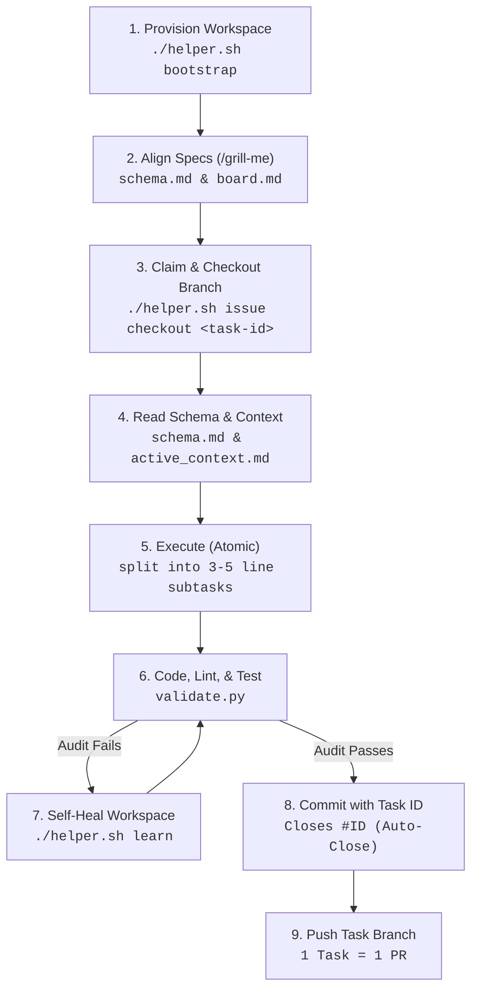

# Antigravity Agent Core (AAC) V3

[](AGENTS.md)
[](.agents/scripts/validate.py)
[](helper.sh)
[](.agents/rules.md)

**Enterprise-Grade Guardrails, Workspace Insulation, and Quality Gates for Autonomous AI Coding Agents.**

Autonomous coding agents (like Cursor, Aider, Cline, and Claude) offer massive productivity boosts, but running them in unstructured repositories introduces severe risks: credential leaks, architectural drift, messy commit histories, and exploding token budgets.

**Antigravity Agent Core (AAC) V3** solves this by wrapping a strict, local-first workflow loop around your repository. Designed for the **Antigravity CLI (agy)**, AAC ensures that AI-driven coding conforms exactly to professional engineering standards without relying on cloud dependencies.

> [!IMPORTANT]
> **100% Local Insulation**: AAC V3 operates entirely within your workspace. All configurations, task boards, developer profiles, and execution logs are isolated under the `.agents/` directory.

> [!WARNING]
> **Disclaimer of Liability**: This software is provided "as is", without warranty of any kind. Autonomous AI agents run processes and modify files directly in your local environment. While AAC V3 establishes security hooks and quality gates, the user is solely responsible for reviewing and approving all commands, code modifications, and commits. The authors assume no liability for code regressions, data loss, credential exposures, or system errors resulting from agent activities.

---

## ⚡ Why Use AAC V3?

| The AI Coding Risk | The AAC V3 Solution |
| :--- | :--- |
| **Credential & Secret Leaks** | Local git hooks proactively block staging or committing `.env` files, private keys, and local credentials. |
| **Messy Branch Commits** | Enforces Conventional Commits with mandatory task ID references. Direct commits to `main` are blocked. |
| **Context & Token Bloat** | Auto-archives old tasks, logs, and finished specifications to keep the active agent context lean and token-efficient. |
| **Parallel Coding Conflicts** | Filesystem-level mutex locks (`./helper.sh lock`) prevent agents from conflicting when editing the same directories. |
| **Amnesia (Loss of Context)** | Features a localized "Hermes Protocol" (`lessons-learned.yaml`) where agents self-correct and memorize solutions for future sessions. |

---

## 🗺️ The Autonomous Workflow

AAC V3 enforces a structured engineering cycle on the agent to prevent speculative or rogue coding:



---

## 🚀 Quick Start Guide

### 1. Prerequisites
- **Git** installed and available in your PATH.
- **Python 3.8+** installed.
- Terminal access (Bash, Zsh, or PowerShell).

### 2. Install AAC V3
Run the installer script at the root of your target project:

**Linux / macOS (Bash):**
```bash
curl -fsSL https://raw.githubusercontent.com/rafaelghif/antigravity-agents/main/install.sh | bash
```

**Windows (PowerShell):**
```powershell
Set-ExecutionPolicy Bypass -Scope Process -Force; Invoke-WebRequest -Uri "https://raw.githubusercontent.com/rafaelghif/antigravity-agents/main/install.ps1" -OutFile "install.ps1"; .\install.ps1
```

### 3. Bootstrap the Workspace
Initialize the workspace to auto-detect your stack (e.g., Python, Node) and generate rules:
```bash
./helper.sh bootstrap
```

### 4. Direct Your Coding Agent
When prompting your agent, instruct it to respect the workspace rules:
> "Read AGENTS.md and align with our workspace layout, rules, and memory ledger before starting."

### 5. Utilize Slash Commands (Anti-Hallucination)
To maximize agent autonomy and prevent hallucinations caused by vague instructions, Antigravity provides native slash commands. Start your prompt with:

| Command | Best For | Description |
| :--- | :--- | :--- |
| **`/goal`** | `Long-running autonomy` | Forces the agent into a persistent loop. It will break down epics, write code, run tests, self-heal, and pull the next task autonomously until 100% complete. |
| **`/grill-me`** | `Requirements gathering` | The agent pauses coding and interviews you with targeted questions to build a concrete architecture before writing any code. |
| **`/teamwork-preview`** | `Parallel execution` | Divides massive tasks and spawns multiple background sub-agents to tackle them concurrently. |
| **`/plan`** | `Step-by-step logic` | Forces the agent to output a rigorous step-by-step architectural plan before proceeding. |

---

## 🛠️ Core CLI Tools (`helper.sh` / `helper.ps1`)

| Command | Description |
| :--- | :--- |
| **`validate`** | Runs 11 strict workspace audits (secrets, linters, tests, branch alignment). |
| **`commit`** | Pre-commit wrapper. Enforces Conventional Commits and blocks unvalidated code. |
| **`issue`** | Local issue tracker (create, list, checkout, close). |
| **`profile`** | Manages Git identities (`add`, `switch`, `list`) to prevent pushing under the wrong profile. |
| **`mcp`** | Integrates Model Context Protocol (MCP) servers (`register`, `start`) securely. |
| **`token`** | Tracks local LLM token usage and budgets. |
| **`doctor`** | Checks Python environment, dependencies, and git configuration health. |
| **`changelog`** | Evaluates commits, maps categories, bumps SemVer, and generates release notes. |

---

## ⚙️ Advanced Configuration

AAC is highly customizable via JSON configs located in `.agents/`:

- **`.agents/config.json`**: Set `"workflow_mode": "solo"` to allow direct local commits to `main`, or `"team"` to enforce strict PR workflows.
- **`.agents/git_profiles.json`**: Safely store and rotate GPG/SSH keys and Personal Access Tokens (PATs) for specific workspaces.
- **`.agents/projects.json`**: Define sub-projects in a monorepo (test commands, API contract sync rules).
- **`.agents/mcp_config.json`**: Define MCP servers (GitHub, Gitea) and inject credentials dynamically without leaking them globally.

---

## 📂 Directory Layout

- `AGENTS.md`: The "Soul" and master ruleset loaded by the agent.
- `.agents/rules.md`: Generated build, test, and style configurations.
- `.agents/schema.md`: Database and architectural source of truth.
- `.agents/tasks/board.md`: The active Kanban-style task board.
- `.agents/memory/lessons-learned.yaml`: The self-learning ledger where the agent memorizes past mistakes.
- `.agents/skills/`: Executable playbooks (e.g., code-review, security-compliance) the agent can dynamically load.
