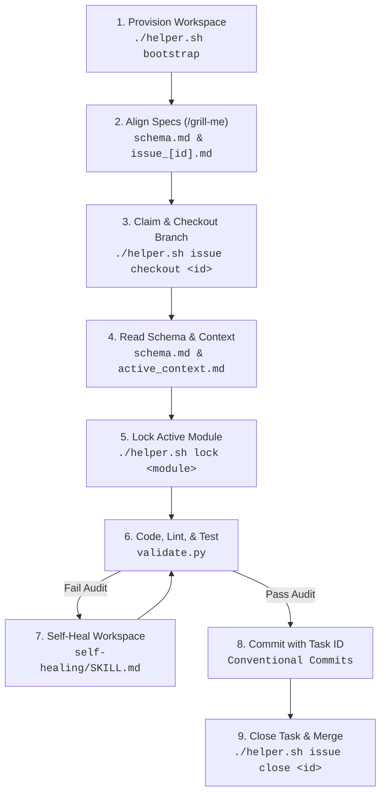

# Antigravity Agent Core (AAC) V3 🚀
### *Enterprise Guardrails & Workspace Customizations for the Antigravity CLI (agy)*
*(Also universally compatible with Cursor, Aider, Cline, and Claude)*

[](AGENTS.md)
[](.agents/scripts/validate.py)
[](helper.sh)
[](.agents/rules.md)

**AAC V3** is an open-source, local-first guardrail and workspace customization framework built for the **Antigravity CLI (agy)**. It enforces strict boundaries, directory structures, and code patterns on autonomous agents to align repository workflows with professional engineering practices.

> [!IMPORTANT]
> **AAC V3** acts as a local security sandbox and quality gate. All configurations, credentials, tasks, and plans are stored strictly at the workspace level under `.agents/` to maintain team consistency without relying on global states.

By placing a strict insulation layer around your workspace, AAC V3 prevents AI tools from:
- 🔓 Leaking local credentials, API keys, or private `.env` files.
- 🔀 Mutating critical base branches (`main`/`master`) directly.
- 🏚️ Violating architectural specifications or database migration templates.
- 💸 Bloating token budgets with stale, completed task/issue logs.

---

## 🗺️ Reusable Development Cycle

AAC V3 forces AI agents to run inside a repeatable, secure lifecycle loop:



---

## 🌟 Key Features

* **📦 Native Git-Based Installer**: Downloads files using `git clone --depth 1` natively, preserving version tags, release logs, and checking network availability dynamically via `git ls-remote`.
* **🎤 Setup Questionnaire Interview**: Guides users through a database, framework, and deployment infrastructure questionnaire at the start of `./helper.sh bootstrap`, immediately injecting parameters into `.agents/schema.md`.
* **🔁 Lookahead Loop & Zero-Touch Chaining**: Rules enforce that the agent performs self-correcting test/lint validation loops and chains commands internally, reducing user interactions to a minimum and preventing hallucinations.
* **⚡ Offline Validation Guard**: Run 10 compliance audits (securing files, secrets, links, task boards, branch names, and unit tests) in **under 100ms** to block bad commits.
* **👤 Zero-Trust Git Profiles**: Rotate author metadata and local developer credentials dynamically, preventing leakage.
* **🔒 Collaborative Module Locks**: Restrict parallel edits on directories using directory-level filesystem mutexes.
* **Active Context Archiver**: Auto-relocates completed task specifications and plans to `.agents/archive/` when optimizing context, saving up to **80% in LLM token budgets**.
* **📊 Visual Status Dashboard**: Run `./helper.sh dashboard` to host a premium local dark-themed visual status panel tracking issue progress, file locks, compile errors, and self-learning lessons dynamically.

---

## 🚀 Getting Started (4-Step Setup)

### 1. Run the Installer
Run the bootstrap installer script inside your project's root folder:

> [!NOTE]
> The installer clones template files directly from the Git repository to verify installation integrity.

**Linux / macOS (Bash):**
```bash
curl -fsSL https://raw.githubusercontent.com/rafaelghif/antigravity-agents/main/install.sh | bash
```

**Windows (PowerShell):**
```powershell
Set-ExecutionPolicy Bypass -Scope Process -Force; Invoke-WebRequest -Uri "https://raw.githubusercontent.com/rafaelghif/antigravity-agents/main/install.ps1" -OutFile "install.ps1"; .\install.ps1
```

### 2. Auto-Detect Stack & Run Interactive Interview
The installer triggers the reconnaissance script (`.agents/scripts/recon.py`), which scans your repository. You will then be prompted to configure your project details:
- **Project Name**
- **Programming Stack**
- **Architecture Pattern** (clean / layered / mvc)
- **Database** (e.g. SQLite, PostgreSQL, MySQL, MongoDB, none)
- **Infrastructure/Deployment** (e.g. Docker, Kubernetes, AWS, GCP, none)
- **Framework/Library** (e.g. Django, Express, Laravel, none)

These details are immediately synchronized and written to [schema.md](file:///.agents/schema.md) and [rules.md](file:///.agents/rules.md).

### 3. Configure Profiles & Sub-projects (Optional)
Customize local developer identities or configure monorepo sub-project validation:
- **Developer Identities**: Edit `.agents/git_profiles.json` (created from `git_profiles.example`) to rotate author credentials, or run `./helper.sh profile add`.
- **Monorepos**: Copy `.agents/projects.example` to `.agents/projects.json` and configure relative paths and test commands for each component directory.

### 4. Start Coding with the Agent
When prompting your agent (e.g. Cline, Aider, Cursor), refer to the master instruction:
> "Read AGENTS.md and align with our workspace layout, rules, and memory ledger."

---

## 🛠️ CLI Commands Reference

Use `./helper.sh` (Linux/macOS) or `./helper.ps1` (Windows) to dispatch commands:

| Command | Usage | Description |
|---|---|---|
| **`bootstrap`** | `./helper.sh bootstrap [-q \| --quick]` | Scaffolds directories, detects stack, and guides setup. Can be run in zero-config mode with `-q` / `--quick` to immediately bootstrap using detected defaults. |
| **`validate`** | `./helper.sh validate [-q \| --quiet]` | Runs 11 compliance audits. Use `-q` / `--quiet` to run validation silently, only printing errors and final summary checklist. |
| **`commit`** | `./helper.sh commit [-i \| --interactive]` | Pre-commit validation wrapper. Use `-i` / `--interactive` to launch Conventional Commit helper with staged changes diff preview. |
| **`dashboard`** | `./helper.sh dashboard` | Launches local web-based interactive visual status dashboard. |
| **`issue`** | `./helper.sh issue <subcommand>` | Local issue tracker. Supports `create`, `list`, `checkout`, and `close`. |
| **`lock`** | `./helper.sh lock [<module> \| --release <module> \| --clear-all \| --prune]` | Local locks to prevent concurrent modifications. Use `--clear-all` to wipe locks, and `--prune` to clear locks of deleted branches. |
| **`profile`** | `./helper.sh profile <subcommand>` | Credentials rotation. Supports `add`, `switch`, `list`, and `apply`. |
| **`context`** | `./helper.sh context optimize` | Rebuilds active context manifest and archives done issues. |
| **`token`** | `./helper.sh token [<subcommand>]` | Local token budget tracker. Defaults to `status` status dashboard if subcommand is omitted. |
| **`pause`** | `./helper.sh pause` | Developer hand-off tool. Pauses and locks agent execution completely. |
| **`resume`** | `./helper.sh resume` | Unpauses agent execution. |
| **`mcp`** | `./helper.sh mcp <subcommand>` | Model Context Protocol integration. Supports `register` and `start`. |
| **`changelog`** | `./helper.sh changelog` | Auto-changelog generator. Parses conventional commits and bumps SemVer. |
| **`sync`** | `./helper.sh sync` | Synchronizes custom skills index in `AGENTS.md` and ADR registries. |
| **`learn`** | `./helper.sh learn "Lesson..."` | Records developer/agent lessons to `lessons-learned.md`. |
| **`doctor`** | `./helper.sh doctor` | Diagnostics tool verifying local setup and python dependencies. |
| **`heartbeat`** | `./helper.sh heartbeat` | Runs workspace heartbeat diagnostic checks (verifies locks, hooks, budget). |

---

## ⚙️ Advanced Workspace Settings

You can customize AAC V3 behavior, developer profiles, and monorepo component testing using workspace-level settings files.

### 1. General Settings (`.agents/config.json`)
Create `.agents/config.json` to customize the agent's operating mode:
```json
{
  "workflow_mode": "solo"
}
```
* **`workflow_mode`** (`"team"` | `"solo"`): By default (`"team"`), AAC blocks direct edits and commits on base branches like `main` or `master`. Setting this to `"solo"` bypasses base branch checks, allowing solo developers to commit directly to the primary branch.

### 2. Developer Profiles (`.agents/git_profiles.json`)
Configure GPG/SSH keys and credentials rotation. Copy `.agents/git_profiles.example` to `.agents/git_profiles.json`:
```json
{
  "profiles": [
    {
      "name": "corporate-work",
      "email": "developer@company.com",
      "signing_key": "ssh-ed25519 AAAAC3N...",
      "ssh_key_path": "~/.ssh/id_ed25519_corp",
      "git_pat": "ghp_corporateTokenExample",
      "active": true
    }
  ]
}
```
* **`name`**: Descriptive identifier of the profile.
* **`email`**: Git author email configuration.
* **`signing_key`**: GPG or SSH signing key for signing commits.
* **`ssh_key_path`**: Path to the SSH private key used to push commits.
* **`git_pat`**: Personal Access Token (PAT) for authenticating GitHub/Gitea API commands.
* **`active`**: Set `true` to apply this profile's configuration to Git during development.

**CLI Profile Utilities:**
- **Add Profile**: `./helper.sh profile add` (launches interactive setup wizard)
- **List Profiles**: `./helper.sh profile list`
- **Switch Active Profile**: `./helper.sh profile switch <profile_name>`
- **Apply Current Profile**: `./helper.sh profile apply` (injects current active credentials directly into Git config)

### 3. Monorepos & Components (`.agents/projects.json`)
Define sub-projects, testing commands, and API contract sync rules in a monorepo. Copy `.agents/projects.example` to `.agents/projects.json`:
```json
{
  "projects": [
    {
      "name": "backend-api",
      "path": "app/backend",
      "stack": "python",
      "test_command": "pytest",
      "sync_contracts": [
        {
          "source": "openapi.yaml",
          "target": "../frontend/src/api/client.ts",
          "generator": "npx openapi-typescript"
        }
      ]
    }
  ]
}
```
* **`name`**: Unique identifier for the sub-project.
* **`path`**: Directory path relative to workspace root.
* **`stack`**: Stack/language of the component (e.g. `python`, `node`, `php`).
* **`test_command`**: Local test execution command (run inside the sub-project directory).
* **`sync_contracts`**: (Optional) Open API/GraphQL contract synchronization rules to generate frontend client bindings.

AAC's validation guard will automatically parse this JSON to run tests and linters for each component inside monorepos.

### 4. Model Context Protocol (`.agents/mcp_config.json`)
Define model context servers and token inputs. Local workspace-level MCP configurations allow secure integrations without exposing credentials globally. Copy `.agents/mcp_config.json` templates to enable external tool capabilities:

```json
{
  "mcpServers": {
    "aac-v3-tools": {
      "command": "python3",
      "args": [
        ".agents/scripts/mcp_server.py"
      ]
    },
    "github": {
      "type": "http",
      "url": "https://api.githubcopilot.com/mcp/",
      "headers": {
        "Authorization": "Bearer ${input:github_mcp_pat}"
      }
    },
    "gitea": {
      "command": "docker",
      "args": [
        "run",
        "-i",
        "--rm",
        "-e",
        "GITEA_ACCESS_TOKEN",
        "-e",
        "GITEA_HOST",
        "docker.gitea.com/gitea-mcp-server"
      ],
      "env": {
        "GITEA_ACCESS_TOKEN": "${input:gitea_token}",
        "GITEA_HOST": "${input:gitea_host}"
      }
    }
  },
  "inputs": [
    {
      "type": "promptString",
      "id": "github_mcp_pat",
      "description": "GitHub Personal Access Token",
      "password": true
    },
    {
      "type": "promptString",
      "id": "gitea_token",
      "description": "Gitea Personal Access Token",
      "password": true
    },
    {
      "type": "promptString",
      "id": "gitea_host",
      "description": "Gitea Host URL (e.g. https://gitea.com or local Gitea domain)",
      "password": false
    }
  ]
}
```
* **`github`**: Integrates GitHub Copilot MCP tools for remote repositories, issues, and workflow runs.
* **`gitea`**: Integrates Gitea MCP tools for internal company repositories and code collaboration.

**CLI MCP Utilities:**
- **Register MCP locally**: `./helper.sh mcp register` (registers workspace servers inside local agent configurations)
- **Register MCP globally**: `./helper.sh mcp register --global` (opt-in to write configuration to user home directory configuration)

### 5. Setup Diagnostics
Ensure your workspace, python environment, and permissions are fully set up by running diagnostic audits:
- **Run doctor diagnostic**: `./helper.sh doctor` (verifies python version, dependencies, system commands, and active configuration files)
- **Run validation heartbeat**: `./helper.sh heartbeat` (verifies active module locks, git identity profiles, hooks, and token budget quotas)


---

## 📂 Directory Layout Blueprint

After bootstrapping, your project will have the following layout:
- `AGENTS.md` (root): Master rules and directory maps loaded by the agent on every prompt.
- `.agents/rules.md`: Automatically generated build, test, and style configurations.
- `.agents/schema.md`: Holds definitions for config schemas and data formats.
- `.agents/projects.json`: Monorepo project references.
- `.agents/tasks/board.md`: Active markdown task board for tracking progress.
- `.agents/archive/`: Contains completed tasks, issues, and plans excluded from LLM context.
- `.agents/memory/`:
  - `architecture.md`: High-level system architecture summary.
  - `decisions/`: Repository containing Architectural Decision Records (ADRs).
  - `glossary.md`: Key terms definitions.
  - `soul.md`: Core agent values, communication policies, and identity.
  - `tech-debt.md` & `lessons-learned.md`: Logs for long-term project quality.
- `.agents/skills/`: Executable playbooks (e.g. `code-review/`, `self-healing/`, `database-evolution/`).
- `.agents/workflows/`: Automation macros for shell slash commands.
