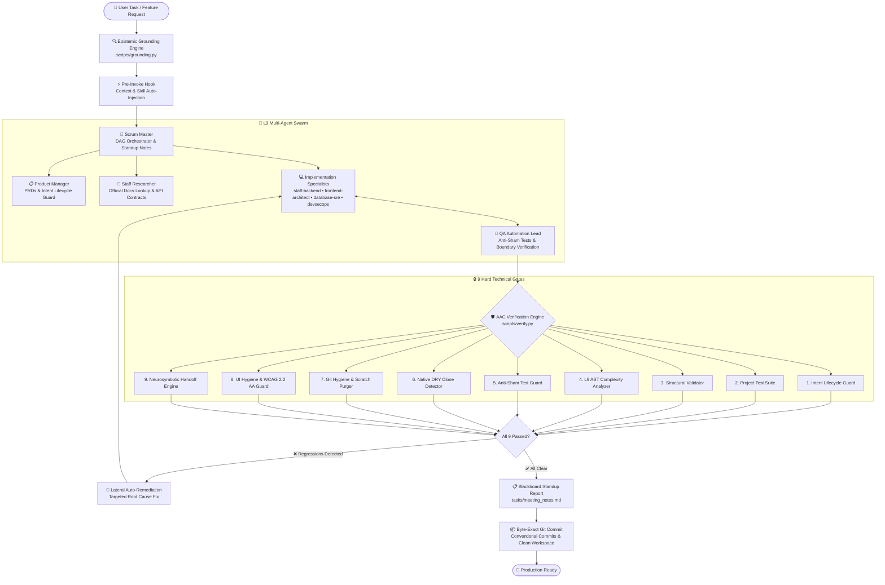

<div align="center">
  <h1>🚀 Antigravity Agent Core (AAC)</h1>
  <p><strong>The Enterprise-Grade Multi-Agent Engineering Framework for Google Antigravity</strong></p>

  <a href="https://github.com/rafaelghif/antigravity-agents/releases"></a>
  [](https://github.com/rafaelghif/antigravity-agents/releases/tag/v4.44.3)
  [](https://antigravity.google/docs/cli/overview)
  [](#-the-8-l9-expert-personas)
  [](#-the-11-core-enterprise-skills)
  [](#-the-9-hard-technical-gates)
  [](LICENSE)
  [](#-support--sponsorship)
</div>

---

**Antigravity Agent Core (AAC)** elevates Google Antigravity AI coding assistants into an autonomous, senior-level software engineering organization. Standard AI models default to superficial "vibe coding" — hallucinating non-existent libraries, duplicating logic, generating hollow placeholder tests, and leaving behind cluttered scratch files. 

AAC enforces **System-2 Test-Time Compute (TTC)**, **Epistemic Codebase Grounding**, **Deterministic DAG Orchestration**, and **9 Strict Static AST Verification Gates**.

AAC turns your AI into an engineering unit that verifies ground truth before planning, reuses existing code, enforces behavioral TDD, respects accessibility standards, and leaves zero garbage in your repository.

---

## 🌟 Key Architectural Pillars

- 🧠 **Epistemic Grounding (Anti-Hallucination)**: Inspects real manifests, active package managers, and layout truth via [`scripts/grounding.py`](scripts/grounding.py) before writing any code. Never guesses APIs or installs redundant packages.
- 🤖 **8 L9 Expert Personas**: Specialization beats generalization. Discrete subagents for Scrum Master, Product Manager, Researcher, Frontend, Backend, DB SRE, DevSecOps, and QA Lead.
- 📚 **11 Consolidated Core Skills**: Replaced fragmented micro-skills with 11 battle-tested, authoritative engineering playbooks.
- ⚡ **Multi-Agent DAG Pipeline**: Deterministic topological execution pipeline ([`.agents/workflows/standard_pr.yaml`](.agents/workflows/standard_pr.yaml)) executing real technical validation gates across personas.
- 🔒 **9 Hard Technical Gates**: Static AST checks, Big-O loop guards, anti-sham test inspectors, rolling SHA-256 DRY clone detectors, and neurosymbolic contracts.
- 🌐 **Full Browsing & Epistemic Research**: Unrestricted search and web reading capabilities enabling autonomous fact-checking against official docs.
- 🤝 **Multi-Mode Team Meetings**: On-demand agile orchestration ([`scripts/meeting_coordinator.py`](scripts/meeting_coordinator.py)) for standups, architectural planning, reviews, and conflict resolution.
- 🌍 **100% Language & Platform Agnostic**: Zero-dependency pure Python engine supporting Python, TypeScript/JavaScript, Go, Rust, Java/Kotlin, C#, PHP, Ruby, C++, Dart, Swift on Linux, macOS, and Windows.

---

## 🏗️ Architecture & Multi-Agent Execution Flow

AAC operates as an epistemic state machine, coordinating specialized subagents through a disk-backed Blackboard and strict verification pipeline:


```mermaid
flowchart TD
    User([👤 User Task / Feature Request]) --> Ground[🔍 Epistemic Grounding Engine<br/>scripts/grounding.py]
    Ground --> PreHook[⚡ Pre-Invoke Hook<br/>Context & Skill Auto-Injection]
    PreHook --> ScrumMaster[🎯 Scrum Master<br/>DAG Orchestrator & Standup Notes]

    subgraph Swarm [🤖 L9 Multi-Agent Swarm]
        ScrumMaster --> PM[📋 Product Manager<br/>PRDs & Intent Lifecycle Guard]
        ScrumMaster --> Research[🔎 Staff Researcher<br/>Official Docs Lookup & API Contracts]
        ScrumMaster --> DevTeam[💻 Implementation Specialists<br/>staff-backend • frontend-architect • database-sre • devsecops]
        DevTeam <--> QALead[🧪 QA Automation Lead<br/>Anti-Sham Tests & Boundary Verification]
    end

    QALead --> VerifyEngine{🛡️ AAC Verification Engine<br/>scripts/verify.py}

    subgraph Gates [🔒 9 Hard Technical Gates]
        VerifyEngine --> G1[1. Intent Lifecycle Guard]
        VerifyEngine --> G2[2. Project Test Suite]
        VerifyEngine --> G3[3. Structural Validator]
        VerifyEngine --> G4[4. L9 AST Complexity Analyzer]
        VerifyEngine --> G5[5. Anti-Sham Test Guard]
        VerifyEngine --> G6[6. Native DRY Clone Detector]
        VerifyEngine --> G7[7. Git Hygiene & Scratch Purger]
        VerifyEngine --> G8[8. UI Hygiene & WCAG 2.2 AA Guard]
        VerifyEngine --> G9[9. Neurosymbolic Handoff Engine]
    end

    G1 & G2 & G3 & G4 & G5 & G6 & G7 & G8 & G9 --> GateCheck{All 9 Passed?}
    GateCheck -- ❌ Regressions Detected --> AutoFix[🔄 Lateral Auto-Remediation<br/>Targeted Root Cause Fix]
    AutoFix --> DevTeam
    GateCheck -- ✅ All Clear --> Blackboard[📋 Blackboard Standup Report<br/>tasks/meeting_notes.md]
    Blackboard --> GitCommit[📦 Byte-Exact Git Commit<br/>Conventional Commits & Clean Workspace]
    GitCommit --> Production([🚀 Production Ready])
```

---

## 🤖 The 8 L9 Expert Personas

Subagents are defined in `.agents/agents/<name>.md`. The Meta-Router delegates domain tasks to specialized personas:

| Persona | Role | Key Responsibilities |
| :--- | :--- | :--- |
| **`scrum-master`** | Principal Agile Orchestrator | Task DAG management, blocker resolution, cross-agent coordination, standup reporting ([`tasks/meeting_notes.md`](tasks/meeting_notes.md)). |
| **`product-manager`** | Principal Product Manager | User stories, acceptance criteria, PRD generation, and intent verification via [`scripts/intent_guard.py`](scripts/intent_guard.py). |
| **`researcher`** | Staff Technical Researcher | Epistemic web research, official documentation lookup, external API contract verification, and anti-hallucination fact checks. |
| **`frontend-architect`** | Staff Frontend Architect | UI components, DTCG design tokens, WCAG 2.2 AA accessibility, responsive UX, and Core Web Vitals (LCP, INP, CLS). |
| **`staff-backend`** | Staff Backend Engineer | Distributed architecture, RFC 7807 problem details, idempotency keys, transactional outbox resilience, and API contracts. |
| **`database-sre`** | Principal Database SRE | Zero-downtime expand-contract schema migrations, concurrent non-blocking indexing, and query optimization. |
| **`devsecops-principal`** | Principal DevSecOps | Zero-Trust security, Docker containerization, CI/CD pipelines, secret scanning, and MCP toolchain configuration. |
| **`qa-automation-lead`** | Staff QA Automation Lead | Behavioral end-to-end testing, property-based testing, boundary validation, and anti-sham test enforcement. |

---

## 📚 The 11 Core Enterprise Skills

All engineering capabilities are consolidated into 11 authoritative, cross-referenced playbooks in `.agents/skills/`:

| Skill | Playbook File | Focus & Operational Domain |
| :--- | :--- | :--- |
| **`architecture`** | [`.agents/skills/architecture/SKILL.md`](.agents/skills/architecture/SKILL.md) | Distributed system design, RFC 7807 contracts, idempotency, transactional outbox, and circuit breakers. |
| **`code-quality`** | [`.agents/skills/code-quality/SKILL.md`](.agents/skills/code-quality/SKILL.md) | SOLID principles, clean architecture, early returns, DRY deduplication, and anti-overengineering. |
| **`data-engineering`** | [`.agents/skills/data-engineering/SKILL.md`](.agents/skills/data-engineering/SKILL.md) | Zero-downtime expand-contract migrations, concurrent DDL, ETL/ELT pipelines, and streaming CDC. |
| **`deep-research`** | [`.agents/skills/deep-research/SKILL.md`](.agents/skills/deep-research/SKILL.md) | Epistemic 3-step research loop: targeted search, deep extraction, and local truth synthesis. |
| **`design`** | [`.agents/skills/design/SKILL.md`](.agents/skills/design/SKILL.md) | UI components, 3-tier DTCG design tokens, WCAG 2.2 AA accessibility, and Core Web Vitals optimization. |
| **`devops`** | [`.agents/skills/devops/SKILL.md`](.agents/skills/devops/SKILL.md) | Docker, Kubernetes, CI/CD pipelines, Infrastructure as Code (Terraform), and MCP toolchains. |
| **`observability`** | [`.agents/skills/observability/SKILL.md`](.agents/skills/observability/SKILL.md) | Structured logging, Prometheus metrics, and OpenTelemetry distributed tracing. |
| **`security`** | [`.agents/skills/security/SKILL.md`](.agents/skills/security/SKILL.md) | Zero-Trust architecture, secret management, PBAC/RBAC, and input sanitization. |
| **`semantic-graphing`** | [`.agents/skills/semantic-graphing/SKILL.md`](.agents/skills/semantic-graphing/SKILL.md) | AST knowledge graph, transitive caller resolution, PageRank centrality, and blast radius analysis. |
| **`verification`** | [`.agents/skills/verification/SKILL.md`](.agents/skills/verification/SKILL.md) | TDD, boundary validation, property-based tests, and anti-sham test hygiene. |
| **`caveman`** | [`.agents/skills/caveman/SKILL.md`](.agents/skills/caveman/SKILL.md) | High-density token compression ("Mouth smaller, not brain smaller") cutting token usage by 60%+. |

---

## 🔒 The 9 Hard Technical Gates

Unlike superficial prompt instructions, AAC runs **native, zero-dependency Python gates** that physically inspect and validate code before every commit:

| Gate | Guard Script | What It Strictly Enforces |
| :--- | :--- | :--- |
| **1. Intent Lifecycle Guard** | [`scripts/intent_guard.py`](scripts/intent_guard.py) | **Keeps requirements fresh.** Enforces `intent.yaml` lifecycle state (`IN_PROGRESS`/`DONE`) and guarantees all micro-tasks in `tasks/` match before release. |
| **2. Project Test Suite** | Native test runner | **Exercises real behavior.** Automatically detects and executes repository test suites across multiple frameworks with zero regressions. |
| **3. Structural Validator** | [`scripts/validate.py`](scripts/validate.py) | **Zero-drift configuration.** Validates JSON schema integrity, version consistency across manifests, and required path contracts. |
| **4. L9 AST Complexity Analyzer** | [`scripts/complexity_analyzer.py`](scripts/complexity_analyzer.py) | **Enforces $O(N)$ efficiency.** Forbids nested loops ($O(N^2)$), empty `except: pass` blocks, missing type annotations, and unhandled anti-patterns at the AST level. |
| **5. Anti-Sham Test Guard** | [`scripts/test_quality_guard.py`](scripts/test_quality_guard.py) | **Blocks tautological/fake unit tests.** Inspects AST to reject tests that only assert `callable(fn)`, `hasattr(mod, fn)`, `is not None`, or `expect(fn).toBeDefined()`. |
| **6. Native DRY Clone Detector** | [`scripts/dry_guard.py`](scripts/dry_guard.py) | **Blocks code duplication.** Uses normalized rolling-window SHA-256 hashing to find cross-file copy-paste blocks ($\ge 6$ lines) and demands shared helpers. |
| **7. Git Hygiene & Scratch Purger** | [`scripts/git_hygiene_guard.py`](scripts/git_hygiene_guard.py) | **Eliminates Git garbage.** Intercepts `git commit` to block temporary files (`scratch_*.py`, `tmp_*`, `debug_*`, `*.tmp`, `*.bak`). Sweeps lingering scratch scripts. |
| **8. UI Hygiene & a11y Guard** | [`scripts/ui_hygiene_guard.py`](scripts/ui_hygiene_guard.py) | **WCAG 2.2 AA & DTCG Tokens.** Enforces visible focus rings (bans bare `outline-none`), `alt` text on images, explicit `<button>` types, and design tokens. |
| **9. Neurosymbolic Handoff Engine** | [`scripts/neurosymbolic_engine.py`](scripts/neurosymbolic_engine.py) | **Strict subagent contract.** Validates `handoff.json` payloads and enforces mandatory TDD (modifications without tests are rejected). |

---

## ⚡ Real-World Capabilities

### 🔍 Epistemic Grounding (Zero Hallucination)
Before planning or touching code, AAC runs [`scripts/grounding.py`](scripts/grounding.py). It detects:
- **Active Ecosystems**: Node/TS, Python, Go, Rust, Java, C#, PHP, Ruby, etc.
- **True Dependencies**: Reads `package.json`, `requirements.txt`, `go.mod`, `Cargo.toml`, `pom.xml`, etc.
- **Actual Directory Layout**: Identifies source roots, test suites, and configuration baselines.
- **Manifest Synthesis**: Writes an absolute ground truth snapshot to `.agents/brain/active_context.md`.

### 🤝 Multi-Mode Agile Meeting Coordinator
Run targeted agile ceremonies on demand via [`scripts/meeting_coordinator.py`](scripts/meeting_coordinator.py):
- `--standup`: Compiles current blockers, ongoing PR tasks, and completed deliverables.
- `--planning "<topic>"`: Initiates architectural alignment and requirements breakdown.
- `--review`: Performs peer review and verification audit on recent handoffs.
- `--sync`: Reconciles agent state, resolves deadlocks, and updates [`tasks/meeting_notes.md`](tasks/meeting_notes.md).

### 🔌 Model Context Protocol (MCP) & Full Browsing
AAC provides complete, unrestricted permissions in `.agents/antigravity-settings.example.json` for:
- **Live Browsing & Epistemic Research**: `search_web`, `read_url_content`, and `read_browser_page`.
- **Subagent Swarms**: `invoke_subagent`, `send_message`, `manage_subagents`, `define_subagent`.
- **Database & External MCPs**: PostgreSQL, MySQL, Puppeteer, GitHub Copilot MCP, and custom tools.

---

## 🚀 Quick Start & Installation

Install AAC into any target project in seconds using the universal installer:

### 🐍 Universal (Linux, macOS, Windows)
```bash
python3 install.py
```
Or run directly without cloning:
- **Linux / macOS / WSL**:
  ```bash
  curl -fsSL https://raw.githubusercontent.com/rafaelghif/antigravity-agents/main/install.py | python3
  ```
- **Windows (PowerShell / CMD)**:
  ```powershell
  irm https://raw.githubusercontent.com/rafaelghif/antigravity-agents/main/install.py | python
  ```

*(Legacy bootstrap shims `curl .../install.sh | bash` and `irm .../install.ps1 | iex` automatically delegate to Python).*

> **Zero Destruction Guarantee**: The installer creates an automated timestamped backup in `.agents-backups/`, preserves your existing `.env`, source code, memory files, and will **never** pollute your project with external CI/CD workflows.

---

## 🔄 Effortless 1-Command Upgrader

Keep your agent framework permanently synchronized with upstream releases:

### From Terminal
```bash
# Check if a new version is available
python3 scripts/upgrade.py --check

# Upgrade to latest release in 3 seconds (preserves all memory & rules)
python3 scripts/upgrade.py
```

### In Antigravity Chat
Simply type in the chat prompt:
```text
/upgrade
```
*or ask the agent: "upgrade agent"* — AAC will autonomously query GitHub Releases, apply updates, run verification, and summarize new capabilities.

---

## 🛠️ Developer Commands Cheat Sheet

| Task | Command | Description |
| :--- | :--- | :--- |
| **Ground Workspace** | `python3 scripts/grounding.py` | Discovers true project stack, dependencies, and layout. |
| **Verify Everything** | `python3 scripts/verify.py --execute` | Runs the full 9-gate verification pipeline. |
| **Terse ACI Verify** | `python3 scripts/verify.py --execute --terse` | High-density 1-line verification summary for CI/agents. |
| **Production Release Gate** | `python3 scripts/verify.py --release` | Strict pre-release gate enforcing tests and git hygiene. |
| **Run DAG Pipeline** | `python3 scripts/dag_orchestrator.py <dag.yaml>` | Executes multi-agent topological task workflow. |
| **Team Standup Meeting** | `python3 scripts/meeting_coordinator.py --standup` | Compiles team progress into `tasks/meeting_notes.md`. |
| **Architecture Planning** | `python3 scripts/meeting_coordinator.py --planning "<topic>"` | Conducts architectural planning ceremony. |
| **Audit Duplication** | `python3 scripts/dry_guard.py --check` | Detects cross-file code clones with line numbers. |
| **Audit UI & a11y** | `python3 scripts/ui_hygiene_guard.py --check` | Scans UI code for WCAG 2.2 AA and token compliance. |
| **Blast Radius Analysis** | `python3 scripts/semantic_grapher.py --blast-radius <symbol>` | Analyzes all upstream callers impacted by code changes. |
| **PageRank Centrality** | `python3 scripts/semantic_grapher.py --pagerank` | Computes PageRank to identify core architectural hubs. |
| **Purge Scratch Files** | `python3 scripts/git_hygiene_guard.py --clean` | Sweeps and removes untracked temporary scratch files. |
| **Check Upgrades** | `python3 scripts/upgrade.py --check` | Queries GitHub Releases for newer AAC versions. |
| **Perform Upgrade** | `python3 scripts/upgrade.py` | 1-click update preserving all brain memory and rules. |

---

## 📁 Repository Structure

```text
├── .agents/
│   ├── agents/          # 8 L9 Expert Subagents (scrum-master, pm, researcher, backend, frontend, db-sre, devsecops, qa)
│   ├── brain/           # Permanent cross-session memory (memory.md, active_context.md, rules.md, ANCHOR.md)
│   ├── harness/         # Token governance & compute guardrails
│   ├── skills/          # 11 Consolidated Playbooks (architecture, code-quality, deep-research, design, devops, etc.)
│   ├── workflows/       # Multi-agent topological DAG workflows (standard_pr.yaml)
│   └── config.json      # Core framework configuration & version profile
├── scripts/
│   ├── hooks/           # Lifecycle hooks (pre-invoke context, post-invoke telemetry, pre-tool gate)
│   ├── complexity_analyzer.py # Enterprise AST & Big-O analyzer
│   ├── dag_orchestrator.py    # Multi-agent topological DAG execution engine
│   ├── dry_guard.py           # Native sliding-window clone detector
│   ├── git_hygiene_guard.py   # Scratch file cleaner & commit blocker
│   ├── grounding.py           # Epistemic codebase stack & layout discovery engine
│   ├── hermes_manager.py      # Subagent dispatch & prompt compiler
│   ├── inbox_manager.py       # Disk-backed Blackboard communication & standup reporter
│   ├── intent_guard.py        # Lifecycle state & PR acceptance criteria validator
│   ├── meeting_coordinator.py # Multi-mode agile meeting ceremony coordinator
│   ├── memory_consolidator.py # Hierarchical cross-session memory synchronizer
│   ├── neurosymbolic_engine.py# Subagent handoff contract & TDD validator
│   ├── self_learner.py        # Autonomous continuous learner across turns
│   ├── semantic_grapher.py    # GraphRAG knowledge graph & blast radius engine
│   ├── test_quality_guard.py  # Anti-sham behavioral test quality guard
│   ├── ui_hygiene_guard.py    # WCAG 2.2 AA accessibility & design token guard
│   ├── upgrade.py             # 1-command effortless upgrader
│   ├── validate.py            # Structural framework validator
│   └── verify.py              # Central verification runner
├── tasks/               # Atomic tasks, handover notes & meeting_notes.md
├── tests/               # Cross-platform unit tests (Linux, macOS, Windows)
├── AGENTS.md            # The master policy & World-Class Gates constitution
├── GEMINI.md            # Workspace bootstrap & anti-hallucination directive
├── install.py           # Cross-platform pure stdlib installer & engine
├── install.sh           # Linux / macOS shell bootstrap shim
└── install.ps1          # Windows PowerShell bootstrap shim
```

---

## 📚 Standing on the Shoulders of Giants (References & Acknowledgments)

AAC synthesizes battle-tested architectural patterns and token-optimization paradigms from open-source pioneers in the AI agent and developer experience ecosystem. Deep gratitude to:

| Project & Author | Core Inspiration in AAC | Impact |
| :--- | :--- | :--- |
| **[JuliusBrussee/caveman](https://github.com/JuliusBrussee/caveman)** by Julius Brussee | **Caveman Token Compression Protocol** | Enforces *"Mouth smaller, not brain smaller"*. Strips conversational fluff to cut output tokens by 60%+ while keeping code and commands 100% byte-exact. |
| **[DietrichGebert/ponytail](https://github.com/DietrichGebert/ponytail)** by Dietrich Gebert | **Senior Ladder & Lazy Developer Philosophy** | "Best code is the code you never wrote." Enforces the 7-step decision ladder (YAGNI -> Codebase Reuse -> Stdlib -> Native Platform -> Existing Deps -> 1-Line -> Minimal Diff). |
| **[Graphify-Labs/graphify](https://github.com/Graphify-Labs/graphify)** by Graphify Labs | **AST Knowledge Graph & Blast-Radius Engine** | Direct architectural inspiration for [`scripts/semantic_grapher.py`](scripts/semantic_grapher.py), enabling transitive caller resolution, blast radius calculation, and GraphRAG dependency extraction. |
| **[plugin87/ux-ui-agent-skills](https://github.com/plugin87/ux-ui-agent-skills)** by plugin87 | **Senior UX/UI Design & WCAG 2.2 AA Hygiene** | Foundation for `.agents/skills/design/SKILL.md` and [`scripts/ui_hygiene_guard.py`](scripts/ui_hygiene_guard.py), providing 3-tier DTCG tokens, 6-state interactive spectrums, and visible focus ring linters. |
| **[addyosmani/agent-skills](https://github.com/addyosmani/agent-skills)** by Addy Osmani | **Production Webperf & Code-Simplification** | Foundation for Web Vitals in `.agents/skills/design/` and anti-overengineering in `.agents/skills/code-quality/`, bringing Core Web Vitals (LCP, INP, CLS), metric honesty, and bundle tree-shaking to AAC. |
| **[obra/superpowers](https://github.com/obra/superpowers)** by Jesse Vincent | **Systematic TDD & Disciplined Agent Pipeline** | Core foundation for AAC's Flow Engineering (`[DRAFT]->[VERIFY]->[FIX]->[FINALIZE]`), strict behavioral TDD enforcement ([`scripts/test_quality_guard.py`](scripts/test_quality_guard.py)), and zero-guesswork root-cause debugging. |
| **[princeton-nlp/SWE-agent](https://github.com/princeton-nlp/SWE-agent)** by Princeton NLP | **Agent-Computer Interface (ACI)** | Model-centric tool feedback (`scripts/verify.py --terse`), precise StartLine/EndLine AST views, and eliminating human terminal noise from LLM context. |
| **[Aider-AI/aider](https://github.com/Aider-AI/aider)** by Paul Gauthier | **Architect/Editor Split & PageRank AST Centrality** | PageRank-weighted centrality ranking in [`scripts/semantic_grapher.py`](scripts/semantic_grapher.py) and separation of architectural planning from line diff editing. |
| **[RooVetGit/Roo-Code](https://github.com/RooVetGit/Roo-Code)** by Roo Code Team | **Scoped Custom Modes & Tool Boundaries** | Specialized subagent definitions with isolated tool permissions (`.agents/agents/`) to eliminate prompt confusion. |
| **[daymade/claude-code-skills](https://github.com/daymade/claude-code-skills)** by daymade | **Dynamic Custom Skill Synthesis Engine** | Autonomous on-demand skill generation in [`scripts/self_learner.py`](scripts/self_learner.py) to automatically create domain-specific skills for user repos. |
| **[temporalio/temporal](https://github.com/temporalio/temporal)** by Temporal Technologies | **Distributed Resilience & Idempotency Engine** | Foundation for distributed resilience in `.agents/skills/architecture/`, enforcing idempotency keys, transactional outbox, and exponential backoff with full jitter. |
| **[planetscale](https://github.com/planetscale)** & **[pgroll](https://github.com/xataio/pgroll)** | **Zero-Downtime Database Schema Evolution** | Foundation for zero-downtime migrations in `.agents/skills/data-engineering/`, enforcing 3-phase expand/contract lifecycles and non-blocking concurrent DDL. |
| **[bufbuild/buf](https://github.com/bufbuild/buf)** & **[OpenAPI/Spectral](https://github.com/stoplightio/spectral)** | **API Contract Governance & Backward Compatibility** | Foundation for contract governance in `.agents/skills/architecture/`, enforcing non-breaking API evolution, runtime schema validation, and RFC 7807 problem details. |
| **[letta-ai/letta](https://github.com/letta-ai/letta)** (MemGPT) & **[cline/cline](https://github.com/cline/cline)** | **Hierarchical Memory Bank & Cross-Session Persistence** | Architectural foundation for `.agents/brain/active_context.md` and [`scripts/memory_consolidator.py`](scripts/memory_consolidator.py), eliminating session amnesia via tiered working memory and deterministic auto-injection. |

---

## 💖 Support & Sponsorship

If Antigravity Agent Core (AAC) saves you hours of debugging, cleans up your AI code, or elevates your development workflow, please consider sponsoring or buying a coffee to support ongoing maintenance and autonomous agent research:

<div align="center">
  <a href="https://github.com/sponsors/rafaelghif"></a>
  &nbsp;
  <a href="https://trakteer.id/rafael_ghifari"></a>
  &nbsp;
  <a href="https://saweria.co/rafaelghifari"></a>
</div>

---

<div align="center">
  <sub>Built for engineers who demand OP code quality, strict static guarantees, and zero AI fluff.</sub>
</div>
