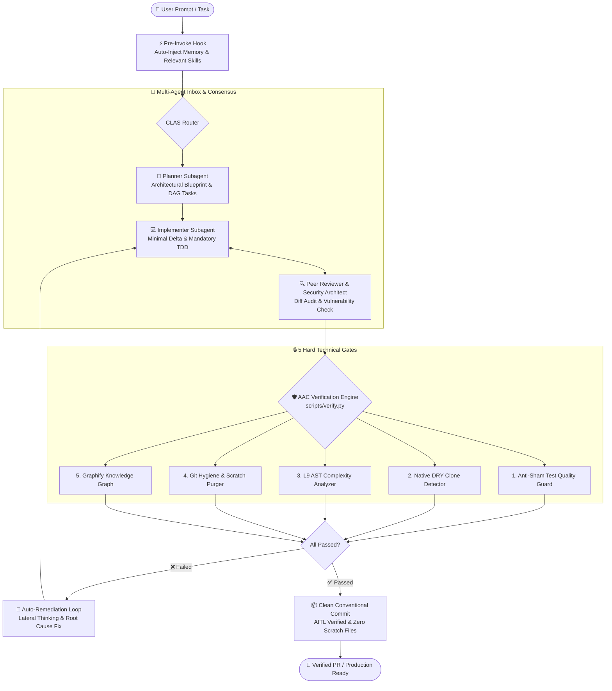

<div align="center">
  <h1>🚀 Antigravity Agent Core (AAC)</h1>
  <p><strong>The Enterprise-Grade Agentic Engineering Framework for Google Antigravity</strong></p>

  [](https://github.com/rafaelghif/antigravity-agents/releases/tag/v4.19.0)
  [](https://antigravity.google/docs/cli/overview)
  [](#-the-5-hard-technical-gates)
  [](https://modelcontextprotocol.io/)
  [](LICENSE)
</div>

---

**Antigravity Agent Core (AAC)** elevates Google Antigravity AI coding assistants into an autonomous, senior-level software engineering unit. While standard AI models produce superficial "vibe coding" — shallow implementations, duplicate code, fake tests, and uncleaned scratch scripts — AAC enforces **System-2 Test-Time Compute (TTC)**, **Deterministic Flow Engineering**, and **Strict Static AST Verification Gates**.

AAC turns your AI into an engineer that thinks before acting, reuses existing code, tests behavioral outcomes, and leaves zero garbage in your repository.

---

## 🏗️ Architecture & Execution Flow

AAC operates as a deterministic State Machine, coordinating specialized subagents through an asynchronous inbox and strict verification pipeline:


```mermaid
flowchart TD
    User([👤 User Prompt / Task]) --> PreHook[⚡ Pre-Invoke Hook<br/>Auto-Inject Memory & Relevant Skills]
    PreHook --> Router{CLAS Router}
    
    subgraph MultiAgent [🤖 Multi-Agent Inbox & Consensus]
        Router --> Planner[🎯 Planner Subagent<br/>Architectural Blueprint & DAG Tasks]
        Planner --> Implementer[💻 Implementer Subagent<br/>Minimal Delta & Mandatory TDD]
        Implementer <--> Reviewer[🔍 Peer Reviewer & Security Architect<br/>Diff Audit & Vulnerability Check]
    end

    Reviewer --> VerifyEngine{🛡️ AAC Verification Engine<br/>scripts/verify.py}

    subgraph Gates [🔒 5 Hard Technical Gates]
        VerifyEngine --> G1[1. Anti-Sham Test Quality Guard]
        VerifyEngine --> G2[2. Native DRY Clone Detector]
        VerifyEngine --> G3[3. L9 AST Complexity Analyzer]
        VerifyEngine --> G4[4. Git Hygiene & Scratch Purger]
        VerifyEngine --> G5[5. Graphify Knowledge Graph]
    end

    G1 & G2 & G3 & G4 & G5 --> GateCheck{All Passed?}
    GateCheck -- ❌ Failed --> AutoFix[🔄 Auto-Remediation Loop<br/>Lateral Thinking & Root Cause Fix]
    AutoFix --> Implementer
    GateCheck -- ✅ Passed --> GitCommit[📦 Clean Conventional Commit<br/>AITL Verified & Zero Scratch Files]
    GitCommit --> Done([🚀 Verified PR / Production Ready])
```

---

## 🔒 The 5 Hard Technical Gates

Unlike generic prompt templates, AAC ships with **native, zero-dependency Python tools** that physically inspect and block substandard code before it enters Git:

| Gate | Tool | What It Enforces |
| :--- | :--- | :--- |
| **1. Anti-Sham Test Guard** | [`scripts/test_quality_guard.py`](scripts/test_quality_guard.py) | **Blocks tautological/fake unit tests.** Inspects AST to reject tests that only assert `callable(fn)`, `hasattr(mod, fn)`, `is not None`, or `expect(fn).toBeDefined()`. Mandates testing real inputs, outputs, exceptions, and edge cases. |
| **2. Native DRY Clone Detector** | [`scripts/dry_guard.py`](scripts/dry_guard.py) | **Blocks code duplication.** Uses normalized rolling-window SHA-256 hashing to find cross-file copy-paste blocks ($\ge 6$ lines) and demands extraction into shared hooks/helpers. |
| **3. L9 AST Complexity Analyzer** | [`scripts/complexity_analyzer.py`](scripts/complexity_analyzer.py) | **Enforces $O(N)$ efficiency.** Forbids nested loops ($O(N^2)$), empty `except: pass` blocks, missing type annotations, and unhandled anti-patterns at the AST level. |
| **4. Git Hygiene & Scratch Purger** | [`scripts/git_hygiene_guard.py`](scripts/git_hygiene_guard.py) | **Eliminates Git garbage.** Intercepts `git commit` to block temporary files (`scratch_*.py`, `tmp_*`, `debug_*`, `*.tmp`, `*.bak`). Sweeps and deletes lingering scratch scripts after each turn. |
| **5. Graphify Knowledge Graph** | [`scripts/semantic_grapher.py`](scripts/semantic_grapher.py) | **Prevents broken refactors.** Computes transitive BFS dependency chains, blast-radius impacts, and exports GraphRAG JSON before touching core modules. |

---

## ⚡ Real-World Capabilities

### 🔌 Model Context Protocol (MCP) Integration
AAC provides first-class configuration templates for MCP servers (`.agents/mcp_config.json.example`). Your agent can securely interact with:
- **Relational Databases**: PostgreSQL, MySQL via native MCP protocol.
- **Browser & E2E Testing**: Headless automation via Puppeteer / Playwright.
- **External Tools**: GitHub Copilot MCP, custom CLI tools, and secure APIs without writing boilerplate connectors.

### 💻 Native Git CLI & AITL Consensus
- **Conventional Commits**: Automates clean, standardized commit history (`feat(...)`, `fix(...)`, `refactor(...)`).
- **AITL (Agent-In-The-Loop) Production Gate**: Destructive actions (`git push`, `npm publish`) require verified consensus from peer review subagents recorded in `.agents/brain/AITL_CONSENSUS.yaml`.

### 🧠 Zero-Amnesia Cross-Session Memory
- **Persistent Context**: Automatically discovers stack dependencies (Next.js, Prisma, Tailwind, Python, Go, etc.) and stores preferences in [`.agents/brain/memory.md`](.agents/brain/memory.md).
- **Self-Learned Rules**: Adapts to project constraints and logs critical lessons into [`.agents/brain/rules.md`](.agents/brain/rules.md) so the agent never repeats past mistakes.

### 🎯 Dynamic Skill Auto-Injection
Context window bloat is eliminated. AAC monitors conversational intent in real-time and injects only the relevant skill instructions (`design`, `architecture`, `security`, `dry`, `code-quality`, `verification`) on-the-fly via [`scripts/hooks/pre_invoke_master.py`](scripts/hooks/pre_invoke_master.py).

---

## 🚀 Quick Start & Installation

Install the AAC Control Plane into any new or existing workspace with a single command:

### Linux / macOS / WSL
```bash
curl -fsSL https://raw.githubusercontent.com/rafaelghif/antigravity-agents/main/install.sh | bash
```

### Windows (PowerShell)
```powershell
irm https://raw.githubusercontent.com/rafaelghif/antigravity-agents/main/install.ps1 | iex
```

> **Zero Destruction Guarantee**: The installer creates an automated timestamped backup in `.agents-backups/` and preserves your existing `.env`, source code, and configurations.

---

## 🔄 Effortless 1-Command Upgrader

Keep your agent framework permanently up-to-date with upstream capabilities:

### Option A: From Terminal
```bash
# Check if a new version is available
python3 scripts/upgrade.py --check

# Upgrade to latest release in 3 seconds (preserves all memory & rules)
python3 scripts/upgrade.py
```

### Option B: Directly in Antigravity Chat
Simply type in the chat prompt:
```text
/upgrade
```
*or ask the agent: "upgrade agent"* — The agent will autonomously check GitHub Releases, apply the latest update, run validation, and report the new features.

---

## 🛠️ Developer Commands Cheat Sheet

| Task | Command | Description |
| :--- | :--- | :--- |
| **Verify Everything** | `python3 scripts/verify.py --execute` | Runs the full 5-gate pipeline (Structural, AST, Anti-Sham, DRY, Git Hygiene). |
| **Check Upgrades** | `python3 scripts/upgrade.py --check` | Queries GitHub Releases to see if a newer AAC version exists. |
| **Perform Upgrade** | `python3 scripts/upgrade.py` | One-click upgrade that preserves user memory and rules. |
| **Audit Duplication** | `python3 scripts/dry_guard.py --check` | Detects cross-file code clones with line numbers and recommendations. |
| **Purge Scratch Files** | `python3 scripts/git_hygiene_guard.py --clean` | Sweeps and removes untracked scratch/temporary scripts. |
| **Blast Radius Analysis** | `python3 scripts/semantic_grapher.py --blast-radius <symbol>` | Analyzes all upstream callers impacted by modifying a class/function. |
| **Export GraphRAG** | `python3 scripts/semantic_grapher.py --json` | Generates deterministic Knowledge Graph JSON for AST analysis. |

---

## 📁 Repository Structure

```text
├── .agents/
│   ├── agents/          # Specialized subagent definitions (planner, implementer, reviewer, etc.)
│   ├── brain/           # Permanent cross-session memory (memory.md, rules.md, ANCHOR.md)
│   ├── harness/         # Token governance & compute guardrails
│   ├── skills/          # Domain-specific procedures (architecture, dry, security, design, etc.)
│   └── config.json      # Core framework configuration & version profile
├── scripts/
│   ├── hooks/           # Antigravity lifecycle hooks (pre-invoke context, post-invoke telemetry)
│   ├── complexity_analyzer.py # Enterprise AST & Big-O analyzer
│   ├── dry_guard.py           # Native sliding-window clone detector
│   ├── git_hygiene_guard.py   # Scratch file cleaner & commit blocker
│   ├── semantic_grapher.py    # GraphRAG knowledge graph & blast radius engine
│   ├── test_quality_guard.py  # Anti-sham behavioral test quality guard
│   ├── upgrade.py             # 1-command effortless upgrader
│   ├── validate.py            # Structural framework validator
│   └── verify.py              # Central verification runner
├── AGENTS.md            # The master policy & World-Class Gates constitution
└── install.sh / install.ps1   # Universal auto-resolving installers
```

---

<div align="center">
  <sub>Built for engineers who demand OP code quality, strict static guarantees, and zero AI fluff.</sub>
</div>
