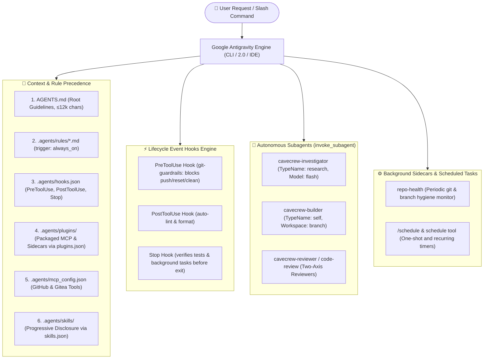

# 🚀 Antigravity Agents (v5.0.0)

<div align="center">

**The Production-Grade, Autonomous Engineering Framework for Google Antigravity**  
*Optimized for Gemini 3.8 Flash (High) • Native Progressive Disclosure • Lifecycle Hooks • Multi-Agent Workspaces*

[](https://github.com/rafaelghif/antigravity-agents/releases/tag/v5.0.0)
[](https://antigravity.google/docs)
[-0052CC.svg?style=flat-square)](https://antigravity.google/docs/rules-workflows)
[](#-autonomous-skills-suite)
[](LICENSE)

</div>

---

## 🌟 What is Antigravity Agents v5?

**Antigravity Agents v5** represents a complete architectural evolution for the [antigravity-agents](https://github.com/rafaelghif/antigravity-agents) repository. Transitioning from script-heavy scaffolding in v4, **v5** adopts the official **Google Antigravity Customization Architecture**:

1. **Zero Hallucination Native Tooling**: Directly integrates with Antigravity's native primitives (`run_command`, `replace_file_content`, `view_file`, `invoke_subagent`, `manage_task`, `schedule`).
2. **Gemini 3.8 Flash (High) Optimization**: Designed for ultra-fast, deterministic, low-token pair programming following the **Caveman Principle** (terse technical precision) and **Ponytail Principle** (7-rung minimalist code ladder).
3. **Progressive Disclosure Skills**: Houses 60+ modular engineering, testing, architectural, and token-saving skills that load dynamically on demand without polluting the main context window.
4. **First-Class Lifecycle Hooks**: Configured via `.agents/hooks.json` supporting `PreToolUse` (git guardrails, mutation blockers), `PostToolUse` (formatters, linters), `PreInvocation`, `PostInvocation`, and `Stop` gates.
5. **Autonomous Subagent Workspaces**: Native DAG execution via `invoke_subagent` utilizing isolated workspace branches (`Workspace: "branch"` or `"share"`).
6. **Multi-VCS Model Context Protocol (MCP)**: Out-of-the-box configuration for **Gitea MCP** (stdio) and **GitHub MCP** (remote SSE) with zero-leak credential isolation (`.gitignore` sandboxing).
7. **Strict Workspace Isolation**: 100% scoped to `.agents/`. Zero machine-global pollution. Fully tested on Windows (PowerShell 5.1+) and cross-platform POSIX.

---

## 🏗️ Architecture Overview


```mermaid
flowchart TD
    User(["👤 User Request / Slash Command"]) --> Antigravity["Google Antigravity Engine (CLI / 2.0 / IDE)"]

    subgraph Context ["🧠 Context & Rule Precedence"]
        AGENTS["1. AGENTS.md (Root Guidelines, ≤12k chars)"]
        Rules["2. .agents/rules/*.md (trigger: always_on)"]
        Hooks["3. .agents/hooks.json (PreToolUse, PostToolUse, Stop)"]
        Plugins["4. .agents/plugins/ (Packaged MCP & Sidecars via plugins.json)"]
        MCP["5. .agents/mcp_config.json (GitHub & Gitea Tools)"]
        Skills["6. .agents/skills/ (Progressive Disclosure via skills.json)"]
    end

    Antigravity --> Context

    subgraph HooksEngine ["⚡ Lifecycle Event Hooks Engine"]
        PreTool["PreToolUse Hook (git-guardrails: blocks push/reset/clean)"]
        PostTool["PostToolUse Hook (auto-lint & format)"]
        StopHook["Stop Hook (verifies tests & background tasks before exit)"]
    end

    Antigravity --> HooksEngine

    subgraph SubagentsEngine ["🤖 Autonomous Subagents (invoke_subagent)"]
        Investigator["cavecrew-investigator (TypeName: research, Model: flash)"]
        Builder["cavecrew-builder (TypeName: self, Workspace: branch)"]
        Reviewer["cavecrew-reviewer / code-review (Two-Axis Reviewers)"]
    end

    Antigravity --> SubagentsEngine

    subgraph SidecarsEngine ["⚙️ Background Sidecars & Scheduled Tasks"]
        Sidecars["repo-health (Periodic git & branch hygiene monitor)"]
        CronSchedule["/schedule & schedule tool (One-shot and recurring timers)"]
    end

    Antigravity --> SidecarsEngine
```

---

## 📂 Repository Layout

```text
antigravity-agents/
├── .agents/
│   ├── hooks.json                     # Antigravity lifecycle hooks (PreToolUse matcher on run_command)
│   ├── hooks/                         # Executable hook scripts (block-dangerous-git.ps1, .js)
│   ├── plugins.json                   # Explicit workspace plugin registration
│   ├── skills.json                    # Explicit workspace skills registration
│   ├── mcp_config.example.json        # Public sanitized template for Gitea and GitHub MCP
│   ├── plugins/                       # Workspace plugins packaging tools & background processes
│   │   └── workspace-integrations/    # Workspace integrations bundle
│   │       ├── plugin.json            # Plugin manifest
│   │       ├── mcp_config.example.json# Packaged MCP template
│   │       └── sidecars/              # Background persistent sidecars
│   │           └── repo-health/       # Repository health and hygiene sidecar (sidecar.json)
│   ├── rules/                         # Workspace-level rules with 'trigger: always_on'
│   │   ├── caveman.md                 # Ultra-compressed token communication protocol
│   │   ├── coding-standards.md        # Quality, SRP, error handling, targeted replacement
│   │   ├── git-workflow.md            # Conventional Commits and atomic changes
│   │   └── ponytail.md                # 7-rung minimalist code ladder (YAGNI to one-liners)
│   └── skills/                        # 60+ On-demand skills (Progressive disclosure)
│       ├── ask-matt/                  # Meta-router across all engineering workflows
│       ├── cavecrew/                  # Compressed subagent presets (investigator, builder, reviewer)
│       ├── caveman/                   # Terse, high-speed token conservation modes
│       ├── code-review/               # Two-axis parallel subagent review (Standards & Spec)
│       ├── codebase-design/           # Deep module interfaces and seam vocabulary
│       ├── git-guardrails/            # Native PreToolUse hook blocking destructive git operations
│       ├── implement-spec/            # Concurrent spec implementation in isolated worktrees
│       ├── ponytail/                  # Minimalist developer persona & review suite
│       ├── subagent-handoff/          # Asynchronous background session delegation
│       ├── tdd/                       # Test-driven red-green-refactor loop
│       ├── to-spec/                   # Converts discussion into structured technical specs
│       ├── to-tickets/                # Breaks specs into dependency-linked tracer-bullet tickets
│       ├── triage/                    # State-machine issue & pull request triager
│       └── wayfinder/                 # Multi-session milestone and fog-of-war roadmap mapper
├── AGENTS.md                          # Root instructions unconditionally loaded per turn
├── GEMINI.md                          # Pointer alias to AGENTS.md
├── .gitignore                         # Quarantines PATs, credentials, and local caches
├── skills-lock.json                   # Checksums and upstream source tracking for skills
└── README.md                          # Framework documentation
```

---

## ⚡ Autonomous Skills Suite

Skills are loaded into Antigravity via **progressive disclosure**: only names and descriptions are exposed initially. When a matching intent is recognized, Antigravity reads the target `SKILL.md` directly:

### 1. Minimalist Code & Token Reduction
- **`ponytail` / `ponytail-review` / `ponytail-audit`**: Enforces the 7-rung code ladder (YAGNI → Reuse → Standard Library → Native Platform → Dependency → One-Liner → Minimal Diff). Eliminates speculative abstractions.
- **`caveman` / `cavecrew` / `caveman-compress` / `caveman-commit`**: Compresses output and context to conserve tokens while preserving 100% technical fidelity.

### 2. Specification & Planning
- **`ask-matt`**: Meta-router recommending the best skill or workflow for any given task.
- **`grill-me` / `grill-with-docs` / `grilling`**: Relentless interactive interview stress-testing plans, requirements, and domain glossaries.
- **`to-spec`**: Synthesizes conversations into exhaustive technical specifications with test seams.
- **`to-tickets`**: Decomposes specs into vertical tracer-bullet tickets with dependency edges.
- **`wayfinder`**: Maps complex multi-session efforts into a map of frontier decisions under the fog of war.

### 3. Implementation & Verification
- **`tdd`**: Strict test-first loop (Red → Green → Refactor) enforcing pre-agreed seams.
- **`implement` / `implement-spec`**: Executes tickets across concurrent subagents in isolated branches (`Workspace: "branch"`).
- **`surgical-patch`**: Pinpoint bug fixing at the narrowest responsible layer without scope creep.
- **`diagnosing-bugs`**: Systematic scientific hypothesis testing for intermittent issues and regressions.
- **`code-review`**: Parallel two-axis review checking **Standards** (conventions & Fowler smells) and **Spec** (fidelity to requirements).

### 4. Safety & Delegation
- **`git-guardrails`**: Intercepts `run_command` in Antigravity to reject `push`, `reset --hard`, `clean -f`, and `branch -D`.
- **`handoff` / `subagent-handoff`**: Compacts sessions into structured handoffs and spins off background workers.
- **`triage`**: Triages issues and PRs through canonical states (`needs-triage`, `needs-info`, `ready-for-agent`, `ready-for-human`, `wontfix`).

---

## 🔌 Model Context Protocol (MCP) Setup

Antigravity Agents v5 natively supports workspace-level MCP servers.

Copy `.agents/mcp_config.example.json` to `.agents/mcp_config.json` (which is gitignored):

```bash
cp .agents/mcp_config.example.json .agents/mcp_config.json
```

Configure your credentials:

```json
{
  "mcpServers": {
    "github": {
      "serverUrl": "https://api.githubcopilot.com/mcp/",
      "headers": {
        "Authorization": "Bearer YOUR_GITHUB_PAT"
      }
    },
    "gitea": {
      "command": "gitea-mcp",
      "args": ["-t", "stdio"],
      "env": {
        "GITEA_HOST": "https://gitea.com",
        "GITEA_ACCESS_TOKEN": "YOUR_GITEA_PAT"
      }
    }
  }
}
```

- **Gitea MCP**: Runs locally via `gitea-mcp` stdio transport.
- **GitHub MCP**: Connects remotely via SSE.

---

## 🛡️ Git Guardrails & Security

Destructive git operations are blocked before execution by the Antigravity `PreToolUse` hook in `.agents/hooks.json`:

```powershell
# Tested on Windows PowerShell:
'{"toolCall":{"name":"run_command","args":{"CommandLine":"git push origin main"}}}' | powershell -File .agents/skills/git-guardrails/scripts/block-dangerous-git.ps1
# Returns: {"decision":"deny","reason":"BLOCKED: 'git push origin main' matches dangerous git pattern '\\bgit\\s+push\\b'..."}
```

---

## 🚀 Getting Started

1. **Clone the Repository**:
   ```bash
   git clone https://github.com/rafaelghif/antigravity-agents.git
   cd antigravity-agents
   ```

2. **Open in Antigravity**:
   - Launch **Antigravity 2.0**, **Antigravity IDE**, or **Antigravity CLI** (`agy`):
     ```bash
     agy
     ```

3. **Verify Active Configuration**:
   - `AGENTS.md` is loaded automatically into the agent's context.
   - Run `/help` or ask the agent what workflows to use:
     ```text
     What workflows are available for implementing a new feature?
     ```
   - The agent will autonomously route through `ask-matt`, `to-spec`, `tdd`, or `implement-spec`.

---

## 📜 License & Credits

- **Author**: Muhammad Rafael Ghifari ([@rafaelghif](https://github.com/rafaelghif))
- **License**: [MIT](LICENSE)
- **Built For**: [Google Antigravity](https://antigravity.google)
