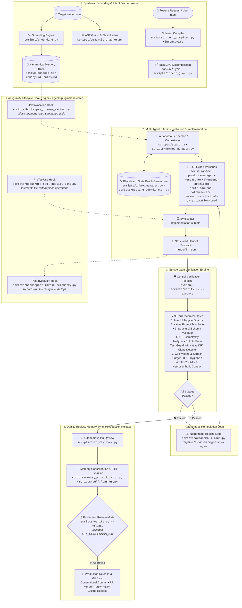

<div align="center">
  <h1>🚀 Antigravity Agent Core (AAC)</h1>
  <p><strong>The Enterprise-Grade Multi-Agent Engineering Framework for Google Antigravity</strong></p>

  <a href="https://github.com/rafaelghif/antigravity-agents/releases"></a>
  [](https://github.com/rafaelghif/antigravity-agents/releases/tag/v4.46.0)
  [](https://antigravity.google/docs/cli/overview)
  [](#-the-8-l9-expert-personas)
  [](#-the-11-core-enterprise-skills)
  [](#-the-9-hard-technical-gates)
  [](LICENSE)
  [](#-support--sponsorship)
</div>

---

**Antigravity Agent Core (AAC)** transforms Google Antigravity AI coding assistants into an autonomous, senior-grade software engineering organization. While standard AI coding models frequently generate ungrounded code, invent non-existent libraries, duplicate existing logic, create hollow placeholder tests, and pollute repository workspaces with scratch artifacts, AAC introduces deterministic engineering rigor.

AAC enforces **Epistemic Codebase Grounding**, **System-2 Test-Time Compute (TTC)**, **Deterministic Multi-Agent DAG Orchestration**, and **9 Strict Static & Behavioral Verification Gates**.

Every architectural decision is grounded in local codebase reality before planning begins, code changes reuse existing abstractions, testing enforces genuine behavioral assertions, interfaces comply with WCAG 2.2 AA accessibility standards, and workspaces remain completely clean.

---

## 🌟 Key Architectural Pillars

- 🧠 **Epistemic Grounding (Zero Hallucination)**: Inspects real manifests, package managers, compilers, and directory layouts via [`scripts/grounding.py`](scripts/grounding.py) before proposing or writing code. Never assumes unverified APIs or dependencies.
- 📋 **Intent Compilation & Task DAG**: Deconstructs high-level objectives into formal specifications (`intent.yaml`) and atomic micro-tasks (`tasks/*.yaml`) via [`scripts/intent_compiler.py`](scripts/intent_compiler.py) and [`scripts/intent_guard.py`](scripts/intent_guard.py).
- 🤖 **8 L9 Expert Personas**: Discrete subagents with strict domain boundaries for Scrum Master, Product Manager, Researcher, Frontend Architect, Staff Backend, Database SRE, DevSecOps Principal, and QA Automation Lead.
- 📚 **11 Consolidated Core Skills**: Authoritative engineering playbooks consolidated in `.agents/skills/` covering architecture, security, design, code quality, data engineering, and verification.
- ⚡ **Deterministic Multi-Agent DAG Engine**: Topological task scheduler ([`scripts/hermes_manager.py`](scripts/hermes_manager.py) and [`scripts/dag_orchestrator.py`](scripts/dag_orchestrator.py)) orchestrating persona swarms with crash-resilient checkpointing.
- 🔒 **9 Hard Technical Gates**: Pure-Python zero-dependency gates physically inspecting AST complexity, anti-sham testing, DRY clone duplication, git hygiene, UI accessibility, and neurosymbolic handoff contracts via [`scripts/verify.py`](scripts/verify.py).
- 🔄 **Autonomous Remediation Loop**: Built-in self-healing loop ([`scripts/autonomous_loop.py`](scripts/autonomous_loop.py)) driving targeted, test-driven remediation upon gate or test failures.
- 🧐 **Automated PR Code Review**: Built-in autonomous reviewer ([`scripts/auto_reviewer.py`](scripts/auto_reviewer.py)) evaluating working tree diffs against enterprise production criteria.
- 🕸️ **AST Knowledge Graph & Blast Radius**: Code intelligence engine ([`scripts/semantic_grapher.py`](scripts/semantic_grapher.py)) providing caller resolution, transitive blast radius analysis, and PageRank centrality ranking.
- 🤝 **Agile Ceremonies & Blackboard**: Disk-backed Blackboard ([`scripts/inbox_manager.py`](scripts/inbox_manager.py)) and meeting coordinator ([`scripts/meeting_coordinator.py`](scripts/meeting_coordinator.py)) for standups, architectural planning, reviews, and conflict resolution.
- ⚡ **Antigravity Lifecycle Hooks**: Native plugin hooks ([`.agents/plugins/aac-core/hooks.json`](.agents/plugins/aac-core/hooks.json)) intercepting pre-invocation context, file mutation gates, and post-invocation telemetry.
- 🌍 **100% Platform & Runtime Agnostic**: Pure Python standard library implementation with zero external package dependencies, supporting Python, TypeScript/JavaScript, Go, Rust, Java/Kotlin, C#, PHP, Ruby, C++, Dart, and Swift across Linux, macOS, and Windows.

---

## 🏗️ Architecture & Multi-Agent Execution Flow

AAC operates as a deterministic epistemic state machine, coordinating specialized personas through a disk-backed Blackboard, automated lifecycle hooks, and a 9-gate verification engine:


```mermaid
flowchart TD
    subgraph Phase1 ["1. Epistemic Grounding & Intent Decomposition"]
        Repo[("📂 Target Workspace")] --> Grounding["🔍 Grounding Engine<br/><code>scripts/grounding.py</code>"]
        Repo --> SemanticGraph["🕸️ AST Graph & Blast Radius<br/><code>scripts/semantic_grapher.py</code>"]
        UserPrompt(["👤 Feature Request / User Intent"]) --> IntentCompiler["📋 Intent Compiler<br/><code>scripts/intent_compiler.py</code> • <code>intent.yaml</code>"]
        IntentCompiler --> TaskDAG["🗂️ Task DAG Decomposition<br/><code>tasks/*.yaml</code> • <code>scripts/intent_guard.py</code>"]
        Grounding --> MemoryBank[("🧠 Hierarchical Memory Bank<br/><code>active_context.md</code> • <code>memory.md</code> • <code>rules.md</code>")]
    end

    subgraph Hooks ["⚡ Antigravity Lifecycle Hook Engine (.agents/plugins/aac-core/)"]
        PreInvoke["PreInvocation Hook<br/><code>scripts/hooks/pre_invoke_master.py</code><br/><i>Injects memory, rules & matched skills</i>"]
        PreTool["PreToolUse Hook<br/><code>scripts/hooks/pre_tool_quality_gate.py</code><br/><i>Intercepts file write/replace operations</i>"]
        PostInvoke["PostInvocation Hook<br/><code>scripts/hooks/post_invoke_telemetry.py</code><br/><i>Records run telemetry & audit logs</i>"]
    end

    subgraph Phase2 ["2. Multi-Agent DAG Orchestration & Implementation"]
        TaskDAG --> Daemon["🎯 Autonomous Daemon & Orchestrator<br/><code>scripts/start.py</code> • <code>scripts/hermes_manager.py</code>"]
        MemoryBank -.-> PreInvoke -.-> Daemon
        Daemon <--> Blackboard[("📋 Blackboard State Bus & Ceremonies<br/><code>scripts/inbox_manager.py</code> • <code>scripts/meeting_coordinator.py</code>")]
        Daemon --> Specialists["👥 8 L9 Expert Personas<br/><code>scrum-master</code> • <code>product-manager</code> • <code>researcher</code> • <code>frontend-architect</code><br/><code>staff-backend</code> • <code>database-sre</code> • <code>devsecops-principal</code> • <code>qa-automation-lead</code>"]
        Specialists --> Implementation["💻 Byte-Exact Implementation & Tests"]
        PreTool -.-> Implementation
        Implementation --> Handoff["📝 Structured Handoff Contract<br/><code>handoff.json</code>"]
        Handoff -.-> PostInvoke
    end

    subgraph Phase3 ["3. Strict 9-Gate Verification Engine"]
        Handoff --> VerifyRunner["🛡️ Central Verification Pipeline<br/><code>python3 scripts/verify.py --execute</code>"]
        VerifyRunner --> Gates["🔒 9 Hard Technical Gates<br/>1. Intent Lifecycle Guard • 2. Native Project Test Suite • 3. Structural Schema Validator<br/>4. AST Complexity Analyzer • 5. Anti-Sham Test Guard • 6. Native DRY Clone Detector<br/>7. Git Hygiene & Scratch Purger • 8. UI Hygiene / WCAG 2.2 AA • 9. Neurosymbolic Contract"]
        Gates --> GateDecision{"All 9 Gates<br/>Passed?"}
    end

    subgraph SelfHealing ["Autonomous Remediation Loop"]
        GateDecision -- "❌ Failure" --> HealingLoop["🔄 Autonomous Healing Loop<br/><code>scripts/autonomous_loop.py</code><br/><i>Targeted test-driven diagnostics & repair</i>"]
        HealingLoop --> Specialists
    end

    subgraph Phase4 ["4. Quality Review, Memory Sync & Production Release"]
        GateDecision -- "✅ Passed" --> PRReview["🧐 Autonomous PR Review<br/><code>scripts/auto_reviewer.py</code>"]
        PRReview --> MemorySync["💾 Memory Consolidation & Skill Evolution<br/><code>scripts/memory_consolidator.py</code> • <code>scripts/self_learner.py</code>"]
        MemorySync --> ReleaseGate{"🔒 Production Release Gate<br/><code>scripts/verify.py --release</code><br/><i>Validates AITL_CONSENSUS.yaml</i>"}
        ReleaseGate -- "✅ Approved" --> ProductionShip["🚀 Production Release & Git Sync<br/>Conventional Commit • PR Merge • Tag v4.46.0 • GitHub Release"]
    end
```

### Execution Lifecycle Breakdown:
1. **Epistemic Recon & Intent Decomposition**: Ground truth is extracted from the consumer workspace using [`scripts/grounding.py`](scripts/grounding.py) and [`scripts/semantic_grapher.py`](scripts/semantic_grapher.py). The feature intent is compiled via [`scripts/intent_compiler.py`](scripts/intent_compiler.py) into atomic micro-tasks with explicit dependencies and falsifiable acceptance criteria.
2. **Antigravity Lifecycle Hook Engine**: Integrated via `.agents/plugins/aac-core/hooks.json`. Before each invocation, `pre_invoke_master.py` dynamically injects the active working context, memory, and matched skills. During execution, `pre_tool_quality_gate.py` intercepts file write operations to prevent unvalidated changes.
3. **Deterministic Multi-Agent Orchestration**: The autonomous daemon (`scripts/start.py`) launches the background meeting coordinator (`scripts/meeting_coordinator.py`) and drives task execution via `scripts/hermes_manager.py`. The 8 L9 personas communicate asynchronously through the Blackboard (`scripts/inbox_manager.py`) and deliver complete code changes with structured `handoff.json` contracts.
4. **9-Gate Verification & Self-Healing**: Code must pass all 9 static and behavioral technical gates executed by [`scripts/verify.py --execute`](scripts/verify.py). If any gate fails, `scripts/autonomous_loop.py` routes diagnostic feedback back to the specialist for targeted repair.
5. **Quality Review, Memory Sync & Production Release**: Passing code undergoes autonomous PR review (`scripts/auto_reviewer.py`), permanent memory consolidation (`scripts/memory_consolidator.py`), and procedural skill synthesis (`scripts/self_learner.py`). The production release gate (`scripts/verify.py --release`) confirms consensus before final release.

---

## 🤖 The 8 L9 Expert Personas

Subagents are defined in [`.agents/agents/`](.agents/agents/). Specialized roles operate with discrete operational boundaries:

| Persona | Role | Key Responsibilities |
| :--- | :--- | :--- |
| **[`scrum-master`](.agents/agents/scrum-master.md)** | Principal Agile Orchestrator | Task DAG scheduling, blocker elimination, cross-agent coordination, and standup reporting ([`tasks/meeting_notes.md`](tasks/meeting_notes.md)). |
| **[`product-manager`](.agents/agents/product-manager.md)** | Principal Product Manager | User stories, acceptance criteria, intent compilation ([`scripts/intent_compiler.py`](scripts/intent_compiler.py)), and lifecycle gatekeeping ([`scripts/intent_guard.py`](scripts/intent_guard.py)). |
| **[`researcher`](.agents/agents/researcher.md)** | Staff Technical Researcher | Epistemic documentation lookup, external API contract verification, and anti-hallucination web research. |
| **[`frontend-architect`](.agents/agents/frontend-architect.md)** | Staff Frontend Architect | Responsive UI engineering, 3-tier DTCG design tokens, WCAG 2.2 AA accessibility, and Core Web Vitals (LCP, INP, CLS). |
| **[`staff-backend`](.agents/agents/staff-backend.md)** | Staff Backend Engineer | Distributed system design, RFC 7807 problem details, idempotency keys, and transactional outbox patterns. |
| **[`database-sre`](.agents/agents/database-sre.md)** | Principal Database SRE | Zero-downtime expand-contract schema migrations, concurrent non-blocking indexing, and query optimization. |
| **[`devsecops-principal`](.agents/agents/devsecops-principal.md)** | Principal DevSecOps | Zero-Trust security, Docker containerization, CI/CD pipelines, secret scanning, and MCP toolchain configuration. |
| **[`qa-automation-lead`](.agents/agents/qa-automation-lead.md)** | Staff QA Automation Lead | Behavioral end-to-end testing, property-based testing, boundary validation, and anti-sham test hygiene. |

---

## 📚 The 11 Core Enterprise Skills

All engineering capabilities are consolidated into 11 authoritative playbooks located in [`.agents/skills/`](.agents/skills/):

| Skill | Playbook File | Focus & Operational Domain |
| :--- | :--- | :--- |
| **`architecture`** | [`.agents/skills/architecture/SKILL.md`](.agents/skills/architecture/SKILL.md) | Distributed system design, RFC 7807 contracts, idempotency, transactional outbox, and circuit breakers. |
| **`caveman`** | [`.agents/skills/caveman/SKILL.md`](.agents/skills/caveman/SKILL.md) | High-density token compression ("Mouth smaller, not brain smaller") reducing token overhead by 60%+ while keeping code byte-exact. |
| **`code-quality`** | [`.agents/skills/code-quality/SKILL.md`](.agents/skills/code-quality/SKILL.md) | SOLID principles, clean architecture, early returns, DRY deduplication, and anti-overengineering. |
| **`data-engineering`** | [`.agents/skills/data-engineering/SKILL.md`](.agents/skills/data-engineering/SKILL.md) | Zero-downtime expand-contract migrations, concurrent DDL, ETL/ELT pipelines, and streaming CDC. |
| **`deep-research`** | [`.agents/skills/deep-research/SKILL.md`](.agents/skills/deep-research/SKILL.md) | Epistemic research loop: targeted search, deep extraction, and local truth synthesis. |
| **`design`** | [`.agents/skills/design/SKILL.md`](.agents/skills/design/SKILL.md) | UI components, 3-tier DTCG design tokens, WCAG 2.2 AA accessibility, and Core Web Vitals optimization. |
| **`devops`** | [`.agents/skills/devops/SKILL.md`](.agents/skills/devops/SKILL.md) | Docker, Kubernetes, CI/CD pipelines, Infrastructure as Code, and MCP toolchains. |
| **`observability`** | [`.agents/skills/observability/SKILL.md`](.agents/skills/observability/SKILL.md) | Structured logging, Prometheus metrics, and OpenTelemetry distributed tracing. |
| **`security`** | [`.agents/skills/security/SKILL.md`](.agents/skills/security/SKILL.md) | Zero-Trust architecture, secret management, PBAC/RBAC, and input sanitization. |
| **`semantic-graphing`** | [`.agents/skills/semantic-graphing/SKILL.md`](.agents/skills/semantic-graphing/SKILL.md) | AST knowledge graph, transitive caller resolution, PageRank centrality, and blast radius analysis. |
| **`verification`** | [`.agents/skills/verification/SKILL.md`](.agents/skills/verification/SKILL.md) | Behavioral TDD, boundary validation, property-based tests, and anti-sham test hygiene. |

---

## 🔒 The 9 Hard Technical Gates

AAC runs **native, zero-dependency Python verification gates** via [`scripts/verify.py`](scripts/verify.py) that physically inspect code before release:

| Gate | Guard Script | What It Strictly Enforces |
| :--- | :--- | :--- |
| **1. Intent Lifecycle Guard** | [`scripts/intent_guard.py`](scripts/intent_guard.py) | **Keeps requirements fresh.** Enforces `intent.yaml` lifecycle states (`IN_PROGRESS`/`DONE`) and guarantees all micro-tasks in `tasks/` match before release. |
| **2. Native Project Test Suite** | Native test runner | **Exercises real behavior.** Automatically detects and executes repository test suites across multiple frameworks with zero regressions. |
| **3. Structural Schema Validator** | [`scripts/validate.py`](scripts/validate.py) | **Zero-drift configuration.** Validates JSON schema integrity, version consistency across manifests, and required path contracts. |
| **4. L9 AST Complexity Analyzer** | [`scripts/complexity_analyzer.py`](scripts/complexity_analyzer.py) | **Enforces $O(N)$ efficiency.** Forbids nested loops ($O(N^2)$), empty `except: pass` blocks, missing type annotations, and unhandled anti-patterns at the AST level. |
| **5. Anti-Sham Test Guard** | [`scripts/test_quality_guard.py`](scripts/test_quality_guard.py) | **Blocks tautological unit tests.** Inspects AST to reject tests that only assert `callable(fn)`, `hasattr(mod, fn)`, `is not None`, or `expect(fn).toBeDefined()`. |
| **6. Native DRY Clone Detector** | [`scripts/dry_guard.py`](scripts/dry_guard.py) | **Blocks code duplication.** Uses normalized rolling-window SHA-256 hashing to find cross-file copy-paste blocks ($\ge 6$ lines) and demands shared helpers. |
| **7. Git Hygiene & Scratch Purger** | [`scripts/git_hygiene_guard.py`](scripts/git_hygiene_guard.py) | **Eliminates Git garbage.** Intercepts git staging to block temporary files (`scratch_*`, `tmp_*`, `debug_*`, `*.tmp`, `*.bak`) and sweeps lingering scratch scripts. |
| **8. UI Hygiene & a11y Guard** | [`scripts/ui_hygiene_guard.py`](scripts/ui_hygiene_guard.py) | **WCAG 2.2 AA & DTCG Tokens.** Enforces visible focus rings (bans bare `outline-none`), `alt` text on images, explicit `<button>` types, and design tokens. |
| **9. Neurosymbolic Handoff Engine** | [`scripts/neurosymbolic_engine.py`](scripts/neurosymbolic_engine.py) | **Strict subagent contract.** Validates `handoff.json` payloads and enforces mandatory TDD (modifications without tests are rejected). |

---

## ⚡ Core Operational Modules

### 🔍 Epistemic Grounding Engine
Before planning or touching code, AAC runs [`scripts/grounding.py`](scripts/grounding.py). It inspects:
- **Active Ecosystems**: Node/TS, Python, Go, Rust, Java, C#, PHP, Ruby, Dart, Swift.
- **True Dependencies**: Reads `package.json`, `requirements.txt`, `go.mod`, `Cargo.toml`, `pom.xml`, etc.
- **Actual Directory Layout**: Identifies source roots, test suites, and configuration baselines.
- **Context Snapshot**: Writes ground truth directly to `.agents/brain/active_context.md`.

### 📋 Intent Compiler & Lifecycle Guard
Formal requirements management ensures agents work against explicit, verifiable goals:
- **Compile Intent**: `python3 scripts/intent_compiler.py intent.yaml` decomposes high-level intent into discrete tasks (`tasks/*.yaml`) with assigned personas and dependencies.
- **Validate State**: `python3 scripts/intent_guard.py` enforces task completion states before release.

### 🤝 Multi-Mode Agile Meeting Coordinator
Run targeted agile ceremonies on demand via [`scripts/meeting_coordinator.py`](scripts/meeting_coordinator.py):
- `--standup`: Compiles current blockers, ongoing PR tasks, and completed deliverables into [`tasks/meeting_notes.md`](tasks/meeting_notes.md).
- `--planning "<topic>"`: Initiates architectural alignment and requirements breakdown.
- `--review`: Performs peer review and verification audit on recent handoffs.
- `--sync`: Reconciles agent state and resolves coordination deadlocks.

### 🕸️ Code Intelligence & Blast Radius Analysis
Use [`scripts/semantic_grapher.py`](scripts/semantic_grapher.py) to inspect the codebase AST:
- `--blast-radius <symbol>`: Resolves all upstream callers and transitive impact before modifying critical symbols.
- `--pagerank`: Computes PageRank centrality to identify core architectural hub nodes.
- `--path-find <start> <end>`: Calculates the shortest call path between two functions or classes.

### 🧐 Autonomous PR Reviewer
Review working tree diffs against L9 engineering standards via [`scripts/auto_reviewer.py`](scripts/auto_reviewer.py):
- Runs verification gates automatically before evaluating the diff.
- Outputs structured review verdicts (`APPROVED` / `CHANGES_REQUESTED`) with actionable feedback.

### 🔌 Model Context Protocol (MCP) & Browsing
AAC configures complete tool permissions in `.agents/antigravity-settings.example.json` and `.agents/mcp_config.json` for:
- **Live Browsing & Epistemic Research**: `search_web`, `read_url_content`, and `read_browser_page`.
- **Subagent Swarms**: `invoke_subagent`, `send_message`, `manage_subagents`, `define_subagent`.
- **Database & External MCPs**: PostgreSQL, MySQL, Puppeteer, and custom enterprise tools.

---

## 🚀 Installation & Quick Start

Install AAC into any target project using the universal installer:

### 🐍 Universal (Linux, macOS, Windows)
```bash
python3 install.py
```

### Direct Remote Bootstrap (Zero Cloning Required)
- **Linux / macOS / WSL**:
  ```bash
  curl -fsSL https://raw.githubusercontent.com/rafaelghif/antigravity-agents/main/install.py | python3
  ```
- **Windows (PowerShell / CMD)**:
  ```powershell
  irm https://raw.githubusercontent.com/rafaelghif/antigravity-agents/main/install.py | python
  ```

*(Legacy bootstrap shims `curl .../install.sh | bash` and `irm .../install.ps1 | iex` automatically delegate to Python).*

### Advanced Installer Options
```bash
# Check latest upstream version without installing
python3 install.py --check

# Force clean reinstallation
python3 install.py --force

# Air-gapped / offline installation from a local source directory
python3 install.py --source-dir /path/to/local/antigravity-agents
```

> **Zero Destruction Guarantee**: The installer creates an automated timestamped backup in `.agents-backups/`, preserves existing `.env` files, source code, and custom memory files, and never pollutes your project with external CI/CD workflows.

---

## 🔄 Effortless 1-Command Upgrader

Keep your agent framework synchronized with upstream releases:

```bash
# Check if a newer version is available
python3 scripts/upgrade.py --check

# Upgrade to latest release (preserves memory, context, and custom rules)
python3 scripts/upgrade.py
```

When interacting with the agent in Google Antigravity, you can simply instruct the agent: *"upgrade agent"* to query upstream releases, apply updates, execute verification gates, and summarize updated capabilities.

---

## 🛠️ Developer Commands Cheat Sheet

| Task | Command | Description |
| :--- | :--- | :--- |
| **Ground Workspace** | `python3 scripts/grounding.py` | Discovers true project stack, dependencies, and layout. |
| **Full Verification** | `python3 scripts/verify.py --execute` | Runs the full 9-gate verification pipeline. |
| **Terse ACI Verify** | `python3 scripts/verify.py --execute --terse` | High-density telegraphic verification summary. |
| **Production Release Gate** | `python3 scripts/verify.py --release` | Enforces production release approval (`AITL_CONSENSUS.yaml`). |
| **Validate Intent** | `python3 scripts/intent_guard.py` | Validates `intent.yaml` schema and task alignment. |
| **Compile Intent** | `python3 scripts/intent_compiler.py intent.yaml` | Decomposes feature intent into atomic `tasks/*.yaml`. |
| **Run DAG Pipeline** | `python3 scripts/dag_orchestrator.py <dag.yaml>` | Executes multi-agent topological workflow. |
| **Hermes Status** | `python3 scripts/hermes_manager.py --status` | Displays dependency graph status and pending tasks. |
| **Autonomous Daemon** | `python3 scripts/start.py` | Starts background meeting coordinator and autonomous task loop. |
| **Hermes Daemon** | `python3 scripts/start.py --hermes` | Starts background meeting coordinator and Hermes DAG orchestrator. |
| **Automated PR Review** | `python3 scripts/auto_reviewer.py --terse` | Reviews working tree diffs against L9 quality criteria. |
| **Team Standup** | `python3 scripts/meeting_coordinator.py --standup` | Compiles team progress into `tasks/meeting_notes.md`. |
| **Architecture Planning** | `python3 scripts/meeting_coordinator.py --planning "<topic>"` | Conducts architectural planning ceremony. |
| **Audit Duplication (DRY)** | `python3 scripts/dry_guard.py --check` | Detects cross-file code clones with line numbers. |
| **Audit UI & a11y** | `python3 scripts/ui_hygiene_guard.py --check` | Scans UI code for WCAG 2.2 AA and token compliance. |
| **Blast Radius Analysis** | `python3 scripts/semantic_grapher.py --blast-radius <symbol>` | Analyzes all upstream callers impacted by code changes. |
| **PageRank Centrality** | `python3 scripts/semantic_grapher.py --pagerank` | Computes PageRank to identify core architectural hubs. |
| **Purge Scratch Files** | `python3 scripts/git_hygiene_guard.py --clean` | Sweeps and removes untracked temporary scratch files. |
| **Memory Consolidation** | `python3 scripts/memory_consolidator.py --update-focus '<task>'` | Updates hierarchical working context and memory. |
| **Check Upgrades** | `python3 scripts/upgrade.py --check` | Queries GitHub Releases for newer AAC versions. |
| **Perform Upgrade** | `python3 scripts/upgrade.py` | 1-command update preserving all brain memory and rules. |

---

## 📁 Repository Structure

```text
├── .agents/
│   ├── agents/          # 8 L9 Expert Subagents (scrum-master, pm, researcher, backend, frontend, db-sre, devsecops, qa)
│   ├── brain/           # Permanent cross-session memory (memory.md, active_context.md, rules.md, ANCHOR.md)
│   ├── harness/         # Token governance & compute guardrails
│   ├── plugins/         # Antigravity CLI lifecycle plugins & hook definitions (hooks.json)
│   ├── skills/          # 11 Consolidated Playbooks (architecture, code-quality, deep-research, design, devops, etc.)
│   ├── workflows/       # Multi-agent topological DAG workflows (standard_pr.yaml)
│   └── config.json      # Core framework configuration & version profile
├── scripts/
│   ├── hooks/           # Lifecycle hooks (pre_invoke_master, pre_tool_quality_gate, post_invoke_telemetry)
│   ├── auto_reviewer.py       # Autonomous code review & PR quality evaluator
│   ├── autonomous_loop.py     # Autonomous task loop & test-driven remediation engine
│   ├── complexity_analyzer.py # Enterprise AST & Big-O analyzer
│   ├── dag_orchestrator.py    # Multi-agent topological DAG execution engine
│   ├── dry_guard.py           # Native sliding-window clone detector
│   ├── git_hygiene_guard.py   # Scratch file cleaner & commit blocker
│   ├── grounding.py           # Epistemic codebase stack & layout discovery engine
│   ├── hermes_manager.py      # Subagent dispatch & prompt compiler
│   ├── inbox_manager.py       # Disk-backed Blackboard communication & standup reporter
│   ├── intent_compiler.py     # Intent compiler generating discrete task files
│   ├── intent_guard.py        # Lifecycle state & PR acceptance criteria validator
│   ├── meeting_coordinator.py # Multi-mode agile meeting ceremony coordinator
│   ├── memory_consolidator.py # Hierarchical cross-session memory synchronizer
│   ├── neurosymbolic_engine.py# Subagent handoff contract & TDD validator
│   ├── platform_guard.py      # Cross-platform stdio and encoding guard
│   ├── self_learner.py        # Autonomous continuous learner across turns
│   ├── semantic_grapher.py    # GraphRAG knowledge graph & blast radius engine
│   ├── start.py               # Autonomous daemon entry point
│   ├── test_quality_guard.py  # Anti-sham behavioral test quality guard
│   ├── ui_hygiene_guard.py    # WCAG 2.2 AA accessibility & design token guard
│   ├── upgrade.py             # 1-command effortless upgrader
│   ├── validate.py            # Structural framework validator
│   ├── verify.py              # Central verification runner (9 hard technical gates)
│   └── yaml_loader.py         # Zero-dependency YAML loader
├── tasks/               # Atomic tasks, handover notes & meeting_notes.md
├── tests/               # Cross-platform unit tests (Linux, macOS, Windows)
├── AGENTS.md            # The master policy & World-Class Gates constitution
├── GEMINI.md            # Workspace bootstrap & anti-hallucination directive
├── install.py           # Cross-platform pure stdlib installer & engine
├── install.sh           # Linux / macOS shell bootstrap shim
└── install.ps1          # Windows PowerShell bootstrap shim
```

---

## 📚 References & Architectural Heritage

AAC synthesizes battle-tested architectural patterns and token-optimization paradigms from open-source pioneers in the AI agent and developer experience ecosystem:

| Project & Author | Core Inspiration in AAC | Impact |
| :--- | :--- | :--- |
| **[JuliusBrussee/caveman](https://github.com/JuliusBrussee/caveman)** by Julius Brussee | **Caveman Token Compression Protocol** | Enforces *"Mouth smaller, not brain smaller"*. Strips conversational fluff to cut output tokens by 60%+ while keeping code and commands 100% byte-exact. |
| **[DietrichGebert/ponytail](https://github.com/DietrichGebert/ponytail)** by Dietrich Gebert | **Senior Ladder & Pragmatic Architecture** | "Best code is the code you never wrote." Enforces the 7-step decision ladder (YAGNI -> Codebase Reuse -> Stdlib -> Native Platform -> Existing Deps -> 1-Line -> Minimal Diff). |
| **[Graphify-Labs/graphify](https://github.com/Graphify-Labs/graphify)** by Graphify Labs | **AST Knowledge Graph & Blast-Radius Engine** | Direct architectural inspiration for [`scripts/semantic_grapher.py`](scripts/semantic_grapher.py), enabling transitive caller resolution, blast radius calculation, and GraphRAG dependency extraction. |
| **[plugin87/ux-ui-agent-skills](https://github.com/plugin87/ux-ui-agent-skills)** by plugin87 | **Senior UX/UI Design & WCAG 2.2 AA Hygiene** | Foundation for `.agents/skills/design/SKILL.md` and [`scripts/ui_hygiene_guard.py`](scripts/ui_hygiene_guard.py), providing 3-tier DTCG tokens, 6-state interactive spectrums, and visible focus ring linters. |
| **[addyosmani/agent-skills](https://github.com/addyosmani/agent-skills)** by Addy Osmani | **Production Webperf & Code-Simplification** | Foundation for Web Vitals in `.agents/skills/design/` and anti-overengineering in `.agents/skills/code-quality/`, bringing Core Web Vitals (LCP, INP, CLS), metric honesty, and bundle tree-shaking to AAC. |
| **[obra/superpowers](https://github.com/obra/superpowers)** by Jesse Vincent | **Systematic TDD & Disciplined Agent Pipeline** | Core foundation for AAC's Flow Engineering (`[DRAFT]->[VERIFY]->[FIX]->[FINALIZE]`), strict behavioral TDD enforcement ([`scripts/test_quality_guard.py`](scripts/test_quality_guard.py)), and zero-guesswork root-cause debugging. |
| **[princeton-nlp/SWE-agent](https://github.com/princeton-nlp/SWE-agent)** by Princeton NLP | **Agent-Computer Interface (ACI)** | Model-centric tool feedback (`scripts/verify.py --terse`), precise StartLine/EndLine AST views, and eliminating human terminal noise from LLM context. |
| **[Aider-AI/aider](https://github.com/Aider-AI/aider)** by Paul Gauthier | **Architect/Editor Split & PageRank AST Centrality** | PageRank-weighted centrality ranking in [`scripts/semantic_grapher.py`](scripts/semantic_grapher.py) and separation of architectural planning from line diff editing. |
| **[RooVetGit/Roo-Code](https://github.com/RooVetGit/Roo-Code)** by Roo Code Team | **Scoped Custom Modes & Tool Boundaries** | Specialized subagent definitions with isolated tool permissions (`.agents/agents/`) to eliminate prompt confusion. |
| **[daymade/claude-code-skills](https://github.com/daymade/claude-code-skills)** by daymade | **Dynamic Custom Skill Synthesis Engine** | Autonomous on-demand skill generation in [`scripts/self_learner.py`](scripts/self_learner.py) to automatically create domain-specific skills for user repos. |
| **[temporalio/temporal](https://github.com/temporalio/temporal)** by Temporal Technologies | **Distributed Resilience & Idempotency Engine** | Foundation for distributed resilience in `.agents/skills/architecture/`, enforcing idempotency keys, transactional outbox, and exponential backoff with full jitter. |
| **[planetscale](https://github.com/planetscale)** & **[pgroll](https://github.com/xataio/pgroll)** | **Zero-Downtime Database Schema Evolution** | Foundation for zero-downtime migrations in `.agents/skills/data-engineering/`, enforcing 3-phase expand/contract lifecycles and non-blocking concurrent DDL. |
| **[bufbuild/buf](https://github.com/bufbuild/buf)** & **[OpenAPI/Spectral](https://github.com/stoplightio/spectral)** | **API Contract Governance & Backward Compatibility** | Foundation for contract governance in `.agents/skills/architecture/`, enforcing non-breaking API evolution, runtime schema validation, and RFC 7807 problem details. |
| **[letta-ai/letta](https://github.com/letta-ai/letta)** (MemGPT) & **[cline/cline](https://github.com/cline/cline)** | **Hierarchical Memory Bank & Cross-Session Persistence** | Architectural foundation for `.agents/brain/active_context.md` and [`scripts/memory_consolidator.py`](scripts/memory_consolidator.py), eliminating session amnesia via tiered working memory and deterministic auto-injection. |

---

## 💖 Support & Sponsorship

If Antigravity Agent Core (AAC) saves you hours of debugging, cleans up your AI code, or elevates your development workflow, please consider sponsoring or buying a coffee to support ongoing maintenance and autonomous agent research:

<div align="center">
  <a href="https://github.com/sponsors/rafaelghif"></a>
  &nbsp;
  <a href="https://trakteer.id/rafael_ghifari"></a>
  &nbsp;
  <a href="https://saweria.co/rafaelghifari"></a>
</div>

---

<div align="center">
  <sub>Built for engineering teams demanding the highest standards of code quality, deterministic verification, and zero AI fluff.</sub>
</div>
