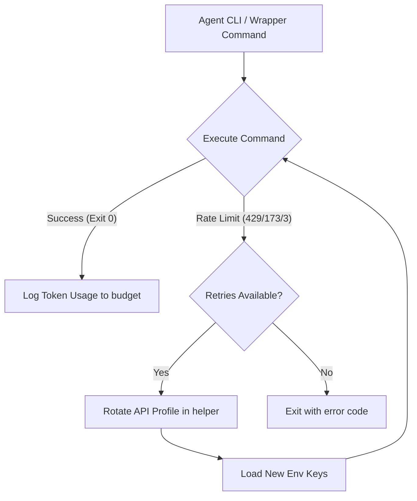

# API Profile Rotation and Budget Tracking Documentation

This document provides in-depth technical details on the API key rotation mechanisms, PowerShell integration wrappers, per-profile token budgets, and verification test suites in the Antigravity Agent Core.

---

## 1. System Topology & Architecture

To prevent API rate-limiting (HTTP 429) or token budget exhaustion from halting autonomous agent tasks, the system implements a hybrid key rotation design pattern:



---

## 2. API Profiles Setup

All profiles are configured locally inside `.agents/api_keys` (which is excluded from Git to prevent credential leaks).

### Configuration Example
To configure multiple profiles, copy the example template `.agents/api_keys.example`:
```ini
# Profile format: [profile_name].[VARIABLE_NAME]=[value]

# Work Profile
work.GEMINI_API_KEY=AIzaSyB_work_key_here
work.OPENAI_API_KEY=sk-proj-work_key_here
work.ANTHROPIC_API_KEY=sk-ant-work_key_here

# Personal Profile
personal.GEMINI_API_KEY=AIzaSyA_personal_key_here
personal.OPENAI_API_KEY=sk-proj-personal_key_here

# Backup Profile
backup.GEMINI_API_KEY=AIzaSyC_backup_key_here
backup.OPENAI_API_KEY=sk-proj-backup_key_here
```

---

## 3. Command Reference

### A. Profile Switching & Rotation (`api-profile`)
You can manage the active profile using the `api-profile` subcommand inside `helper.sh` (Unix) or `helper.ps1` (Windows).

- **View Active Profile & Details**:
  ```bash
  ./.agents/scripts/helper.sh api-profile
  ```
- **Switch to a Specific Profile**:
  ```bash
  ./.agents/scripts/helper.sh api-profile work
  ```
- **Rotate to the Next Profile**:
  ```bash
  ./.agents/scripts/helper.sh api-profile rotate
  ```

### B. Token Budget Logging (`log-usage`)
Tracks token budget per profile name inside `.agents/token_budget.json`.

- **Log to Active Profile** (Auto-detected):
  ```bash
  ./.agents/scripts/helper.sh log-usage 150
  ```
- **Log to Specific Profile Manually**:
  ```bash
  ./.agents/scripts/helper.sh log-usage 150 personal
  ```

---

## 4. Platform Execution Wrappers

The platform provides dedicated wrapper scripts to execute commands with automatic fallback.

### Unix/Linux Wrapper (`api-rotate-wrapper.sh`)
Executes commands, intercepts Unix rate-limit exit codes (`429`, `129`, `3`, and modulo `173`), rotates to the next profile, and transparently retries.
```bash
./.agents/scripts/api-rotate-wrapper.sh [command_to_run] [arguments...]
```

### Windows PowerShell Wrapper (`api-rotate-wrapper.ps1`)
Native PowerShell script doing equivalent rotation for Windows environments.
```powershell
.\.agents\scripts\api-rotate-wrapper.ps1 [command_to_run] [arguments...]
```

### Loading Environment Variables in PowerShell
To automatically import the active profile's keys directly into your current PowerShell session, dot-source the helper:
```powershell
. .\.agents\scripts\helper.ps1 api-profile work
```

---

## 5. Python `api-rotator` Skill

For custom Python agents, the skill under `.agents/skills/api-rotator/` provides a native implementation of:
- **Proactive Budget Guard**: Reads `.agents/token_budget.json` before LLM calls and rotates early if the active profile's quota is exceeded.
- **Reactive Retries**: Catches rate-limiting exceptions from libraries, rotates using `helper.sh api-profile rotate`, and retries.

Run the rotator skill script (with simulation for verification):
```bash
python3 .agents/skills/api-rotator/scripts/main.py --prompt "Explain quantum computing" --simulate-limit 1
```

---

## 6. Automated Verification Test Suite

The test suite at `tests/test_rotation.py` verifies the wrapper script rotation under all conditions:
- **Case 1: Successful Rotation** (exits with 0 after successful profile switch).
- **Case 2: Profile Exhaustion** (exits with 429/173 after all profiles fail).
- **Modulo 256 Handlers**: Correctly handles Unix exit status wrapping modulo 256 (where 429 becomes 173).

Run tests manually:
```bash
python3 tests/test_rotation.py
```
This suite is automatically run during project linter checks and pre-commit commit validation.

---

## 7. Automatic Budget Resets

To prevent token limits from permanently blocking API profile usage, you can configure an automatic reset interval in `.agents/token_budget.json`.

### Configuration
Add the `"reset_interval"` field at the root level of `.agents/token_budget.json`:
```json
{
  "max_token_budget": 500000,
  "current_token_usage": 0,
  "alert_threshold_percent": 90,
  "reset_interval": "daily",
  "last_reset_timestamp": 1781682136,
  "profiles": {}
}
```

### Supported Intervals
- `"hourly"`: Resets token counts every 1 hour (3,600 seconds).
- `"daily"`: Resets token counts every 24 hours (86,400 seconds).
- `"weekly"`: Resets token counts every 7 days (604,800 seconds).
- `"monthly"`: Resets token counts every 30 days (2,592,000 seconds).
- Custom seconds (e.g., `"300"` for every 5 minutes).
- `"none"` (or missing): Disables automatic resets (default opt-in behavior).

### Operation
- Whenever any script calls the CLI helper commands (`helper.sh validate`, `helper.sh log-usage`, etc.), the Python loader automatically evaluates if the interval has elapsed.
- If elapsed, it resets `current_token_usage` and all profile usage logs to `0` and updates `last_reset_timestamp`.
- A message is printed to notify the developer of the reset: `[INFO] Token budget reset interval ('daily') has expired. Resetting all usage counts to 0.`
